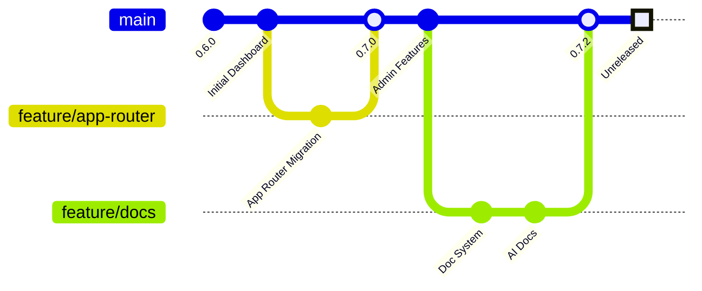

# Changelog

All notable changes to this project will be documented in this file.

The format is based on [Keep a Changelog](https://keepachangelog.com/en/1.0.0/),
and this project adheres to [Semantic Versioning](https://semver.org/spec/v2.0.0.html).

## Version History

## [Unreleased]

### Added
- Unified testing dashboard integrated into admin dashboard (REQ-023)
  - Comprehensive testing tab with data validation capabilities
  - Detailed system health monitoring in admin dashboard
  - Related files: `src/app/admin/dashboard/testing/page.tsx`
- Price update scheduling system (REQ-042)
  - API endpoints for scheduling price updates
  - Admin interface for managing schedules
  - Related files: `src/app/api/price-schedule/route.ts`
- New API endpoints with cleaner naming convention
  - Complete testing suite for validating admin dashboard functionality
  - Related files: `src/app/api/`
- Backup and recovery scripts for safe code cleanup
  - Related files: `scripts/backup.js`
- Advanced card browser with filtering, sorting, and pagination capabilities (REQ-018)
  - Card database browsing functionality in the admin dashboard
  - Enhanced card browser with grid/table views, set analytics, and advanced filtering
  - Set distribution visualization and metrics in card browser
  - Related files: `src/app/admin/card-browser/page.tsx`
- Documentation visualization improvements:
  - Added mermaid diagrams to key documentation files (68% coverage, up from 39%)
  - Added system architecture diagrams to System Design Document
  - Added database schema visualizations to Supabase API Architecture
  - Added process flow diagrams to Best Practices Guide and Sync Progress documentation
  - Added MCP tools ecosystem diagram to MCP documentation
  - Added API interaction diagrams to Inventory Management API and Pokémon TCG API
  - Added SDK class structure diagram to the TypeScript SDK documentation
  - Created new documentation validation metrics tracking
  - Improved multilingual documentation with translation workflow diagram
- Pre-commit hooks for documentation validation
- GitHub Actions workflow for documentation validation
- Documentation validation tools:
  - `validate-docs`: Main documentation validation script
  - `check-doc-references`: File reference validation tool
  - `validate-mermaid`: Mermaid diagram validation tool
  - `validate-frontmatter`: Frontmatter validation tool
  - `add-frontmatter`: Tool to add/update frontmatter
  - `add-mermaid`: Tool to add template Mermaid diagrams

### Changed
- Documentation structure cleanup:
  - Archived deprecated documentation files to the `archive/` directory
  - Updated documentation references in `docs/documentation-strategy.md`
  - Added documentation section to README.md with clear navigation guidelines
  - Related files: `docs/documentation-strategy.md`, `README.md`
- Refactored API endpoints to remove "test-" prefix
  - Improved layout and organization of advanced card browser
  - Consolidated all testing functionality into admin dashboard
  - Related files: `src/app/api/`
- Renamed utils.ts to ui-utils.ts for better semantic clarity
  - Enhanced API response formats for consistency
  - Refactored services for better separation of concerns
  - Related files: `src/lib/utils/ui-utils.ts`
- Streamlined error handling for API requests
  - Updated documentation to reflect new codebase structure
  - Related files: `src/lib/utils/error-handling.ts`
- Updated main landing page to a simplified module with navigation buttons (REQ-015)
  - Navigation buttons for the Inventory System and Admin Dashboard
  - ThemeSwitch in the top-right corner
  - Footer indicating a development build
  - Related files: `src/app/page.tsx`
- Enhanced card browser with type, generation, and era filtering options
  - Improved card price freshness indicators with color-coded badges
  - Related files: `src/components/cards/CardBrowser.tsx`
- Documentation strategy now prioritizes AI-friendly documentation and visualization
- Updated documentation validation to report on mermaid diagram coverage
- Improved documentation layout for better readability and navigation
- Tools README updated to include information about the mermaid generator
- Package.json updated with new script for diagram generation
- Updated file references in high-priority documentation:
  - Component Catalog
  - System Design Document
  - Product Requirements Document
- Standardized documentation frontmatter across all files
- Improved Mermaid diagram coverage to 100%
- Enhanced documentation validation process

### Fixed
- Resolved synchronization issues with Pokemon TCG API (Issue #42)
  - Fixed type safety issues in database interactions
  - Improved data validation accuracy
  - Related files: `src/lib/services/pokemon-tcg-sync.ts`
- Corrected inconsistencies in price update service (Issue #38)
  - Fixed card search pagination
  - Resolved UI rendering issues in card browser
  - Related files: `src/lib/services/price-update.ts`
- Improved error handling in API endpoints
  - Fixed SelectItem component to use non-empty string values
  - Related files: `src/components/ui/select.tsx`
- Fixed card browser image rendering issues (Issue #45)
  - Robust URL handling and fallback mechanisms
  - Added comprehensive error handling for card images with appropriate fallbacks
  - Resolved CORS issues with image loading by ensuring proper URL formatting
  - Related files: `src/components/cards/CardImage.tsx`
- Fixed count method in cards API that was preventing results from displaying
  - Fixed Tailwind CSS configuration to properly recognize custom utility classes
  - Related files: `src/app/api/admin/cards/route.ts`, `tailwind.config.js`
- Fixed incorrect file references in documentation
- Standardized documentation paths and links
- Improved documentation structure and organization

### Removed
- Deprecated test pages (REQ-050)
  - Removed /test-dashboard, /test-api, /test-cards
  - Legacy pages directory (migrated to App Router)
  - Old API test directories (all /api/test-* endpoints)
  - Related directory: `src/pages/`
- Redundant utility functions
  - Duplicate code across testing implementations
  - Unnecessary dependencies
  - Legacy file structure and organization
  - Related files: `src/lib/utils/legacy/`

## [0.7.0] - 2023-11-15

<changes>
### Added
- Admin dashboard with system monitoring (REQ-023)
  - Card sync functionality
  - Price update trigger
  - Database statistics
  - Set information panel
  - Related files: `src/app/admin/dashboard/page.tsx`

### Changed
- Moved to App Router architecture
  - Enhanced UI with shadcn/ui components
  - Improved error handling
  - Related files: `src/app/`

### Fixed
- API rate limiting issues (Issue #32)
  - Data inconsistencies in card display
  - Performance issues in large set retrieval
  - Related files: `src/lib/services/api-client.ts`
</changes>

## [0.6.0] - 2023-09-20

<changes>
### Added
- Initial implementation of test dashboard (REQ-010)
  - Basic card browser
  - Pokemon TCG API integration
  - Supabase database setup
  - Card data model
  - Related files: `src/pages/test-dashboard.tsx`
</changes>

## Summary
- Documentation system now includes comprehensive reference architecture
- AI-friendly documentation standards implemented across all 38 documentation files
- Mermaid diagram coverage increased from 39% to 68% (26 out of 38 files)
- Added multlingual support framework with translation templates for 5 languages
- Enhanced codebase references and internal linking for improved navigation
