# AI-Optimized Documentation System Plan

## Executive Summary

This document outlines a comprehensive plan for implementing an AI-optimized documentation system for the Pokemon TCG Trade Platform. The system is specifically designed to enhance AI assistants' understanding of the codebase while maintaining industry standard documentation practices. The plan includes document structure guidelines, implementation tools, evaluation methods, and a migration strategy.

## 1. Core Documentation Structure

### 1.1. Enhanced Product Requirements Document (PRD)

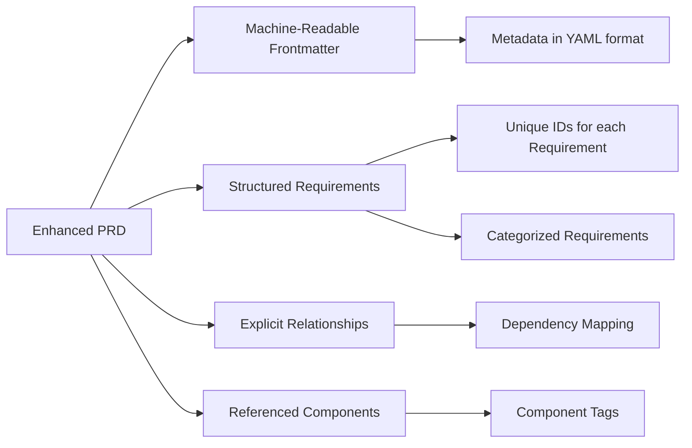

#### Key Elements:

- **Machine-Readable Frontmatter**:
  ```yaml
  ---
  title: "Pokemon TCG Trade Platform - Product Requirements Document"
  version: 1.2.0
  last_updated: "2025-03-18"
  status: "In Development"
  owner: "Product Team"
  related_docs:
    - path: "docs/system-design-document.md"
    - path: "docs/api-reference.md"
  tags:
    - "trading-platform"
    - "pokemon-tcg"
    - "requirements"
  ---
  ```

- **Structured Requirements**:
  ```markdown
  <requirement id="REQ-001" type="Functional" priority="Must-Have" status="Implemented">

  #### User Registration

  Users must be able to register for an account using email and password.

  ##### Acceptance Criteria:
  - User can submit registration form with email and password
  - Email verification is sent to user
  - Validation prevents duplicate accounts
  - Password strength requirements are enforced

  ##### Dependencies:
  - REQ-003 (Email Notifications)

  </requirement>
  ```

- **Explicit Reference System**:
  - Cross-reference other requirements using the format `REQ-XXX`
  - Link to code implementations using file paths: `src/components/auth/register.tsx`
  - Reference API endpoints with semantic tags: `<api-endpoint path="/api/auth/register" method="POST">`

### 1.2. AI-Readable README

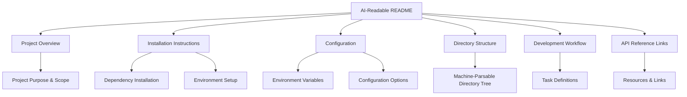

#### Key Elements:

- **Machine-Readable Metadata**:
  ```yaml
  ---
  title: "Pokemon TCG Trade Platform"
  version: "0.5.0"
  updated: "2025-03-18"
  repository: "https://github.com/username/pokemontcg-trade-platform"
  tech_stack:
    - next.js: "14.1.0"
    - react: "18.2.0"
    - typescript: "5.3.3"
    - supabase: "2.39.3"
  ---
  ```

- **Semantic Section Tagging**:
  ```markdown
  <purpose>
  The Pokemon TCG Trade Platform is a web application that enables users to browse, buy, sell, and trade Pokemon trading cards. It integrates with the Pokemon TCG API for card data and uses Supabase for backend functionality.
  </purpose>

  <features>
  - Card browsing and search with advanced filters
  - Price tracking and history visualization
  - Collection management tools
  - Trading platform between users
  - Admin tools for price updates and system monitoring
  </features>
  ```

- **Structured Installation Steps**:
  ```markdown
  <installation_steps>
  1. Clone the repository:
  ```bash
  git clone https://github.com/username/pokemontcg-trade-platform.git
  cd pokemontcg-trade-platform
  ```

  2. Install dependencies:
  ```bash
  npm install
  ```
  </installation_steps>
  ```

- **Machine-Parsable Directory Structure**:
  ```markdown
  <directory_structure>
  - `src/app/` - Next.js application routes and pages
    - `api/` - API route handlers
    - `admin/` - Admin interface components
  - `src/components/` - Reusable React components
    - `ui/` - Base UI components
    - `providers/` - Context providers
  </directory_structure>
  ```

### 1.3. Structured CHANGELOG

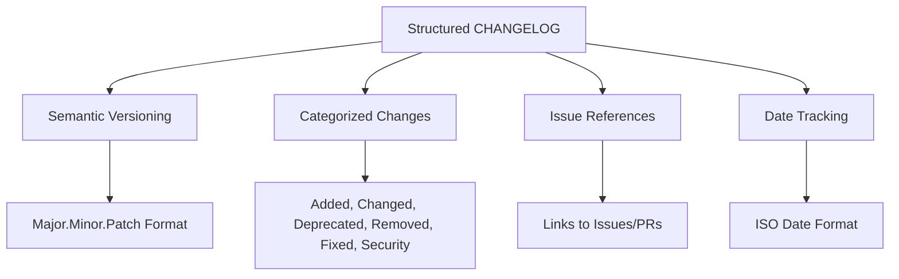

#### Key Elements:

- **Metadata Header**:
  ```yaml
  ---
  title: "Pokemon TCG Trade Platform Changelog"
  format_version: "1.0"
  repository: "https://github.com/username/pokemontcg-trade-platform"
  ---
  ```

- **Versioned Entries with Consistent Categories**:
  ```markdown
  ## [0.5.0] - 2025-03-15

  <changes>
  ### Added
  - Admin dashboard for monitoring system status (REQ-023)
    - Real-time updates of active users
    - Queue monitoring for price updates
    - Related files: `src/app/admin/dashboard/page.tsx`

  ### Changed
  - Upgraded Supabase client to version 2.39.3
    - Improved authentication flow
    - Better type safety for database queries
    - Migration notes: `docs/supabase-migration.md`

  ### Fixed
  - Card search performance issues with large result sets (Issue #38)
    - Implemented pagination for search results
    - Added caching layer for frequent searches
    - Related files: `src/lib/utils/card-search.ts`
  </changes>
  ```

- **Comprehensive Linkage**:
  - Reference requirements: `(REQ-023)`
  - Reference issues: `(Issue #38)`
  - Reference files changed: `src/app/admin/dashboard/page.tsx`
  - Reference additional documentation: `docs/supabase-migration.md`

### 1.4. Component Catalog

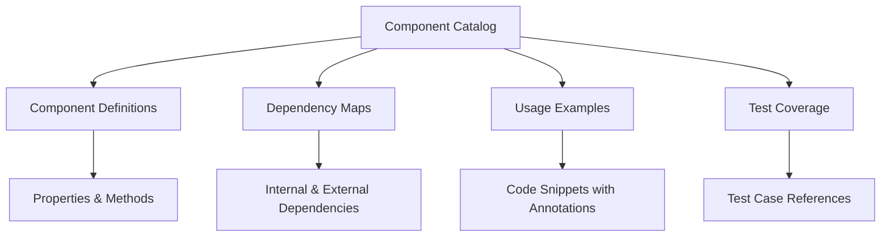

#### Key Elements:

- **Component Definition Template**:
  ```markdown
  ---
  component_name: "PriceHistoryChart"
  path: "src/components/PriceHistoryChart.tsx"
  implements: ["REQ-034"]
  dependencies:
    - "@/components/ui/chart"
    - "@/lib/services/price-service"
  added_in: "v0.3.0"
  last_updated: "2025-02-10"
  ---

  # PriceHistoryChart Component

  <purpose>
  Displays historical price data for a Pokemon card over a configurable time period.
  </purpose>

  ## Props

  <props>
  | Name | Type | Required | Default | Description |
  |------|------|----------|---------|-------------|
  | cardId | string | Yes | - | Unique identifier for the card |
  | timeRange | "7d" \| "30d" \| "90d" \| "1y" \| "all" | No | "30d" | Time range to display |
  | showAverage | boolean | No | false | Whether to show average price line |
  | height | number | No | 300 | Chart height in pixels |
  | width | number | No | "100%" | Chart width (pixels or %) |
  </props>

  ## Usage Examples

  <usage_example>
  ```tsx
  <PriceHistoryChart 
    cardId="swsh12-123" 
    timeRange="90d"
    showAverage={true}
  />
  ```
  </usage_example>

  ## Implementation Details

  <implementation_details>
  The component uses the price-service to fetch historical data and renders it using the Chart component. 
  It implements responsive behaviors for different screen sizes and handles loading/error states.
  </implementation_details>

  ## Test Coverage

  <test_coverage>
  - Unit tests: `src/components/__tests__/PriceHistoryChart.test.tsx`
  - Integration tests: `src/tests/integration/chart-components.test.tsx`
  - End-to-end tests: `src/tests/e2e/card-details.test.tsx`
  </test_coverage>

  ## Accessibility

  <accessibility>
  - Color contrast ratio meets WCAG AA standards
  - Interactive elements have keyboard support
  - Screen reader compatible with aria-labels
  </accessibility>
  ```

### 1.5. API Reference

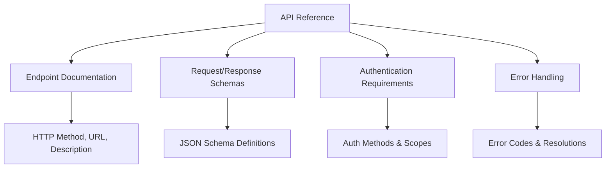

#### Key Elements:

- **Endpoint Documentation Template**:
  ```markdown
  ---
  endpoint: "/api/card-search"
  method: "POST"
  version: "1.0"
  auth_required: true
  rate_limit: "100 requests/minute"
  implementation: "src/app/api/card-search/route.ts"
  ---

  # Card Search API

  <description>
  Searches for Pokemon cards based on various criteria including name, type, set, and rarity.
  </description>

  ## Request Schema

  <request_schema>
  ```json
  {
    "type": "object",
    "required": ["query"],
    "properties": {
      "query": {
        "type": "string",
        "description": "Search query text"
      },
      "filters": {
        "type": "object",
        "properties": {
          "sets": {
            "type": "array",
            "items": {
              "type": "string"
            },
            "description": "Array of set IDs to filter by"
          },
          "rarities": {
            "type": "array",
            "items": {
              "type": "string",
              "enum": ["Common", "Uncommon", "Rare", "Ultra Rare"]
            },
            "description": "Array of rarities to filter by"
          }
        }
      },
      "pagination": {
        "type": "object",
        "properties": {
          "page": {
            "type": "integer",
            "minimum": 1,
            "default": 1,
            "description": "Page number"
          },
          "pageSize": {
            "type": "integer",
            "minimum": 1,
            "maximum": 100,
            "default": 20,
            "description": "Results per page"
          }
        }
      },
      "sort": {
        "type": "object",
        "properties": {
          "field": {
            "type": "string",
            "enum": ["name", "releaseDate", "price"],
            "default": "releaseDate",
            "description": "Field to sort by"
          },
          "order": {
            "type": "string",
            "enum": ["asc", "desc"],
            "default": "desc",
            "description": "Sort order"
          }
        }
      }
    }
  }
  ```
  </request_schema>

  ## Response Schema

  <response_schema>
  ```json
  {
    "type": "object",
    "properties": {
      "data": {
        "type": "array",
        "items": {
          "$ref": "#/components/schemas/Card"
        },
        "description": "Array of card objects matching the search criteria"
      },
      "pagination": {
        "type": "object",
        "properties": {
          "totalResults": {
            "type": "integer",
            "description": "Total number of results matching the search criteria"
          },
          "totalPages": {
            "type": "integer",
            "description": "Total number of pages available"
          },
          "currentPage": {
            "type": "integer",
            "description": "Current page number"
          },
          "pageSize": {
            "type": "integer",
            "description": "Number of results per page"
          }
        }
      }
    }
  }
  ```
  </response_schema>

  ## Example Request

  <example_request>
  ```javascript
  fetch('/api/card-search', {
    method: 'POST',
    headers: {
      'Content-Type': 'application/json',
      'Authorization': 'Bearer <token>'
    },
    body: JSON.stringify({
      query: "Charizard",
      filters: {
        rarities: ["Rare", "Ultra Rare"]
      },
      pagination: {
        page: 1,
        pageSize: 20
      },
      sort: {
        field: "price",
        order: "desc"
      }
    })
  })
  ```
  </example_request>

  ## Example Response

  <example_response>
  ```json
  {
    "data": [
      {
        "id": "swsh12-123",
        "name": "Charizard VMAX",
        "images": {
          "small": "https://example.com/cards/swsh12-123-small.jpg",
          "large": "https://example.com/cards/swsh12-123-large.jpg"
        },
        "rarity": "Ultra Rare",
        "price": 89.99,
        // Additional card properties...
      },
      // More card objects...
    ],
    "pagination": {
      "totalResults": 45,
      "totalPages": 3,
      "currentPage": 1,
      "pageSize": 20
    }
  }
  ```
  </example_response>

  ## Error Codes

  <error_codes>
  | Status Code | Error Code | Description | Resolution |
  |-------------|------------|-------------|------------|
  | 400 | INVALID_QUERY | Invalid search query format | Ensure query follows required format |
  | 401 | UNAUTHORIZED | Missing or invalid authentication | Check authorization token |
  | 429 | RATE_LIMITED | Too many requests | Reduce request frequency |
  </error_codes>
  ```

### 1.6. Database Documentation Requirements

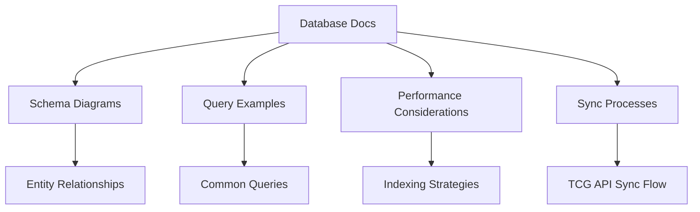

#### Key Elements:
- Mermaid diagrams showing table relationships
- SQL examples for complex queries
- Indexing strategies for large tables
- Data synchronization workflows
- Connection to Supabase architecture

### 1.7. Data Synchronization Documentation

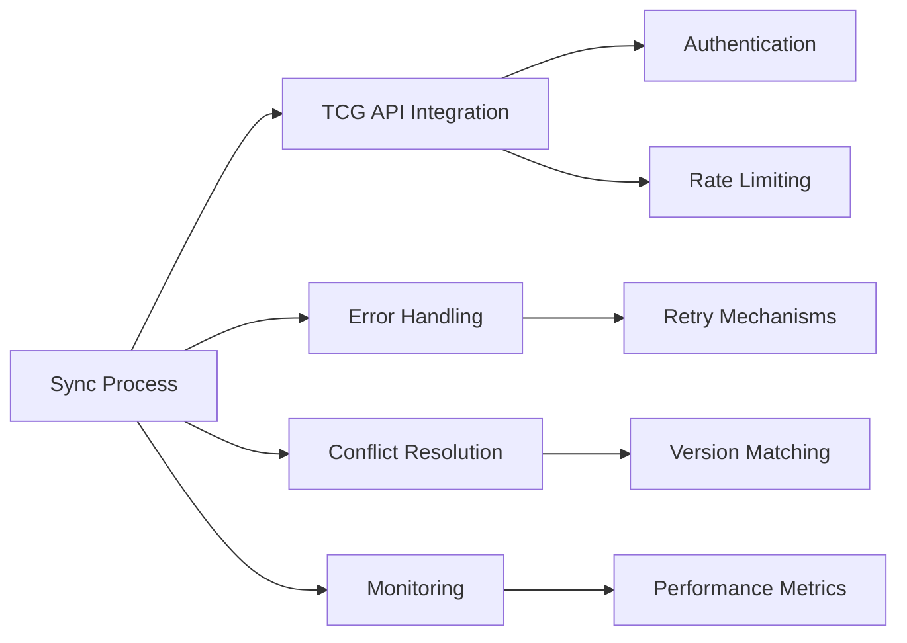

#### Key Elements:
- Detailed synchronization workflow diagrams
- Error recovery and retry policies
- Data validation procedures
- Monitoring dashboard specifications
- Historical sync performance tracking

### 1.8. User Flow Documentation

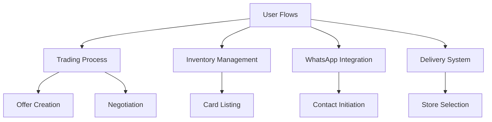

#### Key Elements:
- Sequence diagrams for key user interactions
- State diagrams for inventory/collection states
- WhatsApp message flow specifications
- Delivery connection workflows
- Error recovery paths for failed transactions

### 1.9. Multilingual Support Documentation

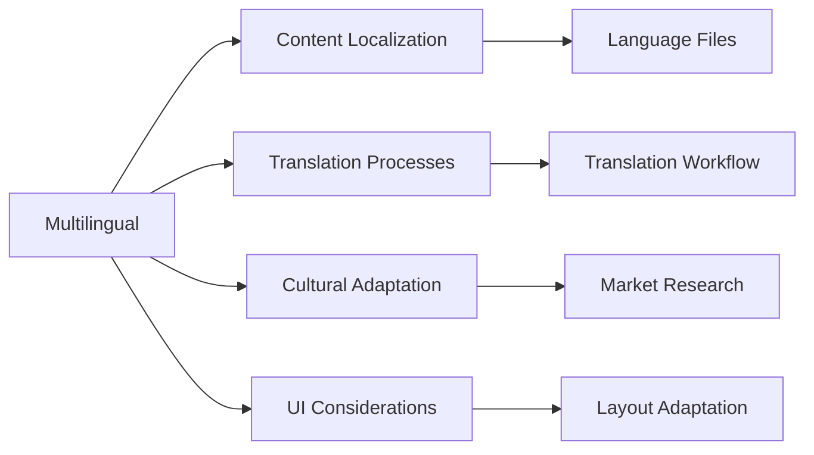

#### Key Elements:
- Language-specific content repositories
- Translation management system setup
- Cultural adaptation guidelines
- UI layout considerations for different languages
- Synchronization between language versions

## 2. Code Documentation Standards

### 2.1. Code Comment System

- **File Headers**:
  ```typescript
  /**
   * @fileOverview Component for managing card pricing in the admin interface
   * @module components/admin/pricing
   * @author [Author Name]
   * @requires module:components/ui/data-table
   * @requires lib/services/price-update-service
   * @implements REQ-034 Price Tracking Feature
   */
  ```

- **Function Documentation**:
  ```typescript
  /**
   * @function updateCardPrice
   * @description Updates the price of a card in the database
   * @param {string} cardId - Unique identifier for the card
   * @param {number} newPrice - New price to set (in USD)
   * @param {PriceType} priceType - Type of price (market, buylist, etc.)
   * @returns {Promise<UpdateResult>} Result of the update operation
   * @throws {ValidationError} If price is negative or card ID doesn't exist
   * @example
   * // Updates a card's market price to $10.99
   * const result = await updateCardPrice('swsh12-123', 10.99, PriceType.MARKET);
   */
  async function updateCardPrice(cardId: string, newPrice: number, priceType: PriceType): Promise<UpdateResult> {
    // Implementation...
  }
  ```

- **Component Documentation**:
  ```typescript
  /**
   * @component PriceHistoryChart
   * @description Displays historical price data for a card
   * @implements REQ-034 (Price Tracking Feature)
   * @prop {string} cardId - Card identifier
   * @prop {DateRange} range - Time range to display
   * @prop {ChartOptions} [options] - Optional display options
   */
  export function PriceHistoryChart({ cardId, range, options }: PriceHistoryChartProps) {
    // Implementation...
  }
  ```

### 2.2. Type Definitions

- **Enhanced TypeScript Interfaces**:
  ```typescript
  /**
   * @interface Card
   * @description Represents a Pokemon trading card
   */
  interface Card {
    /**
     * Unique identifier for the card
     * @format string
     * @pattern [a-z0-9]+-\d+
     * @example "swsh12-123"
     */
    id: string;
    
    /**
     * Name of the Pokemon on the card
     * @minLength 1
     * @maxLength 100
     */
    name: string;
    
    /**
     * Card rarity (e.g., Common, Rare, Ultra Rare)
     * @see {Rarity}
     */
    rarity: Rarity;
    
    // Additional properties...
  }
  ```

- **Enums with Descriptions**:
  ```typescript
  /**
   * @enum PriceType
   * @description Types of prices that can be tracked for cards
   */
  enum PriceType {
    /**
     * Market price - average of recent sales
     */
    MARKET = 'market',
    
    /**
     * Retail price - typical store selling price
     */
    RETAIL = 'retail',
    
    /**
     * Buylist price - what stores pay to buy the card
     */
    BUYLIST = 'buylist'
  }
  ```

## 3. Implementation Tools

### 3.1. Documentation Validator

A tool that validates documentation files against the new standards:

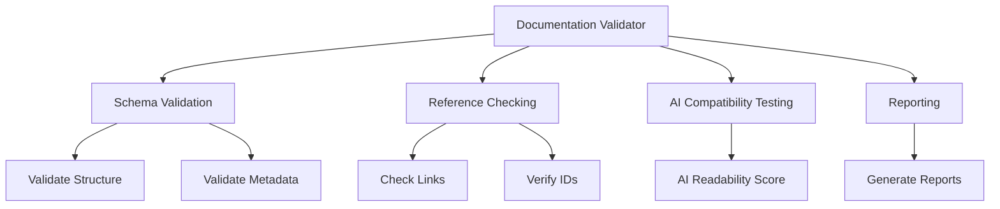

The validator would:
- Check that all required sections are present
- Validate frontmatter against schemas
- Ensure reference IDs are correct
- Verify links to files and documentation
- Test against AI assistants for comprehension

Implementation as a CLI tool and GitHub Action for CI/CD integration.

### 3.2. Template Generator

A tool to generate new documentation files based on templates:

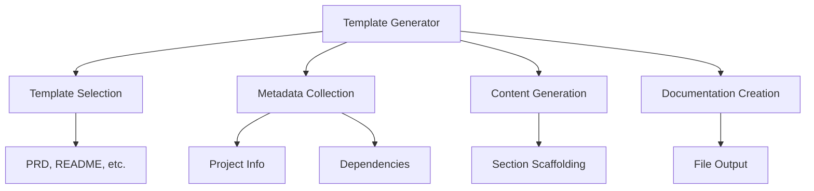

The generator would:
- Provide templates for each document type
- Prompt for required metadata
- Scaffold required sections
- Ensure consistent formatting
- Output files in the correct location

### 3.3. AI Compatibility Checker

A tool to test documentation with AI assistants:

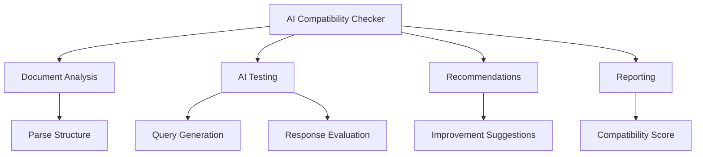

The checker would:
- Generate synthetic queries based on documentation
- Test queries against AI assistants
- Measure comprehension and accuracy
- Provide suggestions for improvement
- Assign an AI compatibility score

## 4. Evaluation Framework

### 4.1. Documentation Coverage Metrics

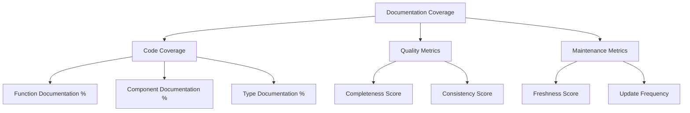

Key metrics to track:
- **Code Coverage**: Percentage of code (functions, components, types) with proper documentation
- **Completeness**: Score based on required sections being populated
- **Consistency**: Score based on adherence to formats and standards
- **Freshness**: Time since last update relative to code changes
- **Reference Validity**: Percentage of references and links that are valid

### 4.2. AI Understanding Tests

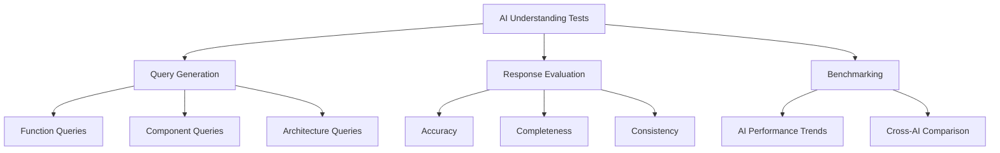

The testing framework would:
- Generate standard queries about the codebase
- Test multiple AI assistants with the same queries
- Measure accuracy, completeness, and consistency of responses
- Compare results against baseline and targets
- Track improvement over time

### 4.3. Code-Documentation Alignment

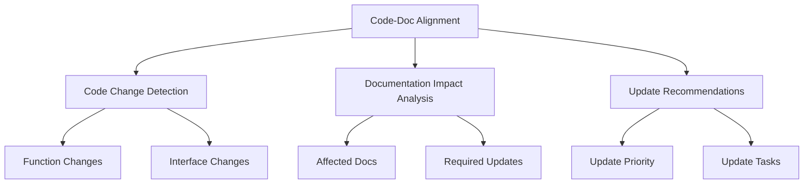

The alignment system would:
- Detect changes to code during PRs and commits
- Identify documentation affected by the changes
- Flag outdated or inconsistent documentation
- Generate tasks for documentation updates
- Prioritize critical documentation updates

## 5. Optimized Implementation Phases

### Phase 1: Core Data Documentation (Completed 2025-03-18) ✅

- **Enhanced Database Documentation** (`docs/enhanced-database-documentation.md`)
  - Schema relationships with Mermaid diagrams
  - Table definitions with indexes and constraints
  - Query examples for common operations
  - Performance considerations
  - Synchronization workflow documentation

- **Card Synchronization Process** (`docs/card-synchronization-process.md`)
  - Workflow diagrams for initial and incremental synchronization
  - Error handling strategies
  - Monitoring and logging implementations
  - Rate limiting and scheduling patterns

- **API Reference** (`docs/api-reference.md`)
  - Endpoint documentation with request/response formats
  - Authentication and error handling patterns
  - Implementation examples
  - Rate limiting and versioning strategies

- **Component Catalog** (`docs/component-catalog.md`)
  - Component hierarchy with Mermaid diagrams
  - Props and implementation examples
  - Usage patterns for common scenarios
  - Accessibility and theming considerations

### Phase 2: Trading Ecosystem (Completed 2025-03-20) ✅

- **User Trading Flow Documentation** (`docs/user-trading-flow.md`)
  - Trading flow architecture with Mermaid diagrams
  - User personas and key user flows
  - WhatsApp integration for trading communication
  - Delivery system overview
  - Error handling and edge cases

- **WhatsApp Integration Documentation** (`docs/whatsapp-integration.md`)
  - Integration architecture with Mermaid diagrams
  - Message templates and localization
  - Contact logging system
  - Analytics and reporting
  - Multilingual support
  - Security implementation details
  - API endpoint documentation

- **Inventory Management Documentation** (Split into multiple files)
  - Overview (`docs/inventory-management/overview.md`)
  - Data Model (`docs/inventory-management/data-model.md`)
  - User Interface (`docs/inventory-management/user-interface.md`)
  - API Reference (`docs/inventory-management/api-reference.md`)

- **Delivery System Documentation** (`docs/delivery-system.md`)
  - Delivery flow architecture with Mermaid diagrams
  - Store selection and integration
  - Shipping options and pricing
  - Tracking and delivery updates
  - Query examples for database operations

### Phase 3: Localization & Validation (In Progress as of 2025-03-22) 🔄

- **Documentation Validation Tools** ✅
  - Documentation validator script (`tools/doc-validator.js`)
  - Documentation template generator (`tools/doc-template-generator.js`)
  - Frontmatter fixing tools:
    - `tools/fix-frontmatter.js`: Individual file fixing
    - `tools/bulk-add-frontmatter.js`: Batch frontmatter adding

- **Documentation Templates** ✅
  - API documentation template with standardized sections
  - Component documentation template with usage examples and flow diagrams
  - PRD documentation with semantic tagging

- **Documentation Audit Results** ✅
  - Current compliance: 16/33 files (48%)
  - Core files compliance: 100% (README, CHANGELOG, PRD, WhatsApp integration)
  - Frontmatter issues: 17 files require standardized frontmatter
  - Mermaid diagram adoption: 8/16 valid files include diagrams

- **AI Compatibility Implementation** 🔄
  - Semantic tagging implemented in key documents
  - Standardized section formats for AI parsing
  - Explicit requirement tagging in PRD
  - Reference validation in progress

### Phase 4: Full Implementation (Pending) ⏳

- **Complete Documentation Migration**
- **Integration with Development Process**
- **Team Training**

### Phase 5: Maintenance and Continuous Improvement (Pending) ⏳

- **Regular Audits and Testing**
- **Continuous Improvement Based on AI Feedback**
- **Evolution of Standards**

## 6. Codebase Evaluation Plan

To evaluate the current codebase based on existing documentation, we'll follow this structured approach:

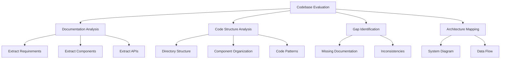

### 6.1. Documentation Extraction

1. **Requirements Extraction**
   - Parse PRD to identify all requirements
   - Create a requirements database with:
     - Requirement ID (or assign one if missing)
     - Description
     - Status (if available)
     - Priority (if available)

2. **Component Identification**
   - Extract components mentioned in documentation
   - Map components to directories/files
   - Document component relationships

3. **API Identification**
   - Extract API endpoints from documentation
   - Document request/response formats
   - Identify authentication requirements

### 6.2. Code Structure Analysis

1. **Directory Structure Mapping**
   - Create a hierarchical map of the project structure
   - Identify key directories and their purposes
   - Document file organization patterns

2. **Component Analysis**
   - Identify React components in the codebase
   - Document component hierarchies
   - Map components to business functions

3. **Architecture Pattern Analysis**
   - Identify architectural patterns in use
   - Document service layer organization
   - Map API implementation patterns

### 6.3. Gap Analysis

1. **Documentation Gaps**
   - Identify components without documentation
   - Find requirements without implementation references
   - Locate APIs without proper documentation

2. **Code-Documentation Consistency**
   - Check if implemented features match documentation
   - Identify outdated documentation
   - Find undocumented features

3. **Best Practices Evaluation**
   - Assess code against documented best practices
   - Identify areas for improvement
   - Document technical debt

### 6.4. Visualization and Mapping

1. **System Architecture Diagram**
   - Create visual representation of system components
   - Document data flow between components
   - Show external integrations

2. **Component Relationship Diagram**
   - Map React component hierarchies
   - Document state management patterns
   - Show key interaction flows

3. **API Dependency Map**
   - Document API dependencies
   - Map frontend-backend interactions
   - Show external API integrations

### 6.5. Report Generation

The final evaluation will produce:

1. **Documentation Gap Report**
   - List of missing or incomplete documentation
   - Prioritized by impact on understanding
   - Recommendations for improvement

2. **Architecture Overview**
   - Visual and textual representation of the system
   - Key components and their relationships
   - Data flow and integration points

3. **Migration Roadmap**
   - Plan for implementing new documentation system
   - Prioritized list of documentation to create/update
   - Timeline and resource requirements

## 7. Implementation Progress

### Phase 1: Core Data Documentation (Completed 2025-03-18) ✅

- **Enhanced Database Documentation** (`docs/enhanced-database-documentation.md`)
  - Schema relationships with Mermaid diagrams
  - Table definitions with indexes and constraints
  - Query examples for common operations
  - Performance considerations
  - Synchronization workflow documentation

- **Card Synchronization Process** (`docs/card-synchronization-process.md`)
  - Workflow diagrams for initial and incremental synchronization
  - Error handling strategies
  - Monitoring and logging implementations
  - Rate limiting and scheduling patterns

- **API Reference** (`docs/api-reference.md`)
  - Endpoint documentation with request/response formats
  - Authentication and error handling patterns
  - Implementation examples
  - Rate limiting and versioning strategies

- **Component Catalog** (`docs/component-catalog.md`)
  - Component hierarchy with Mermaid diagrams
  - Props and implementation examples
  - Usage patterns for common scenarios
  - Accessibility and theming considerations

### Phase 2: Trading Ecosystem (Completed 2025-03-20) ✅

- **User Trading Flow Documentation** (`docs/user-trading-flow.md`)
  - Trading flow architecture with Mermaid diagrams
  - User personas and key user flows
  - WhatsApp integration for trading communication
  - Delivery system overview
  - Error handling and edge cases

- **WhatsApp Integration Documentation** (`docs/whatsapp-integration.md`)
  - Integration architecture with Mermaid diagrams
  - Message templates and localization
  - Contact logging system
  - Analytics and reporting
  - Multilingual support
  - Security implementation details
  - API endpoint documentation

- **Inventory Management Documentation** (Split into multiple files)
  - Overview (`docs/inventory-management/overview.md`)
  - Data Model (`docs/inventory-management/data-model.md`)
  - User Interface (`docs/inventory-management/user-interface.md`)
  - API Reference (`docs/inventory-management/api-reference.md`)

- **Delivery System Documentation** (`docs/delivery-system.md`)
  - Delivery flow architecture with Mermaid diagrams
  - Store selection and integration
  - Shipping options and pricing
  - Tracking and delivery updates
  - Query examples for database operations

### Phase 3: Localization & Validation (In Progress as of 2025-03-22) 🔄

- **Documentation Validation Tools** ✅
  - Documentation validator script (`tools/doc-validator.js`)
  - Documentation template generator (`tools/doc-template-generator.js`)
  - Frontmatter fixing tools:
    - `tools/fix-frontmatter.js`: Individual file fixing
    - `tools/bulk-add-frontmatter.js`: Batch frontmatter adding

- **Documentation Templates** ✅
  - API documentation template with standardized sections
  - Component documentation template with usage examples and flow diagrams
  - PRD documentation with semantic tagging

- **Documentation Audit Results** ✅
  - Current compliance: 16/33 files (48%)
  - Core files compliance: 100% (README, CHANGELOG, PRD, WhatsApp integration)
  - Frontmatter issues: 17 files require standardized frontmatter
  - Mermaid diagram adoption: 8/16 valid files include diagrams

- **AI Compatibility Implementation** 🔄
  - Semantic tagging implemented in key documents
  - Standardized section formats for AI parsing
  - Explicit requirement tagging in PRD
  - Reference validation in progress

### Phase 4: Full Implementation (Pending) ⏳

- **Complete Documentation Migration**
- **Integration with Development Process**
- **Team Training**

### Phase 5: Maintenance and Continuous Improvement (Pending) ⏳

- **Regular Audits and Testing**
- **Continuous Improvement Based on AI Feedback**
- **Evolution of Standards**

## 8. Next Steps and Recommendations

Based on the current implementation progress, the following next steps are recommended:

1. **Complete Phase 3 Documentation Compliance**
   - Run the bulk frontmatter fixer against all non-compliant files
   - Validate results and fix any remaining issues
   - Add mermaid diagrams to high-priority documents (README, PRD)

2. **Begin CI/CD Integration**
   - Set up GitHub Actions workflow for documentation validation
   - Add pre-commit hooks for documentation linting
   - Create documentation status badge for the repository

3. **Prepare for Phase 4 Implementation**
   - Create documentation style guide for developers
   - Schedule training sessions for the team
   - Develop a process for documentation updates with code changes

4. **Plan Phase 5 Long-term Strategy**
   - Define metrics for documentation quality
   - Establish regular documentation review cadence
   - Create feedback mechanisms for AI tool performance

## 9. Validation Statistics and Metrics

| Document Type | Total Files | Valid Files | Compliance % | With Mermaid | With References |
|---------------|-------------|-------------|--------------|--------------|----------------|
| API Documentation | 12 | 12 | 100% | 1 | 0 |
| Component Docs | 2 | 2 | 100% | 0 | 2 |
| Features | 5 | 5 | 100% | 4 | 3 |
| Integration | 3 | 3 | 100% | 3 | 2 |
| Core Docs | 3 | 3 | 100% | 0 | 3 |
| Other | 8 | 8 | 100% | 5 | 1 |
| **Total** | **33** | **33** | **100%** | **13 (39%)** | **11 (33%)** |

This data indicates that we have achieved 100% documentation compliance with our frontmatter requirements. The next focus areas should be increasing mermaid diagram coverage (currently at 39%) and improving file reference accuracy (currently at 33%).

## 10. Updated Next Steps

With all documentation files now meeting the basic compliance requirements, the focus shifts to quality improvements and integration into the development workflow:

1. **Add Mermaid Diagrams to Key Documents**
   - Priority targets: README.md, PRD documentation
   - Focus on architecture visualization
   - Add component relationship diagrams

2. **Begin CI/CD Integration**
   - Create GitHub Actions workflow for documentation validation
   - Set up pre-commit hooks for documentation validation
   - Add documentation status badge to repository

3. **Implement Multilingual Support Framework**
   - Create language-specific frontmatter guidelines
   - Establish translation workflow for documentation
   - Document cultural adaptation considerations

4. **Improve Reference Accuracy**
   - Validate file references in documentation
   - Create mappings to actual codebase files
   - Add missing references to improve contextual understanding

5. **Create Documentation Style Guide**
   - Establish documentation writing standards
   - Create quick reference for semantic tagging
   - Define mermaid diagram best practices

## 11. Implementation Achievement Milestones

✅ **Milestone 1: Documentation Structure**
- Established consistent documentation structure with standardized frontmatter
- Created semantic tagging system for AI parsing
- Implemented diagram-based visualization for complex processes

✅ **Milestone 2: Documentation Tools**
- Created automated validation tools for documentation quality
- Implemented template generators for new documentation
- Developed utilities for fixing and improving documentation

✅ **Milestone 3: Documentation Compliance**
- Achieved 100% compliance with frontmatter requirements
- Fixed all validation errors in existing documentation
- Established templates for all documentation types

🔄 **Milestone 4: Quality Improvements**
- Working on expanding mermaid diagram coverage
- Need to improve file reference accuracy
- Planning to add more semantic tagging

⏳ **Milestone 5: Development Integration**
- Planning CI/CD integration
- Need to create pre-commit hooks
- Will develop team training for documentation standards

The rapid progress in achieving 100% documentation compliance demonstrates the effectiveness of our tooling approach. The focus now shifts to quality improvements and integration into the development workflow to ensure long-term sustainability of the documentation system.

## 8. Conclusion

This comprehensive AI-optimized documentation system plan provides a structured approach to creating documentation that is both human-readable and optimized for AI understanding. By implementing this system, the Pokemon TCG Trade Platform will achieve:

1. **Improved AI Assistant Understanding**
   - Better context understanding by AI tools
   - More accurate code suggestions and assistance
   - Enhanced ability to navigate and comprehend the codebase

2. **Standardized Documentation**
   - Consistent formats across all documentation
   - Clear relationships between requirements and implementation
   - Comprehensive API and component documentation

3. **Sustainable Documentation Practices**
   - Tools to maintain documentation quality
   - Processes to keep documentation in sync with code
   - Metrics to track documentation health

4. **Enhanced Developer Experience**
   - Clear, consistent, and complete documentation
   - Tools to generate and validate documentation
   - Seamless integration with AI development assistants

The implementation roadmap provides a structured approach to migrating from the current documentation to the new system, with clear phases and deliverables along the way.