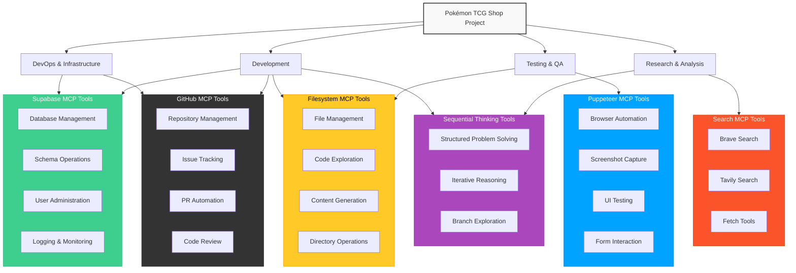

---
title: MCP
version: 1.0.0
last_updated: '2025-03-24'
status: Active
tags:
  - documentation
has_mermaid: true
---

## Introduction

MCP (Managed Cloud Provider) tools provide programmatic access to cloud services, allowing for automated management of infrastructure, database operations, browser automation, and complex problem-solving. This document outlines how these tools can be used to enhance our Pokémon TCG Shop project across various development stages.

## MCP Tools Ecosystem

## Supabase MCP Tools

Supabase MCP tools provide direct, programmatic access to our Supabase instance, allowing for database operations, schema management, user administration, and logging without leaving the development environment.

### Available Tools

| Tool | Description | Use Cases |
|------|-------------|-----------|
| `get_schemas` | List all database schemas with sizes and table counts | Project initialization, database exploration |
| `get_tables` | List all tables in a schema with metadata | Database exploration, schema validation |
| `get_table_schema` | Get detailed structure of a specific table | Development, debugging, documentation |
| `execute_postgresql` | Execute PostgreSQL statements | Schema creation, data migration, database operations |
| `retrieve_migrations` | List all migrations | Version tracking, deployment preparation |
| `send_management_api_request` | Make requests to Supabase Management API | Advanced infrastructure management |
| `get_management_api_spec` | Get API specification | Documentation, API exploration |
| `get_auth_admin_methods_spec` | Get Auth Admin methods specification | Authentication implementation |
| `call_auth_admin_method` | Call Auth Admin methods | User management, authentication flows |
| `live_dangerously` | Toggle unsafe mode for operations | Schema migrations, data modifications |
| `confirm_destructive_operation` | Confirm high-risk operations | Schema changes, data purging |
| `retrieve_logs` | Fetch logs from Supabase services | Debugging, monitoring |

## Puppeteer MCP Tools

Puppeteer MCP tools provide browser automation capabilities for testing, screenshot capture, and web scraping. These tools allow us to automate UI testing and generate visual content for our e-commerce platform.

### Available Tools

| Tool | Description | Use Cases |
|------|-------------|-----------|
| `puppeteer_navigate` | Navigate to a URL | UI testing, web scraping |
| `puppeteer_screenshot` | Take screenshots | UI documentation, visual testing |
| `puppeteer_click` | Click elements | Interactive testing, automation |
| `puppeteer_fill` | Fill form fields | Form testing, automation |
| `puppeteer_select` | Select from dropdowns | Form testing, filtering tests |
| `puppeteer_hover` | Hover over elements | UI interaction testing |
| `puppeteer_evaluate` | Execute JavaScript | Advanced testing, data extraction |

## Sequential Thinking MCP Tool

The Sequential Thinking MCP tool provides a structured approach to solving complex problems through step-by-step reasoning. This tool is particularly useful for planning feature implementations, debugging complex issues, and designing system architectures.

### Tool Capabilities

| Capability | Description |
|------------|-------------|
| Structured Problem Solving | Break down complex problems into manageable steps |
| Iterative Reasoning | Build on previous thoughts to refine understanding |
| Branch Exploration | Explore alternative approaches when needed |
| Hypothesis Testing | Generate and verify hypotheses through logical steps |

## GitHub MCP Tools

GitHub MCP tools provide programmatic access to GitHub functionality, allowing for repository management, issue tracking, and pull request automation.

### Available Tools

| Tool | Description | Use Cases |
|------|-------------|-----------|
| `search_repositories` | Search GitHub repositories | Research, dependency evaluation, competitive analysis |
| `create_repository` | Create a new GitHub repository | Project setup, module separation |
| `create_or_update_file` | Create or update files in a repository | Documentation updates, configuration management |
| `github_create_an_issue` | Create GitHub issues | Bug tracking, feature requests |
| `github_list_commits_on_a_pull_request` | List commits in a PR | Code review, release preparation |
| `github_get_a_pull_request` | Get PR information | CI/CD integration, status checking |
| `github_create_a_review_comment` | Comment on PR code | Automated code reviews |
| `github_create_an_issue_comment` | Comment on issues | Automated responses, status updates |
| `github_create_a_pull_request` | Create a PR | Automated updates, dependency updates |
| `github_check_active_connection` | Check connection status | GitHub integration validation |

## Brave Search MCP Tools

Brave Search MCP tools provide powerful web search capabilities for gathering real-time information, market research, and competitive analysis. These tools are particularly useful for understanding the local Pokémon TCG market in Costa Rica.

### Available Tools

| Tool | Description | Use Cases |
|------|-------------|-----------|
| `brave_web_search` | General web search with relevant results | Market research, competitor analysis, product research |
| `brave_local_search` | Location-based search for local businesses | Finding local TCG shops, local events, community gatherings |

## Tavily Search MCP Tools

Tavily Search MCP tools provide AI-powered search capabilities for deep research, content extraction, and intelligent data analysis. These tools excel at finding detailed information and synthesizing results from multiple sources.

### Available Tools

| Tool | Description | Use Cases |
|------|-------------|-----------|
| `tavily_web_search` | AI-powered comprehensive web search | Detailed research, content aggregation, trend analysis |
| `tavily_answer_search` | AI search with direct answers to queries | Specific questions, factual information, technical details |
| `tavily_news_search` | Search focused on recent news articles | Industry updates, tournament results, new card releases |

## Fetch MCP Tools

Fetch MCP tools provide capabilities for retrieving and processing web content, allowing for data extraction, content analysis, and monitoring of websites for changes. These tools are particularly useful for gathering information from official Pokémon sources.

### Available Tools

| Tool | Description | Use Cases |
|------|-------------|-----------|
| `fetch` | Retrieve and parse web content as markdown | Data extraction, content monitoring, documentation generation |

## Filesystem MCP Tools

Filesystem MCP tools provide direct access to the project's file system, enabling code exploration, file management, and automated content generation. These tools are essential for understanding the codebase structure and implementing new features.

### Available Tools

| Tool | Description | Use Cases |
|------|-------------|-----------|
| `read_file` | Read a file's contents | Code exploration, documentation generation |
| `read_multiple_files` | Read multiple files simultaneously | Codebase analysis, batch processing |
| `write_file` | Create or overwrite a file | Code generation, configuration updates |
| `edit_file` | Make line-based edits to a file | Code refactoring, feature implementation |
| `create_directory` | Create a new directory | Project structure setup |
| `list_directory` | List contents of a directory | Codebase exploration |
| `directory_tree` | Get a recursive tree view of directories | Project structure analysis |
| `move_file` | Move or rename files and directories | Codebase reorganization |
| `search_files` | Search for files matching a pattern | Finding related components |
| `get_file_info` | Get metadata about a file | File analysis |
| `list_allowed_directories` | List accessible directories | Environment setup |