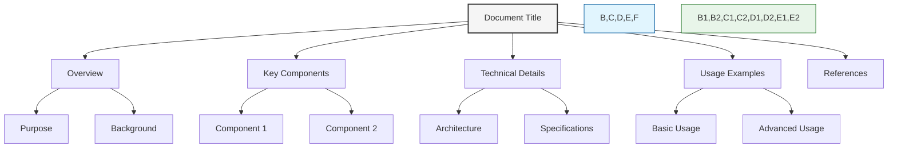

---
title: "AI-Friendly Documentation Best Practices"
type: "guide"
description: "Techniques and standards for creating documentation optimized for AI comprehension and processing"
author: "Documentation Team"
version: "1.0.0"
last_updated: "2023-12-10"
status: "published"
category: "documentation"
has_mermaid: true
---

# AI-Friendly Documentation Best Practices

## Overview

This document outlines techniques and standards for creating documentation that is optimized for both human readers and AI systems. Following these guidelines ensures that our documentation is structured, semantic, and easily processed by AI tools while maintaining clarity for human readers.

## Key Principles

### Semantic Structure

- Use consistent and meaningful heading hierarchies
- Apply semantic HTML/Markdown for content structure
- Maintain logical flow from general to specific information
- Group related information under appropriate headings

### Consistent Patterns

- Follow consistent formatting patterns throughout the documentation
- Use standardized templates for each document type
- Maintain consistent terminology and naming conventions
- Apply the same content organization across similar documents



## Frontmatter Best Practices

### Essential Fields

All documents should include standardized frontmatter with the following fields:

```yaml
---
title: "Document Title"
type: "document_type"
description: "Concise description of document content"
author: "Responsible team or individual"
version: "x.y.z"
last_updated: "YYYY-MM-DD"
status: "draft|in_review|published"
category: "category_name"
has_mermaid: true|false
---
```

### Field Guidelines

- **title**: Clear, descriptive, and specific
- **type**: Consistent document type classification (e.g., guide, reference, tutorial)
- **description**: Concise summary (1-2 sentences) that captures the essential purpose
- **version**: Follows semantic versioning format
- **category**: Uses predefined category terms from a controlled vocabulary

## Content Structuring

### Sectioning

- Begin with a concise overview/summary
- Break content into logical sections with clear headings
- Keep heading levels to a maximum of 3 (H1, H2, H3)
- Use numbered sections for sequential processes

### Information Hierarchy

- Present information in order of importance
- Include the most critical information at the beginning
- Use bullet points and numbered lists for clarity
- Provide context before details

## Named Entities and References

### Entity Tagging

Use consistent patterns to highlight named entities:

- **Code elements**: Use backticks (`code`)
- **Variables**: Use angle brackets or consistent formatting
- **Important terms**: Use bold formatting
- **External references**: Use standardized citation format

### Cross-References

- Use relative links for internal references
- Include descriptive link text (avoid "click here")
- Provide context around each reference
- Use consistent reference patterns

## Tagging and Classification

### Semantic Annotations

Use HTML comments or special tags to denote:

- Code sections
- Examples
- Warnings/Notes
- Prerequisites
- Related topics

Example:
```html
<feature>
This is a description of a feature that can be easily extracted by AI tools.
</feature>
```

### Machine-Readable Sections

- Wrap logical content units in semantic tags
- Use consistent delimiters for machine-extractable content
- Include metadata in structured formats (tables, lists)
- Provide context around data structures

## Examples and Code

### Code Block Formatting

- Always specify the language for code blocks
- Include comments for complex code sections
- Provide context around code examples
- Use consistent indentation and formatting

Example:
```javascript
// This function calculates the total price with tax
function calculateTotal(price, taxRate) {
  // Apply the tax rate to the base price
  return price * (1 + taxRate);
}
```

### Example Structure

- Start with simple examples before complex ones
- Include expected input and output
- Explain edge cases and limitations
- Provide context for when to use each example

## Visual Elements

### Diagrams

- Use mermaid diagrams for visualizing structure and flow
- Include text descriptions of all visual elements
- Label all components in diagrams
- Ensure diagrams have clear titles and captions

### Tables

- Include header rows for all tables
- Use consistent column ordering
- Align similar data across related tables
- Provide context around tabular data

## AI-Specific Optimization

### Pattern Recognition

- Use consistent patterns that AI can learn to recognize
- Apply the same structure across similar documents
- Maintain consistent terminology throughout the documentation
- Use semantic sectioning that follows logical patterns

### Information Extraction

- Structure content to facilitate information extraction
- Use tagged sections for key information
- Provide clear boundaries between content types
- Include machine-readable metadata

## Validation and Compliance

### Documentation Validation

Use the validation tools to ensure compliance:

```bash
npm run validate-docs
```

### Version Control

- Update the version and last_updated fields with each change
- Document significant changes in the CHANGELOG
- Maintain backward compatibility in documentation structure

## Conclusion

Following these AI-friendly documentation practices ensures that our documentation remains accessible to both human readers and AI systems. These practices enhance the discoverability, processability, and overall quality of our documentation, making it more valuable for all users. 