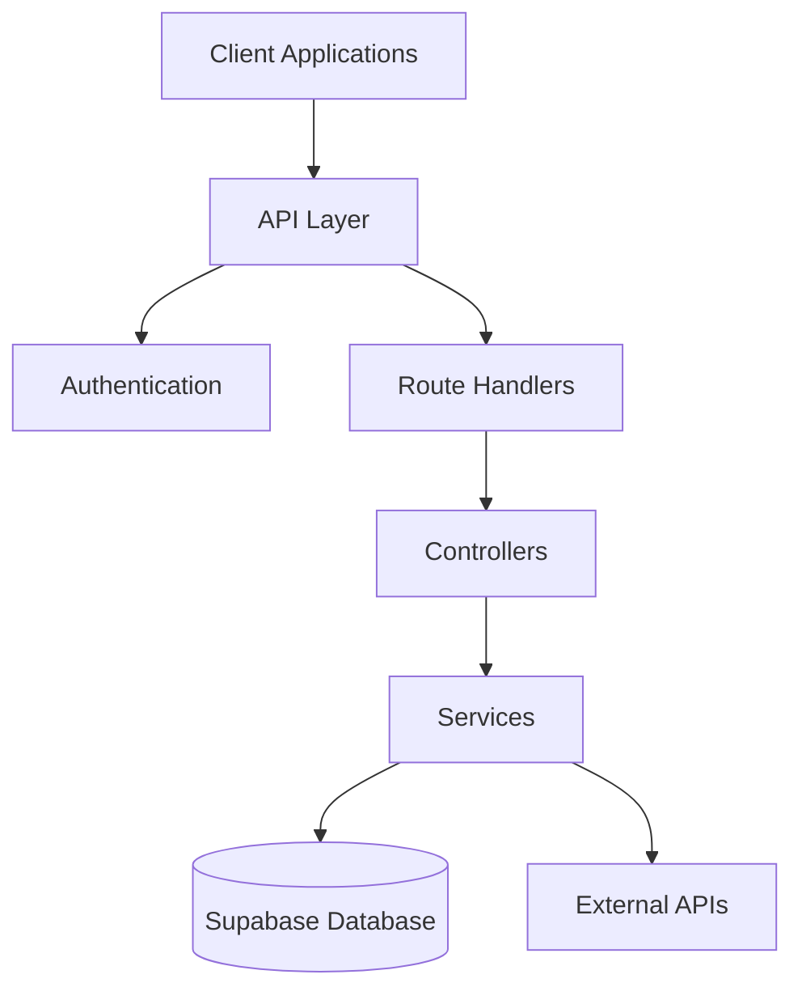

# Pokemon TCG Trade Platform API Reference

## Overview

<purpose>
This document provides a comprehensive reference for the Pokemon TCG Trade Platform API, including endpoints, request/response formats, authentication, and error handling. This documentation is designed to be both human-readable and AI-friendly.
</purpose>

## API Architecture



## Authentication

<authentication>
The API uses JWT-based authentication via Supabase Auth:

```typescript
// Middleware authentication check
import { createMiddlewareClient } from '@supabase/auth-helpers-nextjs';

export async function middleware(req: NextRequest) {
  const res = NextResponse.next();
  const supabase = createMiddlewareClient({ req, res });
  
  const {
    data: { session },
  } = await supabase.auth.getSession();
  
  if (!session && req.nextUrl.pathname.startsWith('/api/protected')) {
    return NextResponse.json(
      { error: 'Unauthorized' },
      { status: 401 }
    );
  }
  
  return res;
}
```

### Authentication Headers

```
Authorization: Bearer <jwt_token>
```
</authentication>

## Core Endpoints

### Card Search API

<endpoint id="card-search">
**Endpoint**: `GET /api/cards/search`

**Purpose**: Search for cards with various filters

**Authentication**: Optional

**Query Parameters**:
- `q` (string): Search query for card name
- `set` (string): Filter by set ID
- `rarity` (string): Filter by rarity
- `type` (string): Filter by card type
- `page` (number, default: 1): Page number
- `limit` (number, default: 20): Results per page
- `sort` (string, default: "release_date:desc"): Sort order

**Response Format**:
```json
{
  "data": [
    {
      "id": "swsh12-123",
      "name": "Charizard V",
      "supertype": "Pokémon",
      "types": ["Fire"],
      "set": {
        "id": "swsh12",
        "name": "Silver Tempest",
        "series": "Sword & Shield"
      },
      "number": "123",
      "rarity": "Rare Holo",
      "images": {
        "small": "https://images.pokemontcg.io/swsh12/123.png",
        "large": "https://images.pokemontcg.io/swsh12/123_hires.png"
      },
      "variations": [
        {
          "type": "Holofoil",
          "price": 12.99
        }
      ]
    }
  ],
  "pagination": {
    "page": 1,
    "pageSize": 20,
    "count": 1,
    "totalCount": 1,
    "totalPages": 1
  }
}
```

**Implementation**:
```typescript
// app/api/cards/search/route.ts
import { NextRequest, NextResponse } from 'next/server';
import { createRouteHandlerClient } from '@supabase/auth-helpers-nextjs';
import { cookies } from 'next/headers';

export async function GET(request: NextRequest) {
  const searchParams = request.nextUrl.searchParams;
  const query = searchParams.get('q') || '';
  const set = searchParams.get('set');
  const rarity = searchParams.get('rarity');
  const type = searchParams.get('type');
  const page = parseInt(searchParams.get('page') || '1');
  const limit = parseInt(searchParams.get('limit') || '20');
  const sort = searchParams.get('sort') || 'release_date:desc';
  
  const supabase = createRouteHandlerClient({ cookies });
  
  let cardQuery = supabase
    .from('enhanced_cards')
    .select(`
      id, name, supertype, types, number, rarity, image_small, image_large,
      set_id, set_name, set_series, release_date,
      card_variations (id, variation_type, treatment, tcg_price)
    `);
  
  // Apply filters
  if (query) {
    cardQuery = cardQuery.ilike('name', `%${query}%`);
  }
  
  if (set) {
    cardQuery = cardQuery.eq('set_id', set);
  }
  
  if (rarity) {
    cardQuery = cardQuery.eq('rarity', rarity);
  }
  
  if (type) {
    cardQuery = cardQuery.contains('types', [type]);
  }
  
  // Apply pagination
  const from = (page - 1) * limit;
  const to = from + limit - 1;
  
  // Apply sorting
  const [sortField, sortDirection] = sort.split(':');
  cardQuery = cardQuery.order(sortField, { ascending: sortDirection === 'asc' });
  
  // Execute query with pagination
  const { data: cards, error, count } = await cardQuery
    .range(from, to)
    .limit(limit);
  
  if (error) {
    return NextResponse.json({ error: error.message }, { status: 500 });
  }
  
  // Format response
  const formattedCards = cards.map(card => ({
    id: card.id,
    name: card.name,
    supertype: card.supertype,
    types: card.types,
    set: {
      id: card.set_id,
      name: card.set_name,
      series: card.set_series
    },
    number: card.number,
    rarity: card.rarity,
    images: {
      small: card.image_small,
      large: card.image_large
    },
    variations: card.card_variations.map(v => ({
      type: v.variation_type,
      price: v.tcg_price
    }))
  }));
  
  // Get total count for pagination
  const { count: totalCount } = await supabase
    .from('enhanced_cards')
    .select('*', { count: 'exact', head: true })
    .ilike('name', `%${query}%`)
    .eq(set ? 'set_id' : 'id', set || 'id');
  
  return NextResponse.json({
    data: formattedCards,
    pagination: {
      page,
      pageSize: limit,
      count: cards.length,
      totalCount,
      totalPages: Math.ceil(totalCount / limit)
    }
  });
}
```
</endpoint>

### User Collection API

<endpoint id="user-collection">
**Endpoint**: `GET /api/users/:username/collection`

**Purpose**: Get a user's card collection

**Authentication**: Required for private collections

**Path Parameters**:
- `username` (string): User's username

**Query Parameters**:
- `page` (number, default: 1): Page number
- `limit` (number, default: 20): Results per page
- `set` (string): Filter by set ID

**Response Format**:
```json
{
  "data": [
    {
      "id": "col_123",
      "card": {
        "id": "swsh12-123",
        "name": "Charizard V",
        "set": {
          "id": "swsh12",
          "name": "Silver Tempest"
        },
        "image": "https://images.pokemontcg.io/swsh12/123.png"
      },
      "variation": {
        "type": "Holofoil",
        "treatment": "Holofoil"
      },
      "quantity": 2,
      "condition": "NM",
      "notes": "Birthday gift",
      "added_at": "2025-01-15T12:00:00Z"
    }
  ],
  "pagination": {
    "page": 1,
    "pageSize": 20,
    "totalItems": 150,
    "totalPages": 8
  }
}
```

**Implementation**:
```typescript
// app/api/users/[username]/collection/route.ts
import { NextRequest, NextResponse } from 'next/server';
import { createRouteHandlerClient } from '@supabase/auth-helpers-nextjs';
import { cookies } from 'next/headers';

export async function GET(
  request: NextRequest,
  { params }: { params: { username: string } }
) {
  const { username } = params;
  const searchParams = request.nextUrl.searchParams;
  const page = parseInt(searchParams.get('page') || '1');
  const limit = parseInt(searchParams.get('limit') || '20');
  const set = searchParams.get('set');
  
  const supabase = createRouteHandlerClient({ cookies });
  
  // Get user ID from username
  const { data: user, error: userError } = await supabase
    .from('users')
    .select('id, is_private_collection')
    .eq('username', username)
    .single();
  
  if (userError || !user) {
    return NextResponse.json({ error: 'User not found' }, { status: 404 });
  }
  
  // Check if collection is private
  if (user.is_private_collection) {
    const { data: { session } } = await supabase.auth.getSession();
    
    // If private, only allow access to the owner
    if (!session || session.user.id !== user.id) {
      return NextResponse.json(
        { error: 'This collection is private' },
        { status: 403 }
      );
    }
  }
  
  // Query collection
  let collectionQuery = supabase
    .from('collections')
    .select(`
      id, quantity, condition, notes, created_at,
      cards!inner (id, name, image_small, set_id),
      card_variations (id, variation_type, treatment),
      sets!cards.set_id (id, name)
    `)
    .eq('user_id', user.id);
  
  // Apply set filter if provided
  if (set) {
    collectionQuery = collectionQuery.eq('cards.set_id', set);
  }
  
  // Apply pagination
  const from = (page - 1) * limit;
  const to = from + limit - 1;
  
  const { data: collection, error: collectionError, count } = await collectionQuery
    .range(from, to)
    .limit(limit);
  
  if (collectionError) {
    return NextResponse.json({ error: collectionError.message }, { status: 500 });
  }
  
  // Format response
  const formattedCollection = collection.map(item => ({
    id: item.id,
    card: {
      id: item.cards.id,
      name: item.cards.name,
      set: {
        id: item.sets.id,
        name: item.sets.name
      },
      image: item.cards.image_small
    },
    variation: item.card_variations ? {
      type: item.card_variations.variation_type,
      treatment: item.card_variations.treatment
    } : null,
    quantity: item.quantity,
    condition: item.condition,
    notes: item.notes,
    added_at: item.created_at
  }));
  
  // Get total count for pagination
  const { count: totalCount } = await supabase
    .from('collections')
    .select('id', { count: 'exact', head: true })
    .eq('user_id', user.id);
  
  return NextResponse.json({
    data: formattedCollection,
    pagination: {
      page,
      pageSize: limit,
      totalItems: totalCount,
      totalPages: Math.ceil(totalCount / limit)
    }
  });
}
```
</endpoint>

## Trading System APIs

<endpoint id="inventory-listing">
**Endpoint**: `POST /api/inventory`

**Purpose**: Create a new inventory listing

**Authentication**: Required

**Request Body**:
```json
{
  "card_id": "swsh12-123",
  "variation_id": "var_456",
  "quantity": 1,
  "condition": "NM",
  "price": 15.99,
  "is_tradeable": true,
  "notes": "Mint condition, pack fresh",
  "store_id": "store_789"
}
```

**Response Format**:
```json
{
  "id": "inv_123",
  "card_id": "swsh12-123",
  "variation_id": "var_456",
  "quantity": 1,
  "condition": "NM",
  "price": 15.99,
  "is_tradeable": true,
  "notes": "Mint condition, pack fresh",
  "store_id": "store_789",
  "created_at": "2025-03-18T10:30:00Z"
}
```

**Implementation**:
```typescript
// app/api/inventory/route.ts
import { NextRequest, NextResponse } from 'next/server';
import { createRouteHandlerClient } from '@supabase/auth-helpers-nextjs';
import { cookies } from 'next/headers';

export async function POST(request: NextRequest) {
  const supabase = createRouteHandlerClient({ cookies });
  
  // Check authentication
  const { data: { session } } = await supabase.auth.getSession();
  if (!session) {
    return NextResponse.json({ error: 'Unauthorized' }, { status: 401 });
  }
  
  // Parse request body
  const body = await request.json();
  const {
    card_id,
    variation_id,
    quantity,
    condition,
    price,
    is_tradeable,
    notes,
    store_id
  } = body;
  
  // Validate required fields
  if (!card_id || !condition || quantity < 1) {
    return NextResponse.json(
      { error: 'Missing required fields' },
      { status: 400 }
    );
  }
  
  // Check if card exists
  const { data: card, error: cardError } = await supabase
    .from('cards')
    .select('id')
    .eq('id', card_id)
    .single();
  
  if (cardError || !card) {
    return NextResponse.json(
      { error: 'Card not found' },
      { status: 404 }
    );
  }
  
  // Check if variation exists if provided
  if (variation_id) {
    const { data: variation, error: variationError } = await supabase
      .from('card_variations')
      .select('id')
      .eq('id', variation_id)
      .single();
    
    if (variationError || !variation) {
      return NextResponse.json(
        { error: 'Variation not found' },
        { status: 404 }
      );
    }
  }
  
  // Check if store exists if provided
  if (store_id) {
    const { data: store, error: storeError } = await supabase
      .from('delivery_stores')
      .select('id')
      .eq('id', store_id)
      .single();
    
    if (storeError || !store) {
      return NextResponse.json(
        { error: 'Store not found' },
        { status: 404 }
      );
    }
  }
  
  // Create inventory listing
  const { data: inventory, error: inventoryError } = await supabase
    .from('inventory')
    .insert({
      user_id: session.user.id,
      card_id,
      variation_id,
      quantity,
      condition,
      price,
      is_tradeable,
      notes,
      store_id,
      is_visible: true,
      created_at: new Date().toISOString()
    })
    .select()
    .single();
  
  if (inventoryError) {
    return NextResponse.json(
      { error: inventoryError.message },
      { status: 500 }
    );
  }
  
  return NextResponse.json(inventory);
}
```
</endpoint>

## Error Handling

<error_handling>
### Standard Error Format

All API errors follow a consistent format:

```json
{
  "error": {
    "code": "RESOURCE_NOT_FOUND",
    "message": "The requested resource was not found",
    "details": {
      "resource": "card",
      "id": "invalid-id"
    }
  }
}
```

### Error Codes

| Code | HTTP Status | Description |
|------|-------------|-------------|
| `UNAUTHORIZED` | 401 | Authentication required |
| `FORBIDDEN` | 403 | Permission denied |
| `RESOURCE_NOT_FOUND` | 404 | Resource not found |
| `VALIDATION_ERROR` | 400 | Invalid request data |
| `RATE_LIMIT_EXCEEDED` | 429 | Too many requests |
| `INTERNAL_ERROR` | 500 | Server error |

### Implementation

```typescript
// lib/api/error-handler.ts
export class ApiError extends Error {
  constructor(
    public code: string,
    public message: string,
    public details?: Record<string, any>,
    public status: number = 500
  ) {
    super(message);
    this.name = 'ApiError';
  }
  
  static notFound(resource: string, id?: string) {
    return new ApiError(
      'RESOURCE_NOT_FOUND',
      `The requested ${resource} was not found`,
      { resource, id },
      404
    );
  }
  
  static unauthorized(message = 'Authentication required') {
    return new ApiError('UNAUTHORIZED', message, undefined, 401);
  }
  
  static forbidden(message = 'Permission denied') {
    return new ApiError('FORBIDDEN', message, undefined, 403);
  }
  
  static validation(message: string, details?: Record<string, any>) {
    return new ApiError('VALIDATION_ERROR', message, details, 400);
  }
  
  static rateLimit(message = 'Too many requests') {
    return new ApiError('RATE_LIMIT_EXCEEDED', message, undefined, 429);
  }
  
  static internal(message = 'Internal server error') {
    return new ApiError('INTERNAL_ERROR', message, undefined, 500);
  }
  
  toResponse() {
    return {
      error: {
        code: this.code,
        message: this.message,
        details: this.details
      }
    };
  }
}

// Middleware for handling API errors
export function withErrorHandling(handler: any) {
  return async (req: NextRequest, context: any) => {
    try {
      return await handler(req, context);
    } catch (error) {
      console.error('API Error:', error);
      
      if (error instanceof ApiError) {
        return NextResponse.json(
          error.toResponse(),
          { status: error.status }
        );
      }
      
      // Default error handling
      return NextResponse.json(
        { error: { code: 'INTERNAL_ERROR', message: 'An unexpected error occurred' } },
        { status: 500 }
      );
    }
  };
}
```
</error_handling>

## Rate Limiting

<rate_limiting>
The API implements rate limiting to prevent abuse:

```typescript
// middleware.ts
import { NextResponse } from 'next/server';
import { Redis } from '@upstash/redis';

const redis = new Redis({
  url: process.env.UPSTASH_REDIS_URL!,
  token: process.env.UPSTASH_REDIS_TOKEN!,
});

const RATE_LIMIT_REQUESTS = 100; // requests
const RATE_LIMIT_DURATION = 60; // seconds

export async function middleware(request: NextRequest) {
  // Skip rate limiting for non-API routes
  if (!request.nextUrl.pathname.startsWith('/api/')) {
    return NextResponse.next();
  }
  
  // Get client IP
  const ip = request.ip || 'anonymous';
  const key = `rate-limit:${ip}`;
  
  // Get current count
  const count = await redis.get(key) || 0;
  
  // Check if rate limit exceeded
  if (count >= RATE_LIMIT_REQUESTS) {
    return NextResponse.json(
      {
        error: {
          code: 'RATE_LIMIT_EXCEEDED',
          message: 'Too many requests, please try again later'
        }
      },
      { status: 429 }
    );
  }
  
  // Increment count and set expiry
  if (count === 0) {
    await redis.set(key, 1, { ex: RATE_LIMIT_DURATION });
  } else {
    await redis.incr(key);
  }
  
  // Add rate limit headers
  const response = NextResponse.next();
  response.headers.set('X-RateLimit-Limit', RATE_LIMIT_REQUESTS.toString());
  response.headers.set('X-RateLimit-Remaining', (RATE_LIMIT_REQUESTS - count - 1).toString());
  
  return response;
}
```
</rate_limiting>

## API Versioning

<versioning>
API versioning is handled through URL prefixes:

```
/api/v1/cards/search
/api/v2/cards/search
```

Each version has its own route handlers:

```
app/api/v1/cards/search/route.ts
app/api/v2/cards/search/route.ts
```

When introducing breaking changes, a new version is created while maintaining backward compatibility for at least 6 months.
</versioning>

## Related Documentation

<related_docs>
- [Enhanced Database Documentation](docs/enhanced-database-documentation.md)
- [Card Synchronization Process](docs/card-synchronization-process.md)
- [Frontend Integration Guide](docs/frontend-integration.md)
</related_docs>
