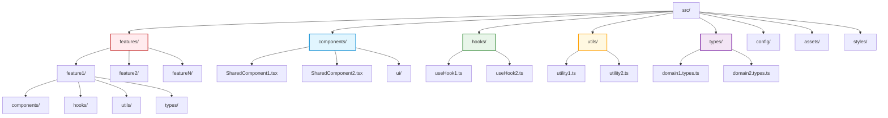
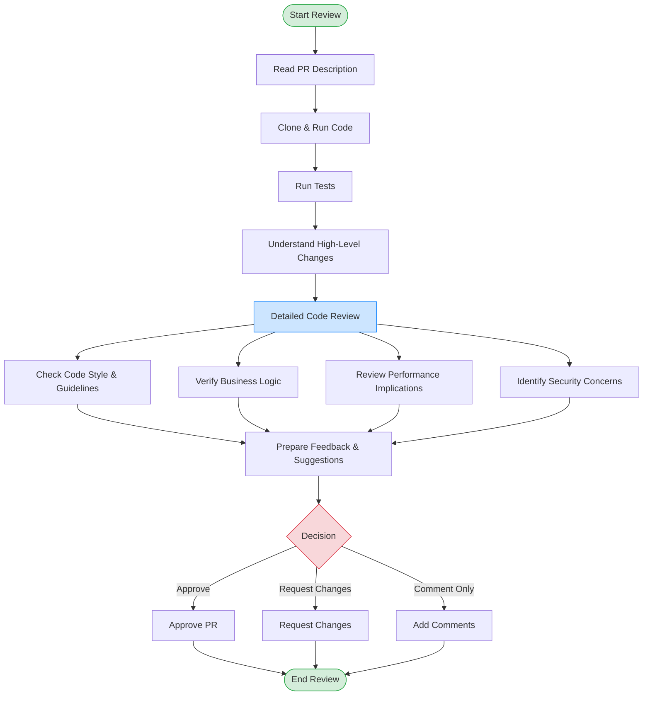

---
title: Best Practices
version: 1.0.0
last_updated: '2025-03-18'
status: Active
tags:
  - documentation
has_mermaid: true
---

# Web Development Best Practices Guide

## Table of Contents

1. [Introduction](#introduction)
2. [Core Development Principles](#core-development-principles)
3. [File and Component Organization](#file-and-component-organization)
4. [Code Modularity and Separation of Concerns](#code-modularity-and-separation-of-concerns)
5. [Type System Best Practices](#type-system-best-practices)
6. [State Management Principles](#state-management-principles)
7. [Project Structure Organization](#project-structure-organization)
8. [UI Components and Design Systems](#ui-components-and-design-systems)
9. [Backend Integration](#backend-integration)
10. [Performance Optimization](#performance-optimization)
11. [Code Review Guidelines](#code-review-guidelines)
12. [Refactoring Decision Process](#refactoring-decision-process)

## Introduction

This guide presents a sequential approach to implementing best practices in modern web development. Each section builds upon previous concepts, providing a comprehensive framework for creating maintainable, scalable applications regardless of the specific technologies used.

## Core Development Principles

### Fundamental Rules

- **Readability First**: Write code that humans can easily read and understand
- **Maintainability**: Code should be structured to accommodate future changes
- **Consistency**: Follow consistent patterns and conventions across the codebase
- **Documentation**: Document why, not what (the code shows what, comments explain why)
- **Testability**: Design code to be easily testable from the start

### Implementation Values

- **Simplicity Over Complexity**: Choose simpler solutions when possible
- **DRY (Don't Repeat Yourself)**: Extract repeated logic into reusable functions
- **YAGNI (You Aren't Gonna Need It)**: Don't build features "just in case"
- **Progressive Enhancement**: Build the core functionality first, then enhance

## File and Component Organization

### File Size Management

- **Maximum File Size**: Keep individual files under 300 lines of code
- **Breaking Down Components**: When a file exceeds this limit, decompose it into smaller, focused components
- **Logical Separation**: Extract related functionality into separate modules that can be composed together

### Warning Signs

- Files exceeding 300 lines
- Functions or components with multiple unrelated responsibilities
- Deeply nested structures
- Multiple complex side effects in a single module

### Example

**Before**: A large 400-line component handling multiple concerns.

**After**: 
- MainComponent.js (250 lines): Core functionality and composition
- SubComponentA.js: Handles one specific feature
- SubComponentB.js: Handles another specific feature
- utils.js: Shared utility functions
- types.js: Shared type definitions

## Code Modularity and Separation of Concerns

### Single Responsibility Principle

- **One Purpose**: Each component, function, or module should have a single, clearly defined purpose
- **Clear Boundaries**: Establish clear responsibility boundaries
- **Composition Over Complexity**: Build complex interfaces from simpler components
- **Related Logic**: Group related logic together, separate unrelated logic

### Sequential Implementation

1. **Identify Responsibilities**: List all responsibilities in a large component
2. **Group Related Tasks**: Organize responsibilities into logical groups
3. **Create Modules**: Transform each group into its own module
4. **Define Interfaces**: Create clear interfaces between modules
5. **Compose Together**: Use composition to rebuild the original functionality

### Example

```javascript
// Before: Mixed concerns
function UserDashboard() {
  // Authentication logic
  // Data fetching logic
  // UI rendering logic
  // Analytics tracking
}

// After: Separated concerns
function UserDashboard() {
  const { user, isAuthenticated } = useAuth(); // Authentication hook
  const { data, loading } = useUserData(user.id); // Data fetching hook
  
  useAnalytics('dashboard_view'); // Analytics hook
  
  return <DashboardUI data={data} loading={loading} />;
}
```

## Type System Best Practices

### Centralization and Reuse

- **Central Type Files**: Define shared types in central files (e.g., `[removed-invalid-reference]`)
- **Avoid Duplication**: Never duplicate type definitions
- **Import Types**: Always import types from central files
- **Share Constants**: Centralize shared constants in appropriate files

### Implementation Process

1. **Audit Types**: Identify all types used in your application
2. **Categorize Types**: Group types by domain or feature
3. **Create Type Files**: Create centralized files for each category
4. **Refactor Imports**: Update imports across the application
5. **Set Standards**: Document type naming conventions and standards

### Example

```typescript
// types/user.ts
export interface User {
  id: string;
  name: string;
  email: string;
  role: UserRole;
}

export type UserRole = 'admin' | 'editor' | 'viewer';

// types/auth.ts
import { User } from './user';

export interface AuthState {
  user: User | null;
  isAuthenticated: boolean;
  token: string | null;
}
```

## State Management Principles

### Custom Logic Extraction

- **Custom Hooks/Stores**: Extract complex stateful logic into custom hooks or stores
- **Location Organization**: Place state management code in dedicated directories
- **Naming Convention**: Use clear naming that indicates purpose
- **Reusability**: Design state management for reusability
- **Testability**: Make state logic easy to test in isolation

### Sequential State Design

1. **Identify State Needs**: Determine what state is needed and where
2. **Categorize State**: Distinguish between local component state and shared state
3. **Design Interface**: Create a clean API for state interactions
4. **Implement Core Logic**: Build the state management functionality
5. **Test in Isolation**: Verify state logic works correctly independently
6. **Integrate with UI**: Connect state management to UI components

### Example

```javascript
// Before: State embedded in component
function ShoppingCart() {
  const [items, setItems] = useState([]);
  
  function addItem(item) {
    setItems([...items, item]);
    localStorage.setItem('cart', JSON.stringify([...items, item]));
  }
  
  function removeItem(itemId) {
    const newItems = items.filter(item => item.id !== itemId);
    setItems(newItems);
    localStorage.setItem('cart', JSON.stringify(newItems));
  }
  
  // Rendering logic
}

// After: Extracted state logic
function useCart() {
  const [items, setItems] = useState([]);
  
  useEffect(() => {
    // Initialize from localStorage
    const savedCart = localStorage.getItem('cart');
    if (savedCart) setItems(JSON.parse(savedCart));
  }, []);
  
  function addItem(item) {
    setItems(prev => {
      const newItems = [...prev, item];
      localStorage.setItem('cart', JSON.stringify(newItems));
      return newItems;
    });
  }
  
  function removeItem(itemId) {
    setItems(prev => {
      const newItems = prev.filter(item => item.id !== itemId);
      localStorage.setItem('cart', JSON.stringify(newItems));
      return newItems;
    });
  }
  
  return { items, addItem, removeItem };
}

function ShoppingCart() {
  const { items, addItem, removeItem } = useCart();
  // Rendering logic only
}
```

## Project Structure Organization

### Organization Principles

- **Feature-Based Organization**: Group related components by feature
- **Logical Hierarchy**: Create a logical folder hierarchy that reflects the application structure
- **Consistent Naming**: Use consistent naming conventions for files and directories
- **Clear Boundaries**: Maintain clear boundaries between different parts of the application

### Recommended Project Structure



### Sequential Organization Process

1. **Analyze Application**: Identify the major features and domains
2. **Create Base Structure**: Establish the root-level directories
3. **Organize by Feature**: Group related files by feature
4. **Establish Shared Resources**: Create directories for shared components/utilities
5. **Define Access Patterns**: Establish how modules import from each other
6. **Document Structure**: Create documentation explaining the organization

### Directory Structure Example

```
src/
├── features/          # Feature-based organization
│   ├── auth/          # Authentication feature
│   ├── products/      # Product-related features
│   └── checkout/      # Checkout flow
├── components/        # Shared components
│   └── ui/            # UI component library
├── hooks/             # Custom hooks
├── utils/             # Utility functions
├── types/             # TypeScript definitions
└── app/               # Application entry points
```

## UI Components and Design Systems

### Component Design Principles

- **Atomic Design**: Build from atoms to molecules to organisms to templates to pages
- **Component Extension**: Create wrapper components when extending UI library components
- **Utility Function**: Use utilities for combining styles and classes
- **Consistent Styling**: Maintain consistent styling patterns across components
- **Accessibility First**: Build accessibility into all UI components from the start

### Sequential Component Development

1. **Identify UI Patterns**: Catalog the UI patterns needed in the application
2. **Create Base Components**: Develop the foundational atomic components
3. **Build Composite Components**: Combine base components into more complex ones
4. **Establish Style System**: Define consistent styling approaches (themes, variables)
5. **Document Usage**: Create component documentation and examples
6. **Test Accessibility**: Ensure all components meet accessibility standards

### Best Practices

- Keep base components simple and focused
- Create wrapper components for complex behavior
- Maintain responsiveness for all screen sizes
- Thoroughly test component interactions
- Document component APIs clearly

## Backend Integration

### Integration Principles

- **Client Separation**: Use appropriate clients for server and client contexts
- **Type Safety**: Always use generated types for backend operations
- **Error Handling**: Implement proper error handling for all backend operations
- **Query Encapsulation**: Encapsulate database queries in dedicated functions
- **Data Fetching Patterns**: Follow established patterns for data fetching

### Sequential Integration Process

1. **Define Data Needs**: Identify the data required by each feature
2. **Design Data Models**: Create models that represent backend data
3. **Build API Layer**: Create functions for communicating with the backend
4. **Implement Error Handling**: Add comprehensive error handling
5. **Add Loading States**: Handle loading states for better UX
6. **Optimize Data Flow**: Implement caching and data optimization strategies

### Example

```typescript
// api/products.ts
import { Product } from '@/types/product';

// API layer function
export async function fetchProducts(category?: string): Promise<Product[]> {
  try {
    const url = new URL('/api/products', window.location.origin);
    if (category) url.searchParams.append('category', category);
    
    const response = await fetch(url.toString());
    
    if (!response.ok) {
      throw new Error(`Error: ${response.status}`);
    }
    
    return response.json();
  } catch (error) {
    console.error('Failed to fetch products:', error);
    throw error;
  }
}

// hooks/useProducts.ts
export function useProducts(category?: string) {
  const [products, setProducts] = useState<Product[]>([]);
  const [loading, setLoading] = useState(true);
  const [error, setError] = useState<Error | null>(null);
  
  useEffect(() => {
    let isMounted = true;
    
    async function getProducts() {
      try {
        setLoading(true);
        const data = await fetchProducts(category);
        if (isMounted) {
          setProducts(data);
          setError(null);
        }
      } catch (err) {
        if (isMounted) {
          setError(err instanceof Error ? err : new Error(String(err)));
        }
      } finally {
        if (isMounted) {
          setLoading(false);
        }
      }
    }
    
    getProducts();
    
    return () => {
      isMounted = false;
    };
  }, [category]);
  
  return { products, loading, error };
}
```

## Performance Optimization

### Optimization Principles

- **Measure First**: Always measure performance before optimizing
- **Progressive Enhancement**: Start with basic functionality, then optimize
- **Critical Path**: Focus on optimizing the critical rendering path
- **User Experience**: Prioritize optimizations that impact user experience
- **Cost/Benefit Analysis**: Evaluate the cost of implementation vs. performance benefit

### Sequential Optimization Process

1. **Establish Baselines**: Measure current performance metrics
2. **Identify Bottlenecks**: Use profiling tools to find performance issues
3. **Prioritize Issues**: Rank issues by user impact and fix complexity
4. **Implement Solutions**: Address issues one by one, starting with highest priority
5. **Verify Improvements**: Re-measure to confirm optimization effectiveness
6. **Document Techniques**: Record successful optimization approaches

### Common Optimization Techniques

- Code splitting and lazy loading
- Memoization of expensive computations
- Virtual scrolling for large lists
- Image optimization and lazy loading
- Service worker caching
- Server-side rendering for initial load
- Optimistic UI updates

## Code Review Guidelines

When reviewing code, check for adherence to these principles:

1. **Readability**: Is the code easy to understand at a glance?
2. **File Size**: Is the file under 300 lines? If not, can it be decomposed?
3. **Single Responsibility**: Does each component have a clear, single purpose?
4. **Type Usage**: Are types consistent and properly defined?
5. **Structure**: Does the file follow the recommended structure?
6. **State Management**: Is state managed appropriately?
7. **Directory Structure**: Is the code organized according to project conventions?
8. **Naming**: Are variables, functions, and components named clearly?
9. **Composition**: Is the code composed of smaller, reusable parts where appropriate?
10. **Duplication**: Is there any duplicated logic that could be centralized?
11. **Testing**: Does the code have appropriate tests?
12. **Performance**: Are there any obvious performance issues?
13. **Accessibility**: Does the UI code follow accessibility best practices?
14. **Error Handling**: Is error handling comprehensive and consistent?

### Code Review Process



## Refactoring Decision Process

When deciding whether to refactor code, follow this sequential process:

1. **Evaluate Current State**:
   - Does the file exceed size limits?
   - Does it violate the single responsibility principle?
   - Is it difficult to understand or test?
   - Is there duplicated logic?

2. **Assess Impact**:
   - How frequently is this code used?
   - How likely is it to change in the future?
   - How much technical debt does it represent?
   - What is the risk of introducing bugs during refactoring?

3. **Plan Refactoring**:
   - Identify the specific issues to address
   - Design the target structure
   - Plan incremental changes
   - Ensure test coverage before starting

4. **Execute Incrementally**:
   - Make small, focused changes
   - Test after each change
   - Commit frequently
   - Document significant decisions

5. **Validate Results**:
   - Verify all tests pass
   - Review the refactored code
   - Ensure performance hasn't regressed
   - Confirm the code is now more maintainable

By following these principles in sequence, you can systematically improve your codebase while minimizing risks.

---

This guide provides a sequential approach to implementing best practices in web development. By applying these principles consistently, you'll build a clean, maintainable, and scalable codebase that can evolve with your project's needs.