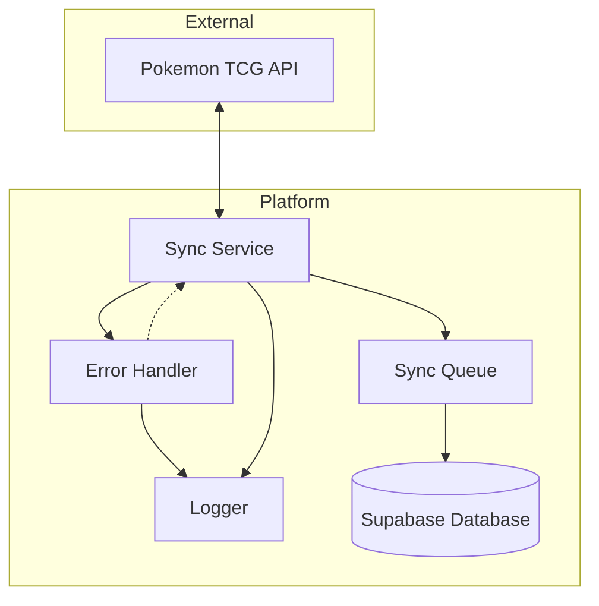
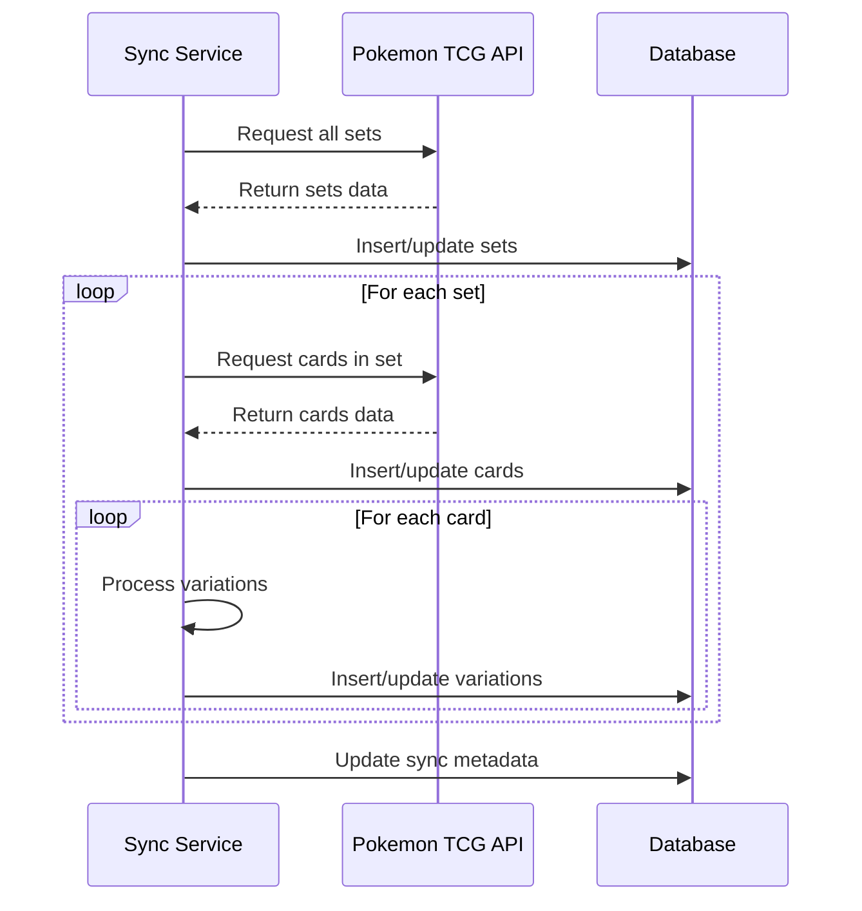
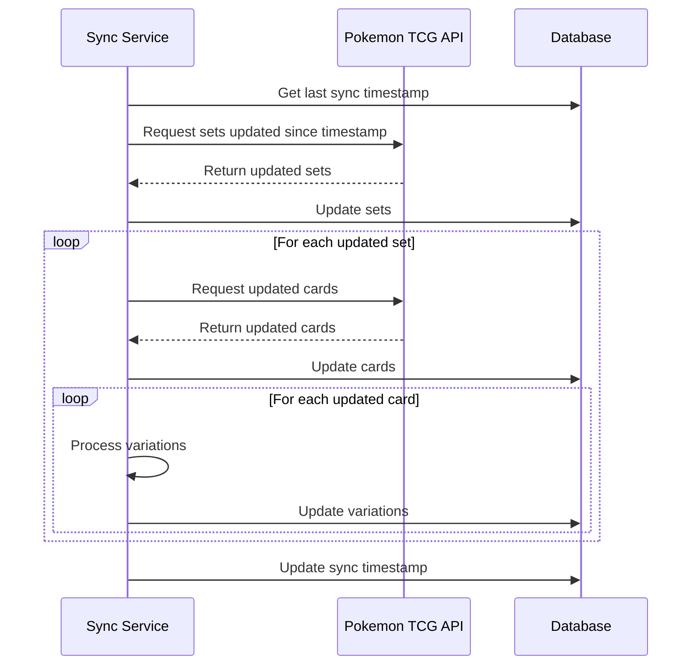
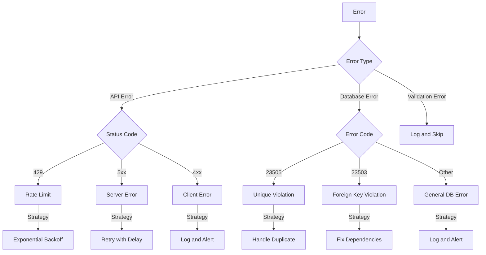
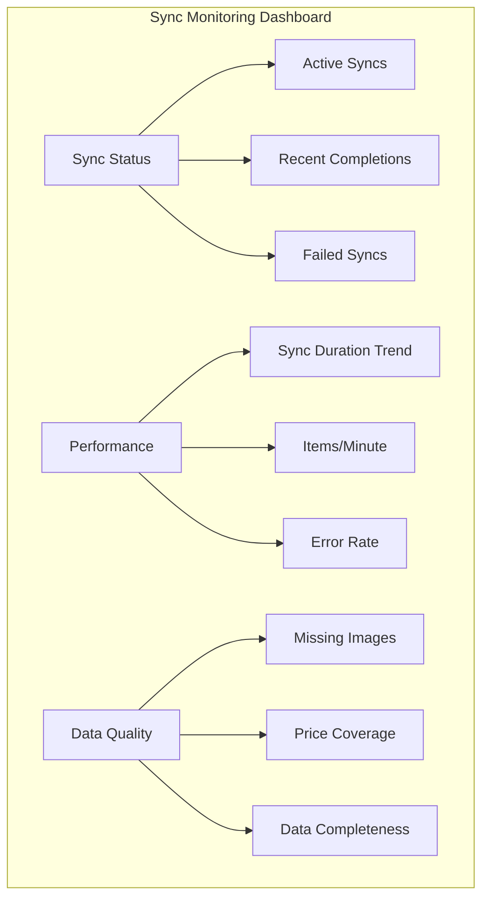
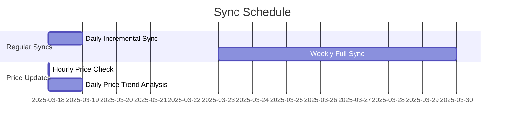

# Pokemon TCG Card Synchronization Process

## Overview

<purpose>
This document details the synchronization process between the Pokemon TCG Trade Platform and the Pokemon TCG API. It covers the workflow, error handling strategies, monitoring, and performance considerations to ensure reliable and efficient data synchronization.
</purpose>

## Synchronization Architecture



## Synchronization Workflow

<workflow>
### Initial Synchronization



### Incremental Synchronization


</workflow>

## API Integration

<api_integration>
### Authentication

The Pokemon TCG API requires an API key for authentication:

```typescript
// src/lib/services/pokemon-tcg-api.ts
import { Pokemon } from 'pokemon-tcg-sdk-typescript';

export class PokemonTcgApiService {
  constructor(private apiKey: string) {
    Pokemon.configure({ apiKey });
  }
  
  // Service methods...
}
```

### Rate Limiting

The Pokemon TCG API has the following rate limits:
- 20,000 requests per day
- Maximum 5 requests per second

Implementation strategy:

```typescript
// src/lib/services/rate-limiter.ts
export class RateLimiter {
  private queue: Array<() => Promise<any>> = [];
  private processing = false;
  private requestsThisSecond = 0;
  private lastRequestTime = 0;
  
  async enqueue<T>(fn: () => Promise<T>): Promise<T> {
    return new Promise((resolve, reject) => {
      this.queue.push(async () => {
        try {
          const result = await fn();
          resolve(result);
        } catch (error) {
          reject(error);
        }
      });
      
      if (!this.processing) {
        this.processQueue();
      }
    });
  }
  
  private async processQueue() {
    if (this.queue.length === 0) {
      this.processing = false;
      return;
    }
    
    this.processing = true;
    
    // Rate limiting logic
    const now = Date.now();
    if (now - this.lastRequestTime < 1000) {
      this.requestsThisSecond++;
      if (this.requestsThisSecond >= 5) {
        // Wait until next second
        const waitTime = 1000 - (now - this.lastRequestTime);
        await new Promise(resolve => setTimeout(resolve, waitTime));
        this.requestsThisSecond = 0;
        this.lastRequestTime = Date.now();
      }
    } else {
      this.requestsThisSecond = 1;
      this.lastRequestTime = now;
    }
    
    const fn = this.queue.shift();
    if (fn) {
      await fn();
    }
    
    // Process next item
    this.processQueue();
  }
}
```
</api_integration>

## Data Processing

<data_processing>
### Set Processing

```typescript
// src/lib/services/set-sync-service.ts
async function syncSets(): Promise<void> {
  const sets = await pokemonTcgApi.getSets();
  
  for (const set of sets) {
    await supabase
      .from('sets')
      .upsert({
        id: set.id,
        name: set.name,
        series: set.series,
        release_date: set.releaseDate,
        total: set.total,
        logo_url: set.images.logo,
        symbol_url: set.images.symbol,
        updated_at: new Date().toISOString(),
      }, {
        onConflict: 'id'
      });
      
    logger.info(`Synced set: ${set.name} (${set.id})`);
  }
}
```

### Card Processing

```typescript
// src/lib/services/card-sync-service.ts
async function syncCardsForSet(setId: string): Promise<void> {
  const cards = await pokemonTcgApi.getCardsBySet(setId);
  
  for (const card of cards) {
    // Insert base card
    await supabase
      .from('cards')
      .upsert({
        id: card.id,
        name: card.name,
        supertype: card.supertype,
        types: card.types || [],
        set_id: card.set.id,
        number: card.number,
        rarity: card.rarity,
        rarity_code: getRarityCode(card.rarity),
        card_era: getCardEra(card.set.id),
        language: 'English',
        image_small: card.images.small,
        image_large: card.images.large,
        pokemon_generation: getPokemonGeneration(card),
        updated_at: new Date().toISOString(),
      }, {
        onConflict: 'id'
      });
    
    // Process variations
    await processCardVariations(card);
    
    logger.info(`Synced card: ${card.name} (${card.id})`);
  }
}
```

### Variation Processing

```typescript
// src/lib/services/variation-sync-service.ts
async function processCardVariations(card: any): Promise<void> {
  // Standard variation
  await supabase
    .from('card_variations')
    .upsert({
      card_id: card.id,
      variation_type: 'Standard',
      treatment: card.tcgplayer?.prices?.normal ? 'Normal' : null,
      is_special_rarity: false,
      image_url: card.images.large,
      tcg_api_price_key: 'normal',
      created_at: new Date().toISOString(),
    }, {
      onConflict: 'card_id, variation_type'
    });
  
  // Holofoil variation if exists
  if (card.tcgplayer?.prices?.holofoil) {
    await supabase
      .from('card_variations')
      .upsert({
        card_id: card.id,
        variation_type: 'Holofoil',
        treatment: 'Holofoil',
        holofoil_pattern: 'Standard',
        is_special_rarity: false,
        image_url: card.images.large,
        tcg_api_price_key: 'holofoil',
        created_at: new Date().toISOString(),
      }, {
        onConflict: 'card_id, variation_type'
      });
  }
  
  // Additional variations based on tcgplayer prices
  const prices = card.tcgplayer?.prices || {};
  
  if (prices.reverseHolofoil) {
    await createVariation(card.id, 'Reverse Holofoil', 'reverseHolofoil');
  }
  
  if (prices.firstEdition) {
    await createVariation(card.id, 'First Edition', 'firstEdition');
  }
  
  // Special variations
  if (card.rarity === 'Rare Holo' && card.id.includes('swsh')) {
    await createVariation(card.id, 'Etched Holo', 'etchedHolofoil');
  }
}
```
</data_processing>

## Error Handling

<error_handling>
### Error Types and Strategies



### Implementation

```typescript
// src/lib/services/error-handler.ts
export class SyncErrorHandler {
  private retryCount: Map<string, number> = new Map();
  private maxRetries = 5;
  
  async handleError(error: any, context: any): Promise<boolean> {
    const errorId = `${context.type}:${context.id}`;
    const currentRetries = this.retryCount.get(errorId) || 0;
    
    if (currentRetries >= this.maxRetries) {
      await this.logFatalError(error, context);
      return false; // Don't retry
    }
    
    this.retryCount.set(errorId, currentRetries + 1);
    
    if (error.response?.status === 429) {
      // Rate limit error
      const delay = Math.pow(2, currentRetries) * 1000; // Exponential backoff
      logger.warn(`Rate limited. Retrying in ${delay}ms`, { context });
      await new Promise(resolve => setTimeout(resolve, delay));
      return true; // Retry
    }
    
    if (error.response?.status >= 500) {
      // Server error
      const delay = 5000; // 5 seconds
      logger.error(`Server error. Retrying in ${delay}ms`, { error, context });
      await new Promise(resolve => setTimeout(resolve, delay));
      return true; // Retry
    }
    
    if (error.code === '23505') {
      // Unique violation - handle duplicate
      logger.warn(`Duplicate entry detected`, { error, context });
      await this.handleDuplicate(context);
      return false; // Don't retry, already handled
    }
    
    // Other errors
    logger.error(`Sync error`, { error, context });
    return false; // Don't retry
  }
  
  private async logFatalError(error: any, context: any): Promise<void> {
    logger.error(`Fatal sync error after ${this.maxRetries} retries`, { error, context });
    
    // Record in database for admin review
    await supabase
      .from('sync_errors')
      .insert({
        error_type: error.name || 'Unknown',
        error_message: error.message || 'No message',
        error_stack: error.stack || 'No stack trace',
        context: context,
        retry_count: this.maxRetries,
        created_at: new Date().toISOString(),
      });
    
    // Alert administrators
    await this.sendErrorAlert(error, context);
  }
  
  private async handleDuplicate(context: any): Promise<void> {
    // Implementation depends on the specific context
    // For example, for card variations:
    if (context.type === 'card_variation') {
      await supabase
        .from('card_variations')
        .update({ updated_at: new Date().toISOString() })
        .match({ card_id: context.card_id, variation_type: context.variation_type });
    }
  }
  
  private async sendErrorAlert(error: any, context: any): Promise<void> {
    // Implementation depends on the alerting system
    // Could be email, Slack, etc.
  }
}
```
</error_handling>

## Monitoring and Logging

<monitoring>
### Metrics Tracked

1. **Sync Performance Metrics**:
   - Total sync duration
   - Cards processed per minute
   - API requests per minute
   - Database operations per minute

2. **Error Metrics**:
   - Error rate by type
   - Retry count
   - Failed items

3. **Data Quality Metrics**:
   - Missing images
   - Incomplete card data
   - Price availability percentage

### Logging Implementation

```typescript
// src/lib/services/sync-logger.ts
export class SyncLogger {
  private syncId: string;
  private startTime: number;
  private counters: Record<string, number> = {
    sets_processed: 0,
    cards_processed: 0,
    variations_processed: 0,
    errors: 0,
    retries: 0,
  };
  
  constructor() {
    this.syncId = uuidv4();
    this.startTime = Date.now();
  }
  
  incrementCounter(counter: string, amount = 1): void {
    this.counters[counter] = (this.counters[counter] || 0) + amount;
  }
  
  async logSyncStart(): Promise<void> {
    await supabase
      .from('sync_logs')
      .insert({
        sync_id: this.syncId,
        status: 'started',
        start_time: new Date().toISOString(),
      });
  }
  
  async logSyncComplete(): Promise<void> {
    const duration = Date.now() - this.startTime;
    
    await supabase
      .from('sync_logs')
      .update({
        status: 'completed',
        end_time: new Date().toISOString(),
        duration_ms: duration,
        sets_processed: this.counters.sets_processed,
        cards_processed: this.counters.cards_processed,
        variations_processed: this.counters.variations_processed,
        error_count: this.counters.errors,
        retry_count: this.counters.retries,
      })
      .match({ sync_id: this.syncId });
  }
  
  async logSyncError(error: any): Promise<void> {
    await supabase
      .from('sync_logs')
      .update({
        status: 'failed',
        end_time: new Date().toISOString(),
        error_message: error.message || 'Unknown error',
        error_stack: error.stack || 'No stack trace',
      })
      .match({ sync_id: this.syncId });
  }
  
  async logItemProcessed(type: 'set' | 'card' | 'variation', id: string): Promise<void> {
    this.incrementCounter(`${type}s_processed`);
    
    // For detailed logging, can also log each item
    if (process.env.DETAILED_LOGGING === 'true') {
      await supabase
        .from('sync_item_logs')
        .insert({
          sync_id: this.syncId,
          item_type: type,
          item_id: id,
          processed_at: new Date().toISOString(),
        });
    }
  }
}
```

### Dashboard

The admin dashboard displays sync metrics and status:


</monitoring>

## Scheduling and Automation

<scheduling>
### Sync Schedule



### Implementation

```typescript
// src/lib/services/sync-scheduler.ts
import cron from 'node-cron';

export class SyncScheduler {
  constructor(
    private syncService: SyncService,
    private priceService: PriceService
  ) {}
  
  startScheduler(): void {
    // Daily incremental sync at 2 AM
    cron.schedule('0 2 * * *', async () => {
      await this.syncService.runIncrementalSync();
    });
    
    // Weekly full sync on Sundays at 3 AM
    cron.schedule('0 3 * * 0', async () => {
      await this.syncService.runFullSync();
    });
    
    // Hourly price updates
    cron.schedule('0 * * * *', async () => {
      await this.priceService.updatePrices();
    });
    
    // Daily price trend analysis at 4 AM
    cron.schedule('0 4 * * *', async () => {
      await this.priceService.analyzePriceTrends();
    });
  }
}
```
</scheduling>

## Troubleshooting Guide

<troubleshooting>
### Common Issues and Resolutions

| Issue | Symptoms | Resolution |
|-------|----------|------------|
| API Rate Limiting | 429 errors, slow sync | Reduce concurrency, implement backoff |
| Duplicate Variations | Unique constraint errors | Run cleanup script, check variation processing logic |
| Missing Images | Cards without images | Check API response, verify URL format |
| Incomplete Syncs | Some sets missing | Check for errors in logs, restart sync |
| Price Data Gaps | Cards without prices | Verify TCG API price keys, check price mapping |

### Diagnostic Queries

```sql
-- Find cards without images
SELECT id, name, set_id
FROM cards
WHERE image_large IS NULL OR image_small IS NULL;

-- Find variations with duplicate keys
SELECT card_id, variation_type, COUNT(*)
FROM card_variations
GROUP BY card_id, variation_type
HAVING COUNT(*) > 1;

-- Check sync completion status
SELECT 
    s.id as set_id,
    s.name as set_name,
    COUNT(c.id) as card_count,
    s.total as expected_count,
    CASE 
        WHEN COUNT(c.id) = s.total THEN 'Complete'
        ELSE 'Incomplete'
    END as status
FROM sets s
LEFT JOIN cards c ON s.id = c.set_id
GROUP BY s.id, s.name, s.total
ORDER BY status, s.release_date DESC;
```

### Manual Sync Commands

```bash
# Run full sync
npm run sync:full

# Run incremental sync
npm run sync:incremental

# Sync specific set
npm run sync:set -- --setId=swsh12

# Fix variations for a set
npm run sync:fix-variations -- --setId=swsh12

# Validate sync data
npm run sync:validate
```
</troubleshooting>

## Related Documentation

<related_docs>
- [Enhanced Database Documentation](enhanced-database-documentation.md)
- [Pokemon TCG API TypeScript SDK](pokemontcg.io-typescript-sdk.md)
- [Sync Progress](sync-progress.md)
</related_docs>
