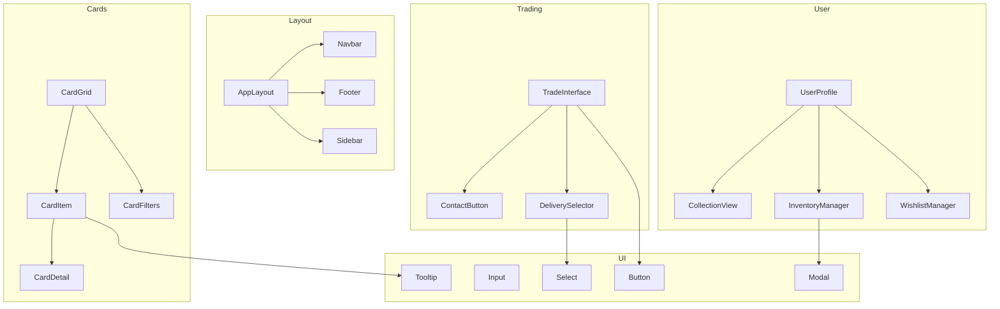

# Pokemon TCG Trade Platform Component Catalog

## Overview

<purpose>
This document catalogs the core React components used in the Pokemon TCG Trade Platform, detailing their purpose, props, usage examples, and relationships. This documentation is designed to be both human-readable and AI-friendly.
</purpose>

## Component Architecture



## Core Components

### Layout Components

<component id="AppLayout">
**Name**: `AppLayout`

**Purpose**: Main layout wrapper for the application

**File Location**: `src/components/layout/AppLayout.tsx` (planned)

**Props**:
```typescript
interface AppLayoutProps {
  children: React.ReactNode;
  showSidebar?: boolean;
  fluid?: boolean;
}
```

**Usage Example**:
```tsx
<AppLayout showSidebar={true}>
  <HomePage />
</AppLayout>
```

**Implementation**:
```tsx
import React from 'react';
import Navbar from './Navbar';
import Sidebar from './Sidebar';
import Footer from './Footer';

export default function AppLayout({
  children,
  showSidebar = true,
  fluid = false
}: AppLayoutProps) {
  return (
    <div className="min-h-screen flex flex-col">
      <Navbar />
      <div className="flex flex-1">
        {showSidebar && <Sidebar />}
        <main className={`flex-1 ${fluid ? 'px-4' : 'container mx-auto px-4'}`}>
          {children}
        </main>
      </div>
      <Footer />
    </div>
  );
}
```
</component>

<component id="Navbar">
**Name**: `Navbar`

**Purpose**: Top navigation bar with search and user menu

**File Location**: `src/components/layout/Navbar.tsx` (planned)

**Props**:
```typescript
interface NavbarProps {
  transparent?: boolean;
}
```

**Usage Example**:
```tsx
<Navbar transparent={false} />
```

**Implementation**:
```tsx
import React, { useState } from 'react';
import Link from 'next/link';
import { useSupabaseClient, useUser } from '@supabase/auth-helpers-react';
import { SearchBar } from '../search/SearchBar';
import { UserMenu } from '../user/UserMenu';
import { Button } from '../ui/Button';

export default function Navbar({ transparent = false }: NavbarProps) {
  const supabase = useSupabaseClient();
  const user = useUser();
  const [isMenuOpen, setIsMenuOpen] = useState(false);
  
  return (
    <nav className={`py-4 ${transparent ? 'bg-transparent' : 'bg-primary'}`}>
      <div className="container mx-auto px-4 flex items-center justify-between">
        <div className="flex items-center">
          <Link href="/" className="text-xl font-bold text-white mr-8">
            Pokemon TCG Trade
          </Link>
          <div className="hidden md:block w-64">
            <SearchBar />
          </div>
        </div>
        
        <div className="flex items-center">
          {user ? (
            <UserMenu user={user} />
          ) : (
            <div>
              <Button variant="ghost" asChild>
                <Link href="/login">Log In</Link>
              </Button>
              <Button variant="secondary" asChild className="ml-2">
                <Link href="/signup">Sign Up</Link>
              </Button>
            </div>
          )}
        </div>
      </div>
    </nav>
  );
}
```
</component>

### Card Components

<component id="CardGrid">
**Name**: `CardGrid`

**Purpose**: Displays a grid of card items with filtering and pagination

**File Location**: `src/components/cards/CardGrid.tsx` (planned)

**Props**:
```typescript
interface CardGridProps {
  cards: CardType[];
  isLoading?: boolean;
  onPageChange?: (page: number) => void;
  totalPages?: number;
  currentPage?: number;
  filters?: CardFilters;
  onFilterChange?: (filters: CardFilters) => void;
}

interface CardType {
  id: string;
  name: string;
  imageUrl: string;
  set: {
    id: string;
    name: string;
  };
  rarity: string;
  price?: number;
}

interface CardFilters {
  set?: string;
  rarity?: string;
  type?: string;
  minPrice?: number;
  maxPrice?: number;
}
```

**Usage Example**:
```tsx
<CardGrid
  cards={cards}
  isLoading={isLoading}
  totalPages={10}
  currentPage={1}
  onPageChange={handlePageChange}
  filters={filters}
  onFilterChange={handleFilterChange}
/>
```

**Implementation**:
```tsx
import React from 'react';
import CardItem from './CardItem';
import CardFilters from './CardFilters';
import Pagination from '../ui/Pagination';
import LoadingGrid from '../ui/LoadingGrid';

export default function CardGrid({
  cards,
  isLoading = false,
  onPageChange,
  totalPages = 1,
  currentPage = 1,
  filters,
  onFilterChange
}: CardGridProps) {
  if (isLoading) {
    return <LoadingGrid count={20} />;
  }
  
  return (
    <div className="space-y-6">
      {filters && onFilterChange && (
        <CardFilters filters={filters} onChange={onFilterChange} />
      )}
      
      {cards.length === 0 ? (
        <div className="text-center py-12">
          <h3 className="text-lg font-medium">No cards found</h3>
          <p className="text-gray-500">Try adjusting your filters</p>
        </div>
      ) : (
        <div className="grid grid-cols-2 sm:grid-cols-3 md:grid-cols-4 lg:grid-cols-5 gap-4">
          {cards.map(card => (
            <CardItem key={card.id} card={card} />
          ))}
        </div>
      )}
      
      {totalPages > 1 && (
        <Pagination
          currentPage={currentPage}
          totalPages={totalPages}
          onChange={onPageChange}
        />
      )}
    </div>
  );
}
```
</component>

<component id="CardItem">
**Name**: `CardItem`

**Purpose**: Displays a single card with image and basic info

**File Location**: `src/components/cards/CardItem.tsx` (planned)

**Props**:
```typescript
interface CardItemProps {
  card: {
    id: string;
    name: string;
    imageUrl: string;
    set: {
      id: string;
      name: string;
    };
    rarity?: string;
    price?: number;
  };
  showPrice?: boolean;
  onClick?: () => void;
}
```

**Usage Example**:
```tsx
<CardItem
  card={{
    id: "swsh12-123",
    name: "Charizard V",
    imageUrl: "https://images.pokemontcg.io/swsh12/123.png",
    set: {
      id: "swsh12",
      name: "Silver Tempest"
    },
    rarity: "Rare Holo",
    price: 12.99
  }}
  showPrice={true}
  onClick={() => router.push(`/cards/swsh12-123`)}
/>
```

**Implementation**:
```tsx
import React from 'react';
import Image from 'next/image';
import Link from 'next/link';
import { formatCurrency } from '@/lib/utils/format';

export default function CardItem({
  card,
  showPrice = false,
  onClick
}: CardItemProps) {
  return (
    <div
      className="rounded-lg overflow-hidden shadow-md hover:shadow-lg transition-shadow duration-200 bg-white"
      onClick={onClick}
    >
      <Link href={`/cards/${card.id}`} className="block">
        <div className="aspect-[2.5/3.5] relative">
          <Image
            src={card.imageUrl}
            alt={card.name}
            fill
            sizes="(max-width: 768px) 100vw, (max-width: 1200px) 50vw, 33vw"
            className="object-contain"
          />
        </div>
        <div className="p-3">
          <h3 className="font-medium text-sm truncate" title={card.name}>
            {card.name}
          </h3>
          <p className="text-xs text-gray-500">{card.set.name}</p>
          {showPrice && card.price && (
            <p className="text-sm font-bold mt-1 text-primary">
              {formatCurrency(card.price)}
            </p>
          )}
        </div>
      </Link>
    </div>
  );
}
```
</component>

### User Components

<component id="UserProfile">
**Name**: `UserProfile`

**Purpose**: Displays a user's profile with collections and inventory

**File Location**: `src/components/user/UserProfile.tsx` (planned)

**Props**:
```typescript
interface UserProfileProps {
  username: string;
  isCurrentUser?: boolean;
}
```

**Usage Example**:
```tsx
<UserProfile username="pokemon_master" isCurrentUser={true} />
```

**Implementation**:
```tsx
import React, { useState, useEffect } from 'react';
import { useSupabaseClient } from '@supabase/auth-helpers-react';
import { Tabs, TabsContent, TabsList, TabsTrigger } from '../ui/Tabs';
import CollectionView from './CollectionView';
import InventoryManager from './InventoryManager';
import WishlistManager from './WishlistManager';
import UserStats from './UserStats';
import UserHeader from './UserHeader';

export default function UserProfile({
  username,
  isCurrentUser = false
}: UserProfileProps) {
  const [user, setUser] = useState<any>(null);
  const [loading, setLoading] = useState(true);
  const supabase = useSupabaseClient();
  
  useEffect(() => {
    async function loadUser() {
      setLoading(true);
      
      const { data, error } = await supabase
        .from('users')
        .select(`
          id, username, profile_slug, profile_image_url, bio, location,
          created_at
        `)
        .eq('username', username)
        .single();
      
      if (error) {
        console.error('Error loading user:', error);
      } else {
        setUser(data);
      }
      
      setLoading(false);
    }
    
    loadUser();
  }, [username, supabase]);
  
  if (loading) {
    return <div>Loading profile...</div>;
  }
  
  if (!user) {
    return <div>User not found</div>;
  }
  
  return (
    <div className="space-y-6">
      <UserHeader user={user} isCurrentUser={isCurrentUser} />
      
      <UserStats userId={user.id} />
      
      <Tabs defaultValue="collection">
        <TabsList>
          <TabsTrigger value="collection">Collection</TabsTrigger>
          <TabsTrigger value="inventory">Inventory</TabsTrigger>
          <TabsTrigger value="wishlist">Wishlist</TabsTrigger>
        </TabsList>
        
        <TabsContent value="collection">
          <CollectionView
            userId={user.id}
            editable={isCurrentUser}
          />
        </TabsContent>
        
        <TabsContent value="inventory">
          <InventoryManager
            userId={user.id}
            editable={isCurrentUser}
          />
        </TabsContent>
        
        <TabsContent value="wishlist">
          <WishlistManager
            userId={user.id}
            editable={isCurrentUser}
          />
        </TabsContent>
      </Tabs>
    </div>
  );
}
```
</component>

### Trading Components

<component id="ContactButton">
**Name**: `ContactButton`

**Purpose**: Button to initiate WhatsApp contact with a seller

**File Location**: `src/components/trading/ContactButton.tsx` (planned)

**Props**:
```typescript
interface ContactButtonProps {
  whatsappNumber: string;
  cardName: string;
  inventoryId: string;
  variant?: 'primary' | 'secondary' | 'outline';
  size?: 'sm' | 'md' | 'lg';
  fullWidth?: boolean;
}
```

**Usage Example**:
```tsx
<ContactButton
  whatsappNumber="5551234567890"
  cardName="Charizard V"
  inventoryId="inv_123"
  variant="primary"
  size="md"
/>
```

**Implementation**:
```tsx
import React from 'react';
import { Button } from '../ui/Button';
import { FaWhatsapp } from 'react-icons/fa';
import { useSupabaseClient } from '@supabase/auth-helpers-react';

export default function ContactButton({
  whatsappNumber,
  cardName,
  inventoryId,
  variant = 'primary',
  size = 'md',
  fullWidth = false
}: ContactButtonProps) {
  const supabase = useSupabaseClient();
  
  const handleContact = async () => {
    // Log contact attempt
    await supabase
      .from('contact_logs')
      .insert({
        inventory_id: inventoryId,
        created_at: new Date().toISOString()
      });
    
    // Format WhatsApp number
    const formattedNumber = whatsappNumber.startsWith('+')
      ? whatsappNumber.substring(1)
      : whatsappNumber;
    
    // Create message
    const message = encodeURIComponent(
      `Hi! I'm interested in your ${cardName} card on Pokemon TCG Trade Platform.`
    );
    
    // Open WhatsApp
    window.open(`https://wa.me/${formattedNumber}?text=${message}`, '_blank');
  };
  
  return (
    <Button
      variant={variant}
      size={size}
      onClick={handleContact}
      className={`flex items-center ${fullWidth ? 'w-full' : ''}`}
    >
      <FaWhatsapp className="mr-2" />
      Contact Seller
    </Button>
  );
}
```
</component>

### UI Components

<component id="Button">
**Name**: `Button`

**Purpose**: Reusable button component with various styles

**File Location**: `src/components/ui/Button.tsx` (planned)

**Props**:
```typescript
interface ButtonProps extends React.ButtonHTMLAttributes<HTMLButtonElement> {
  variant?: 'primary' | 'secondary' | 'outline' | 'ghost' | 'link';
  size?: 'sm' | 'md' | 'lg';
  isLoading?: boolean;
  leftIcon?: React.ReactNode;
  rightIcon?: React.ReactNode;
  asChild?: boolean;
}
```

**Usage Example**:
```tsx
<Button
  variant="primary"
  size="md"
  isLoading={isSubmitting}
  leftIcon={<FaSave />}
  onClick={handleSave}
>
  Save Changes
</Button>
```

**Implementation**:
```tsx
import React, { forwardRef } from 'react';
import { Slot } from '@radix-ui/react-slot';
import { cva, type VariantProps } from 'class-variance-authority';
import { Spinner } from './Spinner';

const buttonVariants = cva(
  "inline-flex items-center justify-center rounded-md font-medium transition-colors focus-visible:outline-none focus-visible:ring-2 focus-visible:ring-offset-2 disabled:opacity-50 disabled:pointer-events-none",
  {
    variants: {
      variant: {
        primary: "bg-primary text-white hover:bg-primary-dark",
        secondary: "bg-secondary text-white hover:bg-secondary-dark",
        outline: "border border-input bg-background hover:bg-accent hover:text-accent-foreground",
        ghost: "hover:bg-accent hover:text-accent-foreground",
        link: "text-primary underline-offset-4 hover:underline",
      },
      size: {
        sm: "h-8 px-3 text-xs",
        md: "h-10 px-4 py-2",
        lg: "h-12 px-6 text-lg",
      },
    },
    defaultVariants: {
      variant: "primary",
      size: "md",
    },
  }
);

const Button = forwardRef<HTMLButtonElement, ButtonProps>(({
  className,
  variant,
  size,
  isLoading = false,
  leftIcon,
  rightIcon,
  asChild = false,
  children,
  ...props
}, ref) => {
  const Comp = asChild ? Slot : "button";
  
  return (
    <Comp
      className={buttonVariants({ variant, size, className })}
      ref={ref}
      disabled={isLoading || props.disabled}
      {...props}
    >
      {isLoading && (
        <Spinner className="mr-2" />
      )}
      {!isLoading && leftIcon && (
        <span className="mr-2">{leftIcon}</span>
      )}
      {children}
      {rightIcon && (
        <span className="ml-2">{rightIcon}</span>
      )}
    </Comp>
  );
});

Button.displayName = "Button";

export { Button, buttonVariants };
```
</component>

## Component Usage Patterns

<usage_patterns>
### Card Display Pattern

For displaying cards in various contexts:

```tsx
// Grid view for search results
<CardGrid
  cards={searchResults}
  isLoading={isSearching}
  totalPages={pagination.totalPages}
  currentPage={pagination.currentPage}
  onPageChange={handlePageChange}
  filters={filters}
  onFilterChange={handleFilterChange}
/>

// Compact view for collection
<CollectionGrid
  cards={collectionCards}
  isLoading={isLoading}
  editable={isOwner}
  onCardClick={handleCardClick}
  onCardRemove={handleCardRemove}
/>

// Detail view for single card
<CardDetail
  card={card}
  showPriceHistory={true}
  showAvailability={true}
  onAddToCollection={handleAddToCollection}
  onAddToWishlist={handleAddToWishlist}
/>
```

### Form Patterns

For consistent form handling:

```tsx
// Card listing form
<CardListingForm
  initialValues={initialValues}
  onSubmit={handleSubmit}
  isSubmitting={isSubmitting}
/>

// Search form
<SearchForm
  defaultValues={defaultSearchParams}
  onSubmit={handleSearch}
  advanced={showAdvancedSearch}
  onToggleAdvanced={toggleAdvancedSearch}
/>
```
</usage_patterns>

## Accessibility Considerations

<accessibility>
### Keyboard Navigation

All interactive components support keyboard navigation:

- `CardGrid` supports arrow key navigation between cards
- `Tabs` components follow WAI-ARIA tab pattern
- `Modal` components trap focus when open

### Screen Reader Support

- All images have appropriate alt text
- Interactive elements have aria labels
- Dynamic content changes announce updates

### Color Contrast

- All text meets WCAG AA standards for contrast
- Focus states are clearly visible
- Interactive elements have hover/focus states
</accessibility>

## Theming System

<theming>
The component library uses a consistent theming system:

```typescript
// src/styles/theme.ts
export const theme = {
  colors: {
    primary: {
      light: '#4dabf7',
      DEFAULT: '#228be6',
      dark: '#1971c2',
    },
    secondary: {
      light: '#f783ac',
      DEFAULT: '#e64980',
      dark: '#d6336c',
    },
    // Other color definitions
  },
  fontSizes: {
    xs: '0.75rem',
    sm: '0.875rem',
    md: '1rem',
    lg: '1.125rem',
    xl: '1.25rem',
    '2xl': '1.5rem',
    // Other size definitions
  },
  // Other theme properties
};
```

Components use these theme values via Tailwind CSS classes or CSS variables.
</theming>

## Related Documentation

<related_docs>
- [API Reference](./api-reference.md): API endpoints used by components
- [Inventory Data Model](./inventory-management/data-model.md): Database schema referenced by components
- [Frontend Architecture](./frontend-architecture.md): Overall frontend architecture
</related_docs>
