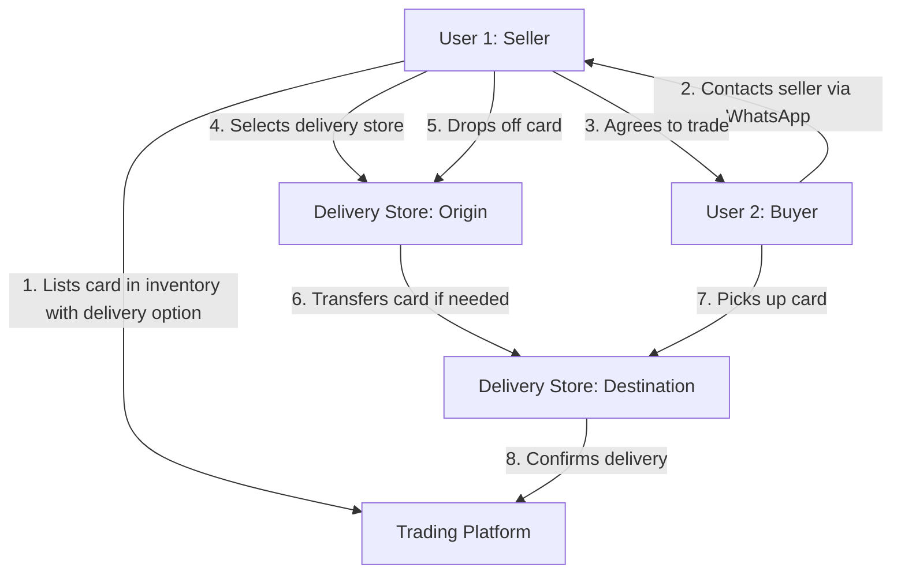

---
title: "Pokemon TCG Trade Platform - Delivery System Documentation"
version: "1.0.0"
last_updated: "2023-11-18"
status: "In Development"
owner: "Platform Team"
related_docs:
  - path: "docs/user-trading-flow.md"
  - path: "docs/whatsapp-integration.md"
  - path: "docs/inventory-management/overview.md"
tags:
  - "delivery"
  - "trading-platform"
  - "pokemon-tcg"
---

# Delivery System Documentation

## Overview

<purpose>
The Delivery System is a key component of the Pokemon TCG Trade Platform that facilitates the physical exchange of cards between users. Rather than implementing direct shipping, the platform leverages a network of partner stores ("delivery stores") where users can drop off and pick up cards, creating a convenient and secure trading environment specific to the Costa Rican market.
</purpose>

## System Architecture



## Database Structure

<database_structure>
### Primary Tables

#### delivery_stores
Stores information about physical delivery locations.

| Column Name  | Data Type | Description                    |
|--------------|-----------|--------------------------------|
| id           | uuid      | Primary Key                    |
| name         | text      | Store name                     |
| location     | text      | Store location/area            |
| network      | text      | Store network/brand            |
| address      | text      | Store address                  |
| contact_info | text      | Contact information            |
| created_at   | timestamp | Record creation timestamp      |

#### store_connections
Maps store-to-store delivery connections.

| Column Name   | Data Type | Description                        |
|---------------|-----------|----------------------------------- |
| id            | uuid      | Primary Key                        |
| from_store_id | uuid      | Foreign key to delivery_stores.id  |
| to_store_id   | uuid      | Foreign key to delivery_stores.id  |
| created_at    | timestamp | Record creation timestamp          |

### Views

#### store_delivery_options
View showing all possible delivery connections between stores.

| Column Name     | Data Type | Description                           |
|-----------------|-----------|---------------------------------------|
| from_store_id   | uuid      | Source store ID                       |
| from_store_name | text      | Source store name                     |
| from_location   | text      | Source store location                 |
| to_store_id     | uuid      | Destination store ID                  |
| to_store_name   | text      | Destination store name                |
| to_location     | text      | Destination store location            |
</database_structure>

## Delivery Flow Process

<process>
### 1. Inventory Listing with Delivery Option

When a user lists a card in their trading inventory, they can specify:
- Whether the card is available for delivery
- Which delivery store they prefer to use for drop-off

This information is stored in the `inventory` table:
```sql
-- Example inventory record with delivery option
INSERT INTO inventory (
  user_id, card_id, variation_id, condition, 
  quantity, price, is_tradeable, 
  delivery_from_id, is_visible
) VALUES (
  'user-uuid', 'card-id', 'variation-uuid', 'NM',
  1, 25.99, true, 'store-uuid', true
);
```

### 2. Trading Negotiation

Users communicate via WhatsApp to negotiate trades. During this process:
- The seller confirms availability of the card
- The buyer and seller agree on price and delivery details
- They select a convenient delivery store for pickup

### 3. Card Drop-off

The seller takes the card to their selected delivery store:
- Store verifies the card condition
- Store logs the receipt of the card in their system
- Store notifies the buyer that the card is available (or in transit)

### 4. Store-to-Store Transfer (if needed)

If the drop-off and pickup stores are different:
- The card is transferred between connected stores
- Transfer is tracked in the store network system
- Buyer is notified when the card reaches the destination store

### 5. Card Pickup

The buyer picks up the card from the designated store:
- Buyer verifies the card condition
- Store logs the completion of the transaction
- Platform is notified of successful delivery
</process>

## Store Network Management

<store_network>
### Adding New Stores

Stores are added to the network through the admin interface:

```sql
-- Example of adding a new store
INSERT INTO delivery_stores (name, location, network, address, contact_info)
VALUES (
  'Card Haven', 'San José', 'CCG Stores', 
  '123 Central Avenue, San José, Costa Rica',
  'Phone: +506 2222-3333, Email: info@cardhaven.cr'
);
```

### Creating Store Connections

Store connections define which stores can exchange cards:

```sql
-- Example of connecting two stores
INSERT INTO store_connections (from_store_id, to_store_id)
VALUES 
  ('store1-uuid', 'store2-uuid'),
  ('store2-uuid', 'store1-uuid'); -- Bidirectional connection
```

### Viewing Delivery Options

Users can view available delivery options using the `store_delivery_options` view:

```sql
-- Query to find all delivery options from a specific area
SELECT * FROM store_delivery_options
WHERE from_location = 'San José';
```
</store_network>

## User Interface Components

<ui_components>
### Seller Interface

The seller interface includes:
- Delivery store selection dropdown in inventory listing form
- Integration with local store network information
- Delivery status tracking for active trades

**Implementation File**: `src/components/inventory/DeliveryOptions.tsx` (planned)

### Buyer Interface

The buyer interface includes:
- Visibility of delivery options for each card in the marketplace
- Store location maps integration
- Pickup scheduling functionality

**Implementation File**: `src/components/trade/StorePickupSelection.tsx` (planned)

### Admin Interface

The admin interface includes:
- Store network management dashboard
- Connection mapping tools
- Store performance analytics
- Issue resolution system

**Implementation File**: `src/app/admin/delivery-network/page.tsx` (planned)
</ui_components>

## API Endpoints

<api_endpoints>
### Store Management Endpoints

#### `GET /api/delivery/stores`
Returns a list of all delivery stores.

**Response Schema**:
```json
{
  "stores": [
    {
      "id": "uuid",
      "name": "Card Haven",
      "location": "San José",
      "network": "CCG Stores",
      "address": "123 Central Avenue, San José, Costa Rica",
      "contact_info": "Phone: +506 2222-3333, Email: info@cardhaven.cr"
    },
    // More stores...
  ]
}
```

#### `GET /api/delivery/stores/{storeId}`
Returns details for a specific store.

#### `POST /api/delivery/stores`
Creates a new delivery store (admin only).

**Request Schema**:
```json
{
  "name": "Card Haven",
  "location": "San José",
  "network": "CCG Stores",
  "address": "123 Central Avenue, San José, Costa Rica",
  "contact_info": "Phone: +506 2222-3333, Email: info@cardhaven.cr"
}
```

#### `GET /api/delivery/connections`
Returns a list of all store connections.

#### `POST /api/delivery/connections`
Creates a new connection between stores (admin only).

**Request Schema**:
```json
{
  "from_store_id": "uuid-1",
  "to_store_id": "uuid-2"
}
```
</api_endpoints>

## Example Database Queries

<query_examples>
### Find All Available Delivery Stores in a Location

```sql
SELECT id, name, location, network, address, contact_info
FROM delivery_stores
WHERE location = 'San José'
ORDER BY name;
```

### Find Delivery Options Between Two Areas

```sql
SELECT from_store_name, to_store_name, from_location, to_location
FROM store_delivery_options
WHERE from_location = 'San José' 
AND to_location = 'Heredia';
```

### Track Delivery Status for a Card

```sql
SELECT dt.status, dt.updated_at, dt.notes,
       fs.name as from_store, ts.name as to_store,
       inv.card_id, u.username as buyer
FROM delivery_tracking dt
JOIN delivery_stores fs ON dt.from_store_id = fs.id
JOIN delivery_stores ts ON dt.to_store_id = ts.id
JOIN inventory inv ON dt.inventory_id = inv.id
JOIN auth.users u ON inv.user_id = u.id
WHERE dt.id = '12345678-1234-1234-1234-123456789012';
```
</query_examples>

## Delivery Status Tracking

<status_tracking>
### Status Flows

Cards in the delivery system can have the following statuses:

1. **Pending Drop-off**: Seller has agreed to deliver but hasn't dropped off yet
2. **At Origin Store**: Card has been received at the initial store
3. **In Transit**: Card is being transferred between stores (if applicable)
4. **Ready for Pickup**: Card is at the destination store and ready for buyer pickup
5. **Delivered**: Buyer has picked up the card
6. **Returned**: Card was returned to seller (e.g., buyer didn't pick up)

### Implementation

Status tracking is implemented through a separate tracking table:

```sql
CREATE TABLE delivery_tracking (
  id UUID PRIMARY KEY DEFAULT uuid_generate_v4(),
  inventory_id UUID REFERENCES inventory(id),
  from_store_id UUID REFERENCES delivery_stores(id),
  to_store_id UUID REFERENCES delivery_stores(id),
  status TEXT NOT NULL,
  notes TEXT,
  updated_at TIMESTAMP WITH TIME ZONE DEFAULT now(),
  created_at TIMESTAMP WITH TIME ZONE DEFAULT now()
);
```

Status updates trigger notifications to both buyer and seller.
</status_tracking>

## Error Handling and Edge Cases

<error_handling>
### Common Issues and Resolutions

1. **Card Condition Disputes**
   - Problem: Buyer claims card condition doesn't match description
   - Solution: Stores verify condition at drop-off and document with photos
   - Implementation: Condition verification protocol at all partner stores

2. **Missed Pickups**
   - Problem: Buyer doesn't pick up the card within agreed timeframe
   - Solution: Automatic return-to-seller process after 7 days
   - Implementation: Status timeout triggers and notifications

3. **Store Network Disruptions**
   - Problem: A store temporarily cannot participate in the network
   - Solution: Dynamic rerouting through alternative stores
   - Implementation: Connection availability monitoring and updates

4. **Communication Failures**
   - Problem: Status updates not reaching users
   - Solution: Multi-channel notification system (WhatsApp, email, in-app)
   - Implementation: Redundant notification queue with retry logic
</error_handling>

## Testing and Quality Assurance

<testing>
### Test Cases

1. **Store Network Tests**
   - Verify store connections are correctly represented
   - Test store search by location
   - Validate connection path finding algorithms

2. **Delivery Flow Tests**
   - End-to-end test of entire delivery process
   - Edge case testing for various delivery scenarios
   - Status transition validation

3. **Integration Tests**
   - WhatsApp notification integration
   - User interface component testing
   - API endpoint validation

### Test Implementation

Test files are located in:
- Unit tests: `src/tests/unit/delivery/`
- Integration tests: `src/tests/integration/delivery-flow.test.ts` (planned)
- End-to-end tests: `src/tests/e2e/trading-with-delivery.test.ts` (planned)
</testing>

## Future Improvements

<future_improvements>
### Planned Enhancements

1. **Delivery Fee System**
   - Implementation of optional delivery fees for premium service
   - Split fee models between platform, stores, and users
   - Expected in v0.8.0

2. **Real-time Tracking**
   - QR-code based tracking system for cards in transit
   - Mobile app integration for real-time status updates
   - Expected in v0.9.0

3. **Store Rating System**
   - User feedback for store performance
   - Quality metrics for delivery speed and reliability
   - Expected in v1.0.0

4. **International Expansion**
   - Framework for cross-border delivery options
   - Integration with international shipping providers
   - Long-term roadmap item
</future_improvements>

## Related Documentation

<related_docs>
- [User Trading Flow](user-trading-flow.md): Details on the overall trading process
- [WhatsApp Integration](whatsapp-integration.md): Information on messaging integration for delivery updates
- [Inventory Management](inventory-management/overview.md): How inventory items connect to the delivery system
</related_docs> 