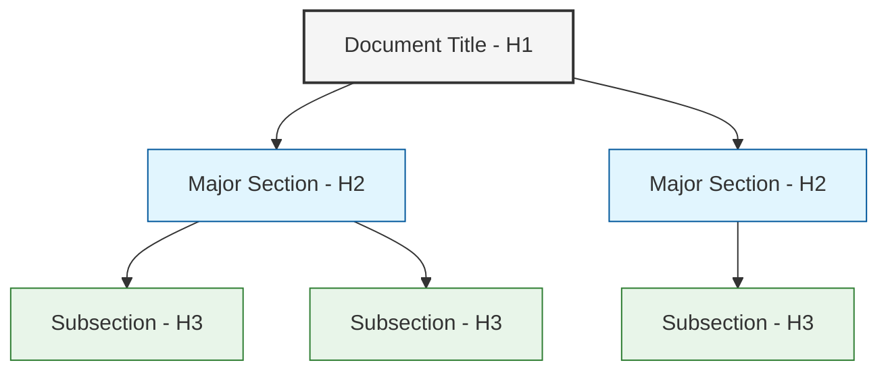

---
title: "Documentation Style Guide"
type: "guide"
description: "Standards and guidelines for creating and maintaining documentation in the Pokémon TCG Trading Platform"
author: "Documentation Team"
version: "1.0.0"
last_updated: "2023-12-10"
status: "published"
category: "documentation"
has_mermaid: true
---

# Documentation Style Guide

## Overview

This style guide establishes consistent standards for all documentation in the Pokémon TCG Trading Platform. Following these guidelines ensures that our documentation is clear, accessible, and optimized for both human readers and AI tools.

## General Principles

### Voice and Tone
- Use a clear, direct, and professional tone
- Write in present tense when possible
- Use active voice instead of passive voice
- Address the reader directly with "you" rather than "the user"

### Language and Grammar
- Use American English spelling and conventions
- Keep sentences concise (25 words or fewer when possible)
- Avoid jargon unless necessary, and define technical terms
- Use consistent terminology throughout all documentation

## Document Structure

### Frontmatter
All documentation files must include standardized frontmatter with the following fields:
```yaml
---
title: "Document Title"
type: "type_of_document"
description: "Brief description of the document content"
author: "Team or individual responsible"
version: "x.y.z"
last_updated: "YYYY-MM-DD"
status: "draft|in_review|published"
category: "category_name"
has_mermaid: true|false
---
```

### Headings
- Use Title Case for Level 1 headings (document title)
- Use Sentence case for all other heading levels
- Structure documents with no more than 3 levels of headings
- Avoid skipping heading levels (e.g., don't go from H2 to H4)



## Formatting Conventions

### Text Formatting
- Use **bold** for emphasis on important points
- Use *italics* for introducing new terms
- Use `inline code` for code references, file names, and UI elements
- Use > blockquotes for important notes or callouts

### Code Blocks
- Use fenced code blocks with language specified:
```javascript
function example() {
  console.log("This is a properly formatted code block");
}
```

### Lists
- Use ordered lists (1., 2., 3.) for sequential steps
- Use unordered lists (bullet points) for non-sequential items
- Keep list items parallel in structure
- Limit nesting to 2 levels

### Tables
- Include a header row
- Use tables for structured data comparison
- Keep tables simple with minimal columns
- Align content logically (left for text, right for numbers)

Example:
| Feature | Description | Status |
|---------|-------------|--------|
| User Authentication | Login and registration system | Completed |
| Card Collection | Management of card inventory | In Progress |

## Visual Elements

### Mermaid Diagrams
- Include mermaid diagrams for complex concepts
- Keep diagrams simple and focused on a single concept
- Use consistent color schemes across all diagrams
- Add meaningful labels and captions

### Images
- Use descriptive file names (e.g., user-registration-flow.png)
- Include alt text for all images
- Keep images under 1MB when possible
- Use SVG format for diagrams and PNG for screenshots

## Cross-Referencing

### Internal Links
- Use relative paths for links to other documentation files
- Include descriptive link text rather than "click here"
- Verify links in the validation process
- Follow this format: `[descriptive text](relative/path/to/file.md)`

### External Links
- Include complete URLs with HTTPS protocol
- Add context about where the link leads
- Consider adding a note if the link opens a new page

## Document Types

### READMEs
- Keep them concise and focused on getting started
- Include purpose, features, installation, and usage sections
- Always include a system architecture diagram

### Technical Documentation
- Focus on implementation details and code structure
- Include code examples when relevant
- Document edge cases and known limitations

### Guides and Tutorials
- Break complex processes into clear, sequential steps
- Include both the "how" and the "why" for each step
- Add screenshots or diagrams at key decision points

## Validation and Maintenance

### Review Process
- All documentation requires at least one peer review
- Check for technical accuracy, completeness, and style compliance
- Use the validation tools (`npm run validate-docs`) before submission

### Versioning
- Follow semantic versioning (MAJOR.MINOR.PATCH)
- Update the version and last_updated in frontmatter with each change
- Document significant changes in the project CHANGELOG

## AI Optimization

### Semantic Tagging
- Use appropriate frontmatter fields to aid AI classification
- Maintain logical document structure with proper headings
- Include clear descriptive text before and after visual elements

### Searchability
- Include relevant keywords naturally in headings and text
- Avoid keyword stuffing or repetitive content
- Use specific terminology consistent with the codebase 