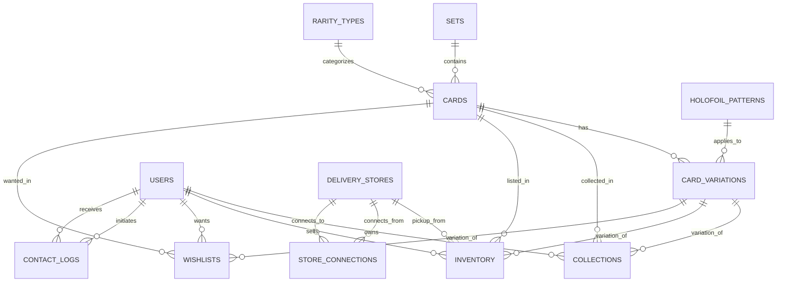
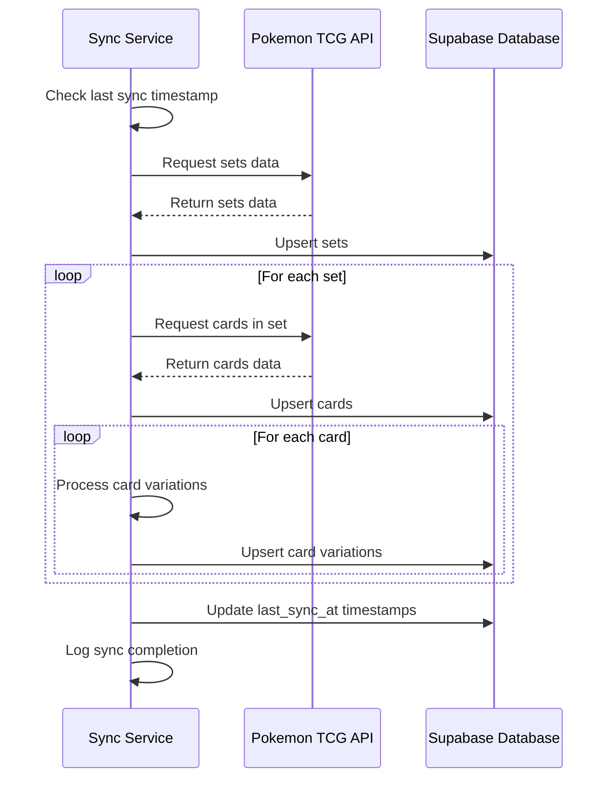

# Pokemon TCG Trade Platform Enhanced Database Documentation

## Overview

<purpose>
This document provides a comprehensive overview of the database architecture for the Pokemon TCG Trading Platform, including schema relationships, query examples, performance considerations, and synchronization processes. This enhanced documentation is designed to be both human-readable and AI-friendly.
</purpose>

## Database Architecture



## Database Schemas

<schemas>
| Schema Name         | Size     | Tables | Purpose |
|---------------------|----------|--------|---------|
| public              | 26 MB    | 12     | Primary application data |
| auth                | 664 kB   | 16     | Authentication management |
| storage             | 144 kB   | 5      | File storage |
| realtime            | 56 kB    | 3      | Real-time updates |
| supabase_migrations | 64 kB    | 1      | Migration tracking |
| vault               | 24 kB    | 1      | Secure credential storage |
</schemas>

## Core Tables

### cards

<table_definition id="cards">
**Purpose**: Stores information about Pokemon TCG cards

**Rows**: 18,509

**Primary Key**: `id` (text)

**Foreign Keys**:
- `set_id` references `[removed-invalid-reference]`

**Indexes**:
- `cards_pkey` (Primary Key, B-tree) on `id`
- `cards_set_id_idx` (B-tree) on `set_id`
- `cards_name_idx` (B-tree) on `name`
- `cards_rarity_idx` (B-tree) on `rarity`

**Key Columns**:
- `id` (text, NOT NULL): Primary Key, unique identifier from Pokemon TCG API
- `name` (text, NOT NULL): Card name
- `supertype` (text): Card supertype (e.g. Pokémon, Trainer, Energy)
- `types` (ARRAY): Array of card types
- `set_id` (text, NOT NULL): Foreign key to sets.id
- `number` (text, NOT NULL): Card number within the set
- `rarity` (text): Card rarity
- `rarity_code` (text): Code representing the rarity
- `card_era` (text): The card's era (e.g. SWSH, SV)
- `language` (text, NOT NULL): Card language, defaults to 'English'
- `image_small` (text): URL to small card image
- `image_large` (text): URL to large card image
- `pokemon_generation` (integer): Pokémon generation number
- `tcg_price` (numeric): Current market price
- `price_updated_at` (timestamp with time zone): When the price was last updated
</table_definition>

### card_variations

<table_definition id="card_variations">
**Purpose**: Stores variations of cards (holofoil, reverse holofoil, etc.)

**Rows**: 71,234

**Primary Key**: `id` (uuid)

**Foreign Keys**:
- `card_id` references `[removed-invalid-reference]`

**Indexes**:
- `card_variations_pkey` (Primary Key, B-tree) on `id`
- `card_variations_card_id_idx` (B-tree) on `card_id`
- `card_variations_variation_type_idx` (B-tree) on `variation_type`

**Key Columns**:
- `id` (uuid, NOT NULL): Primary Key
- `card_id` (text, NOT NULL): Foreign key to cards.id
- `variation_type` (text, NOT NULL): Type of variation
- `treatment` (text): Card treatment type
- `holofoil_pattern` (text): Specific holofoil pattern
- `is_special_rarity` (boolean): Indicates if it's a special rarity
- `special_rarity_type` (text): Type of special rarity
- `image_url` (text): URL to variation image
- `tcg_api_price_key` (text): Key for fetching price from external API
</table_definition>

### sets

<table_definition id="sets">
**Purpose**: Stores information about Pokemon TCG sets

**Rows**: 164

**Primary Key**: `id` (text)

**Indexes**:
- `sets_pkey` (Primary Key, B-tree) on `id`
- `sets_name_idx` (B-tree) on `name`
- `sets_series_idx` (B-tree) on `series`
- `sets_release_date_idx` (B-tree) on `release_date`

**Key Columns**:
- `id` (text, NOT NULL): Primary Key
- `name` (text, NOT NULL): Set name
- `series` (text): Series name
- `release_date` (date): Set release date
- `total` (integer): Total cards in set
- `logo_url` (text): URL to set logo
- `symbol_url` (text): URL to set symbol
</table_definition>

## User Data Tables

### users

<table_definition id="users">
**Purpose**: Stores user account information

**Primary Key**: `id` (uuid)

**Indexes**:
- `users_pkey` (Primary Key, B-tree) on `id`
- `users_username_key` (Unique, B-tree) on `username`
- `users_profile_slug_key` (Unique, B-tree) on `profile_slug`
- `users_email_key` (Unique, B-tree) on `email`

**Key Columns**:
- `id` (uuid, NOT NULL): Primary Key
- `email` (text): User email
- `username` (text, NOT NULL): Username
- `profile_slug` (text, NOT NULL): URL-friendly profile identifier
- `profile_image_url` (text): URL to profile image
- `bio` (text): User biography
- `location` (text): User location
- `whatsapp_number` (text, NOT NULL): WhatsApp contact number
- `phone_number` (text): Alternative phone number
- `phone_verified` (boolean): Phone verification status
- `is_admin` (boolean): Administrative privileges flag
</table_definition>

## Common Query Examples

<query_example id="search_cards_by_name">
**Purpose**: Search for cards by name with pagination

```sql
SELECT c.*, s.name as set_name, s.series as set_series
FROM cards c
JOIN sets s ON c.set_id = s.id
WHERE 
    c.name ILIKE '%charizard%' AND
    c.language = 'English'
ORDER BY 
    s.release_date DESC,
    c.number ASC
LIMIT 20 OFFSET 0;
```
</query_example>

<query_example id="find_user_inventory">
**Purpose**: Get a user's inventory with card details

```sql
SELECT 
    i.id as inventory_id,
    i.price,
    i.condition,
    i.quantity,
    i.is_tradeable,
    c.id as card_id,
    c.name as card_name,
    c.image_small,
    s.name as set_name,
    cv.variation_type
FROM 
    inventory i
JOIN 
    cards c ON i.card_id = c.id
JOIN 
    sets s ON c.set_id = s.id
LEFT JOIN 
    card_variations cv ON i.variation_id = cv.id
WHERE 
    i.user_id = '123e4567-e89b-12d3-a456-426614174000' AND
    i.is_visible = true
ORDER BY 
    i.created_at DESC;
```
</query_example>

<query_example id="find_matching_wishlists">
**Purpose**: Find wishlists that match a specific card in inventory

```sql
SELECT 
    w.id as wishlist_id,
    u.username,
    u.profile_slug,
    u.whatsapp_number,
    w.max_price,
    w.condition_preference
FROM 
    wishlists w
JOIN 
    users u ON w.user_id = u.id
WHERE 
    w.card_id = 'swsh12-123' AND
    (w.variation_id IS NULL OR w.variation_id = '123e4567-e89b-12d3-a456-426614174000') AND
    (w.max_price IS NULL OR w.max_price >= 10.99) AND
    ('NM' = ANY(w.condition_preference));
```
</query_example>

## Performance Considerations

<performance>
### Large Tables Optimization

The `card_variations` table (71,234 rows) requires special attention:

1. **Indexing Strategy**:
   - Compound index on `(card_id, variation_type)` for common filters
   - Consider partial indexes for popular variation types

2. **Query Optimization**:
   - Use `LIMIT` and pagination for all queries returning card variations
   - Avoid selecting all columns when only specific attributes are needed

3. **Caching Strategy**:
   - Cache common variation lookups with 1-hour TTL
   - Implement application-level caching for frequently accessed variations

### Search Performance

For card search functionality:

1. **Text Search Optimization**:
   - Use `ILIKE` with indexes for simple searches
   - Consider implementing full-text search for complex queries
   - Add trigram indexes for name searches: `CREATE INDEX cards_name_trgm_idx ON cards USING gin (name gin_trgm_ops);`

2. **Filtering Optimization**:
   - Create composite indexes for common filter combinations (e.g., `(set_id, rarity)`)
   - Use materialized views for common search patterns
</performance>

## Synchronization with Pokemon TCG API

<sync_process>
### Synchronization Workflow



### Error Handling

1. **API Rate Limiting**:
   - Implement exponential backoff for rate limit errors
   - Track API quota usage and pause sync when approaching limits

2. **Data Validation**:
   - Validate all incoming data against schema before insertion
   - Log validation errors with card IDs for manual review

3. **Duplicate Prevention**:
   - Use ON CONFLICT DO UPDATE for all insertions
   - Track unique constraint violations for review
</sync_process>

## Views

<views>
### enhanced_cards
**Purpose**: Joins cards with their sets for easier querying

```sql
CREATE OR REPLACE VIEW enhanced_cards AS
SELECT 
    c.*,
    s.name as set_name,
    s.series as set_series,
    s.release_date,
    s.logo_url as set_logo_url,
    s.symbol_url as set_symbol_url
FROM 
    cards c
JOIN 
    sets s ON c.set_id = s.id;
```

### user_catalogs
**Purpose**: Aggregation view showing user collection statistics

```sql
CREATE OR REPLACE VIEW user_catalogs AS
SELECT 
    u.id as user_id,
    u.username,
    u.profile_slug,
    COUNT(DISTINCT c.card_id) as unique_cards,
    SUM(c.quantity) as total_cards,
    COUNT(DISTINCT s.id) as unique_sets
FROM 
    users u
LEFT JOIN 
    collections c ON u.id = c.user_id
LEFT JOIN 
    cards cd ON c.card_id = cd.id
LEFT JOIN 
    sets s ON cd.set_id = s.id
GROUP BY 
    u.id, u.username, u.profile_slug;
```
</views>

## Migration and Maintenance

<maintenance>
### Schema Evolution

When modifying the database schema:

1. **Backward Compatibility**:
   - Add new columns as nullable to avoid breaking existing queries
   - Use database migrations for all schema changes
   - Document migration steps in `migrations/` directory

2. **Performance Testing**:
   - Test migrations on a copy of production data
   - Measure query performance before and after changes
   - Document expected performance impacts

### Data Integrity

Regular maintenance tasks:

1. **Data Validation**:
   - Weekly integrity checks for foreign key relationships
   - Validate image URLs are accessible
   - Check for orphaned records in variation tables

2. **Backup Strategy**:
   - Daily full backups via Supabase
   - Point-in-time recovery configuration
   - Monthly backup restoration tests
</maintenance>

## Related Documentation

<related_docs>
- [System Design Document](system-design-document.md): Overall system architecture
- [Supabase API Architecture](supabase-api-architecture.md): Integration with Supabase
- [Sync Progress](sync-progress.md): Current synchronization status
</related_docs>
