# Pokémon TCG Trade Platform - Documentation Index

## Documentation Structure

```mermaid
graph TD
    Index[Documentation Index]
    
    Index --> Overview[Overview Documents]
    Index --> Reference[Reference Documents]
    Index --> Guidelines[Development Guidelines]
    Index --> APIDoc[API Documentation]
    Index --> Archive[Archived Documents]
    
    Overview --> PRD[Product Requirements]
    Overview --> SDD[System Design]
    Overview --> UF[User Flows]
    Overview --> CS[Changelog]
    
    Reference --> DBSchema[Database Schema]
    Reference --> APIRef[API Reference]
    Reference --> CompCat[Component Catalog]
    Reference --> TechSDK[TCG API SDK]
    
    Guidelines --> BP[Best Practices]
    Guidelines --> DS[Documentation Strategy]
    Guidelines --> DSG[Documentation Style Guide]
    Guidelines --> MD[Mermaid Diagram Guide]
    
    APIDoc --> TCGInt[TCG API Integration]
    APIDoc --> SAPI[Supabase API]
    APIDoc --> WhatsApp[WhatsApp Integration]
    APIDoc --> Auth[Authentication]
    
    SDD --> DB[(Database)]
    SDD --> API[APIs]
    SDD --> UI[User Interface]
    
    PRD --> Features[Features]
    PRD --> UserPersonas[User Personas]
    PRD --> Requirements[Requirements]
    
    DB --> CardSync[Card Synchronization]
    
    DB --> SyncProg[Sync Progress Log]
    
    style Index fill:#f5f5f5,stroke:#333,stroke-width:2px
    style Overview fill:#e3f2fd,stroke:#0d47a1,stroke-width:1px
    style Reference fill:#e8f5e9,stroke:#1b5e20,stroke-width:1px
    style Guidelines fill:#fff3e0,stroke:#e65100,stroke-width:1px
    style APIDoc fill:#f3e5f5,stroke:#4a148c,stroke-width:1px
    style CardSync fill:#e0f7fa,stroke:#006064,stroke-width:1px
```

> **Note:** Some deprecated documentation files have been moved to the `/archive` directory. 
> Always refer to the current documentation in this directory for the most up-to-date information.

## Overview Documents

- [Product Requirements Document (PRD)](./pokemon-tcg-trade-platform-prd.md) - Complete product specifications and requirements
- [System Design Document](./system-design-document.md) - Technical architecture and database schema
- [Web Development Best Practices](./best-practices.md) - Coding standards and development guidelines
- [MCP Tools Reference](./MCP.md) - Available MCP tools for development

## Quick Reference Guide

### Business & Product Information

| Topic | Location | Description |
|-------|----------|-------------|
| Executive Summary | [PRD Section 1](./pokemon-tcg-trade-platform-prd.md#1-executive-summary) | High-level project overview |
| Problem Statement | [PRD Section 2](./pokemon-tcg-trade-platform-prd.md#2-problem-statement) | Market challenges being addressed |
| User Personas | [PRD Section 3](./pokemon-tcg-trade-platform-prd.md#3-user-personas) | Target user profiles |
| Product Vision | [PRD Section 4](./pokemon-tcg-trade-platform-prd.md#4-product-vision) | Overall product vision and goals |
| Success Criteria | [PRD Section 5](./pokemon-tcg-trade-platform-prd.md#5-success-criteria) | Metrics to measure success |
| Core Features | [PRD Section 6.1](./pokemon-tcg-trade-platform-prd.md#61-core-features-mvp) | MVP functionality |
| Future Enhancements | [PRD Section 6.2](./pokemon-tcg-trade-platform-prd.md#62-future-enhancements) | Planned future features |
| User Flows | [PRD Section 7](./pokemon-tcg-trade-platform-prd.md#7-user-flows) | Key user interaction paths |
| Development Phases | [PRD Section 11](./pokemon-tcg-trade-platform-prd.md#11-development-phases) | Project timeline and phases |

### Technical Architecture

| Topic | Location | Description |
|-------|----------|-------------|
| Tech Stack | [System Design Section 2](./system-design-document.md#2-tech-stack) | Complete technology stack |
| Database Schema | [System Design Section 3](./system-design-document.md#3-database-schema) | Database tables, views, and indexes |
| Data Storage Strategy | [System Design Section 4](./system-design-document.md#4-data-storage-strategy) | What to store vs. fetch from API |
| API Integration | [System Design Section 5](./system-design-document.md#5-api-integration-strategy) | Working with the Pokémon TCG API |
| Card Variation Handling | [System Design Section 6.3](./system-design-document.md#63-inventory-management-ui) | Managing card variations |
| WhatsApp Integration | [System Design Section 6.4](./system-design-document.md#64-whatsapp-integration) | Connecting users via WhatsApp |
| Authentication Flow | [System Design Section 6.6](./system-design-document.md#66-authentication-flow) | Phone-based verification |
| Store Network | [System Design Section 10](./system-design-document.md#10-store-network-management) | Managing delivery stores |
| Deployment Strategy | [System Design Section 11](./system-design-document.md#11-deployment-strategy) | Vercel deployment setup |

### Development Guidelines

| Topic | Location | Description |
|-------|----------|-------------|
| Core Development Principles | [Best Practices Section 2](./best-practices.md#core-development-principles) | Fundamental development rules |
| File Size Management | [Best Practices Section 3](./best-practices.md#file-and-component-organization) | Keeping files under 300 lines |
| Separation of Concerns | [Best Practices Section 4](./best-practices.md#code-modularity-and-separation-of-concerns) | Single responsibility principle |
| Type System Best Practices | [Best Practices Section 5](./best-practices.md#type-system-best-practices) | Managing types effectively |
| State Management | [Best Practices Section 6](./best-practices.md#state-management-principles) | Custom hooks and state design |
| Project Structure | [Best Practices Section 7](./best-practices.md#project-structure-organization) | Directory organization |
| Component Design | [Best Practices Section 8](./best-practices.md#ui-components-and-design-systems) | Building UI components |
| Backend Integration | [Best Practices Section 9](./best-practices.md#backend-integration) | Working with the backend |
| Performance Optimization | [Best Practices Section 10](./best-practices.md#performance-optimization) | Optimizing performance |
| Code Review Guidelines | [Best Practices Section 11](./best-practices.md#code-review-guidelines) | Standards for code review |
| Refactoring Process | [Best Practices Section 12](./best-practices.md#refactoring-decision-process) | When and how to refactor code |

### Tool Reference

| Tool Category | Location | Description |
|---------------|----------|-------------|
| Supabase MCP Tools | [MCP Section "Supabase MCP Tools"](./MCP.md#supabase-mcp-tools) | Database and auth management |
| Puppeteer MCP Tools | [MCP Section "Puppeteer MCP Tools"](./MCP.md#puppeteer-mcp-tools) | Browser automation |
| Sequential Thinking | [MCP Section "Sequential Thinking MCP Tool"](./MCP.md#sequential-thinking-mcp-tool) | Complex problem solving |
| GitHub MCP Tools | [MCP Section "GitHub MCP Tools"](./MCP.md#github-mcp-tools) | Repository management |
| Search MCP Tools | [MCP Sections "Brave Search" & "Tavily Search"](./MCP.md#brave-search-mcp-tools) | Web search capabilities |
| Fetch MCP Tools | [MCP Section "Fetch MCP Tools"](./MCP.md#fetch-mcp-tools) | Retrieving web content |
| Filesystem MCP Tools | [MCP Section "Filesystem MCP Tools"](./MCP.md#filesystem-mcp-tools) | File management |

## Key Cross-References

### Card Data Management

- **Card Structure**: [System Design Section 3.1](./system-design-document.md#31-core-tables) - See `cards` and `card_variations` tables
- **Rarity System**: [System Design Section 13](./system-design-document.md#13-rarity-reference-data) - Comprehensive rarity classification
- **Variation Handling**: [System Design Section 6.3](./system-design-document.md#63-inventory-management-ui) - UI for card variations
- **API Integration**: [System Design Section 5](./system-design-document.md#5-api-integration-strategy) - Working with the Pokémon TCG API

### User Management

- **User Personas**: [PRD Section 3](./pokemon-tcg-trade-platform-prd.md#3-user-personas) - Target user profiles
- **Authentication**: [System Design Section 6.6](./system-design-document.md#66-authentication-flow) - Phone verification process
- **User Data**: [System Design Section 3.1](./system-design-document.md#31-core-tables) - See `users` table

### Store Network

- **Store Structure**: [System Design Section 10](./system-design-document.md#10-store-network-management) - Store network management
- **Delivery System**: [System Design Section 3.1](./system-design-document.md#31-core-tables) - See `delivery_stores` and `store_connections` tables
- **User Flow**: [PRD Section 7.3](./pokemon-tcg-trade-platform-prd.md#73-searching-for-cards) - How users interact with stores

## How to Use This Documentation

1. **Start with PRD** for a business overview and user requirements
2. **Review System Design** for technical implementation details
3. **Follow Best Practices** when developing code for the project
4. **Reference MCP Tools** when implementing specific functionality

## Development Workflow

1. **Understand Requirements**: Review relevant sections of PRD
2. **Check Design**: Consult System Design document for implementation details
3. **Implement Following Best Practices**: Apply coding standards
4. **Use Appropriate MCP Tools**: Leverage available tools for development
5. **Review Code**: Ensure compliance with guidelines in Best Practices doc

---

*This index will be updated as new documentation is added to the project.*