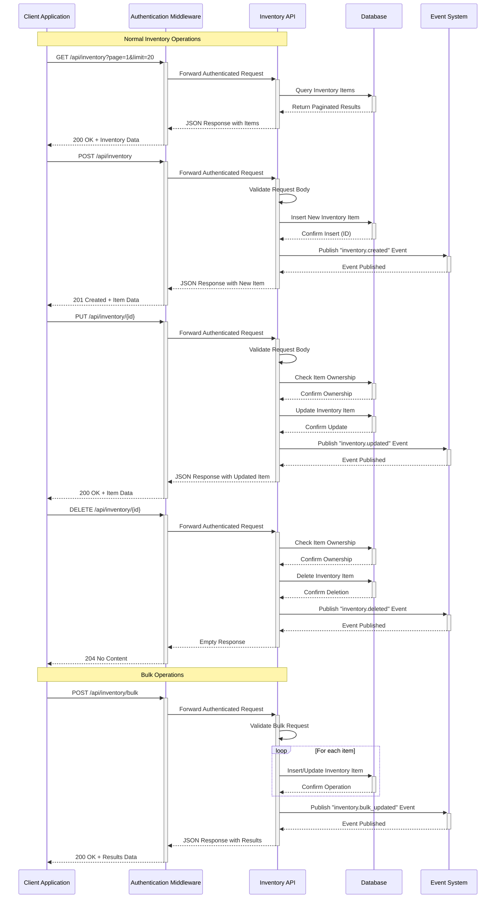

# Inventory Management API Reference

## Overview

<purpose>
This document provides a comprehensive reference for the Inventory Management API endpoints of the Pokemon TCG Trade Platform. These endpoints enable creating, reading, updating, and deleting inventory items, as well as searching and filtering inventory.
</purpose>

## API Interaction Flow



## Base URL

All inventory API endpoints are prefixed with:

```
/api/inventory
```

## Authentication

All inventory endpoints require authentication using JWT tokens. Include the token in the Authorization header:

```
Authorization: Bearer {token}
```

## API Endpoints

<endpoints>
### List Inventory Items

Retrieves a paginated list of inventory items for the authenticated user.

**Endpoint:** `GET /api/inventory`

**Query Parameters:**

| Parameter | Type | Description |
|-----------|------|-------------|
| page | integer | Page number (default: 1) |
| limit | integer | Items per page (default: 20, max: 100) |
| sort | string | Sort field (created_at, price, card_name) |
| order | string | Sort order (asc, desc) |
| for_sale | boolean | Filter by for_sale status |
| for_trade | boolean | Filter by for_trade status |
| condition | string | Filter by condition (NM, LP, MP, HP, DMG) |
| set_id | string | Filter by set ID |
| search | string | Search by card name |

**Response:**

```json
{
  "data": [
    {
      "id": "550e8400-e29b-41d4-a716-446655440000",
      "user_id": "123e4567-e89b-12d3-a456-426614174000",
      "card": {
        "id": "base1-4",
        "name": "Charizard",
        "set": {
          "id": "base1",
          "name": "Base"
        },
        "images": {
          "small": "https://images.pokemontcg.io/base1/4.png",
          "large": "https://images.pokemontcg.io/base1/4_hires.png"
        }
      },
      "variation": {
        "id": "7c9e6679-7425-40de-944b-e07fc1f90ae7",
        "variation_type": "Holo",
        "treatment": "Regular",
        "holofoil_pattern": "Cosmos"
      },
      "condition": "NM",
      "price": 299.99,
      "quantity": 1,
      "for_sale": true,
      "for_trade": false,
      "store": {
        "id": "6ba7b810-9dad-11d1-80b4-00c04fd430c8",
        "name": "Card Shop NYC",
        "location": "New York, NY"
      },
      "notes": "Mint condition, pack fresh",
      "created_at": "2025-01-15T12:00:00Z",
      "updated_at": "2025-01-15T12:00:00Z"
    }
    // More items...
  ],
  "pagination": {
    "total": 156,
    "page": 1,
    "limit": 20,
    "pages": 8
  }
}
```

### Get Inventory Item

Retrieves a specific inventory item by ID.

**Endpoint:** `GET /api/inventory/{id}`

**Path Parameters:**

| Parameter | Type | Description |
|-----------|------|-------------|
| id | string | Inventory item ID |

**Response:**

```json
{
  "id": "550e8400-e29b-41d4-a716-446655440000",
  "user_id": "123e4567-e89b-12d3-a456-426614174000",
  "card": {
    "id": "base1-4",
    "name": "Charizard",
    "set": {
      "id": "base1",
      "name": "Base"
    },
    "images": {
      "small": "https://images.pokemontcg.io/base1/4.png",
      "large": "https://images.pokemontcg.io/base1/4_hires.png"
    }
  },
  "variation": {
    "id": "7c9e6679-7425-40de-944b-e07fc1f90ae7",
    "variation_type": "Holo",
    "treatment": "Regular",
    "holofoil_pattern": "Cosmos"
  },
  "condition": "NM",
  "price": 299.99,
  "quantity": 1,
  "for_sale": true,
  "for_trade": false,
  "store": {
    "id": "6ba7b810-9dad-11d1-80b4-00c04fd430c8",
    "name": "Card Shop NYC",
    "location": "New York, NY"
  },
  "notes": "Mint condition, pack fresh",
  "created_at": "2025-01-15T12:00:00Z",
  "updated_at": "2025-01-15T12:00:00Z",
  "contact_count": 5
}
```

### Create Inventory Item

Adds a new card to the user's inventory.

**Endpoint:** `POST /api/inventory`

**Request Body:**

```json
{
  "card_id": "base1-4",
  "variation_id": "7c9e6679-7425-40de-944b-e07fc1f90ae7",
  "condition": "NM",
  "price": 299.99,
  "quantity": 1,
  "for_sale": true,
  "for_trade": false,
  "store_id": "6ba7b810-9dad-11d1-80b4-00c04fd430c8",
  "notes": "Mint condition, pack fresh"
}
```

**Response:**

```json
{
  "id": "550e8400-e29b-41d4-a716-446655440000",
  "user_id": "123e4567-e89b-12d3-a456-426614174000",
  "card_id": "base1-4",
  "variation_id": "7c9e6679-7425-40de-944b-e07fc1f90ae7",
  "condition": "NM",
  "price": 299.99,
  "quantity": 1,
  "for_sale": true,
  "for_trade": false,
  "store_id": "6ba7b810-9dad-11d1-80b4-00c04fd430c8",
  "notes": "Mint condition, pack fresh",
  "created_at": "2025-03-18T10:30:00Z",
  "updated_at": "2025-03-18T10:30:00Z"
}
```

### Update Inventory Item

Updates an existing inventory item.

**Endpoint:** `PUT /api/inventory/{id}`

**Path Parameters:**

| Parameter | Type | Description |
|-----------|------|-------------|
| id | string | Inventory item ID |

**Request Body:**

```json
{
  "condition": "LP",
  "price": 249.99,
  "quantity": 1,
  "for_sale": true,
  "for_trade": true,
  "store_id": "6ba7b810-9dad-11d1-80b4-00c04fd430c8",
  "notes": "Small whitening on back edge"
}
```

**Response:**

```json
{
  "id": "550e8400-e29b-41d4-a716-446655440000",
  "user_id": "123e4567-e89b-12d3-a456-426614174000",
  "card_id": "base1-4",
  "variation_id": "7c9e6679-7425-40de-944b-e07fc1f90ae7",
  "condition": "LP",
  "price": 249.99,
  "quantity": 1,
  "for_sale": true,
  "for_trade": true,
  "store_id": "6ba7b810-9dad-11d1-80b4-00c04fd430c8",
  "notes": "Small whitening on back edge",
  "created_at": "2025-01-15T12:00:00Z",
  "updated_at": "2025-03-18T10:35:00Z"
}
```

### Delete Inventory Item

Removes an item from inventory.

**Endpoint:** `DELETE /api/inventory/{id}`

**Path Parameters:**

| Parameter | Type | Description |
|-----------|------|-------------|
| id | string | Inventory item ID |

**Response:**

```json
{
  "success": true,
  "message": "Inventory item deleted"
}
```

### Bulk Create Inventory Items

Adds multiple cards to inventory in a single request.

**Endpoint:** `POST /api/inventory/bulk`

**Request Body:**

```json
{
  "items": [
    {
      "card_id": "base1-4",
      "variation_id": "7c9e6679-7425-40de-944b-e07fc1f90ae7",
      "condition": "NM",
      "price": 299.99,
      "quantity": 1,
      "for_sale": true,
      "for_trade": false,
      "store_id": "6ba7b810-9dad-11d1-80b4-00c04fd430c8"
    },
    {
      "card_id": "base2-8",
      "variation_id": "9d8e5678-6534-41cd-b45a-e07fc1f90ae7",
      "condition": "LP",
      "price": 149.99,
      "quantity": 2,
      "for_sale": true,
      "for_trade": true,
      "store_id": "6ba7b810-9dad-11d1-80b4-00c04fd430c8"
    }
    // More items...
  ]
}
```

**Response:**

```json
{
  "success": true,
  "created": 2,
  "failed": 0,
  "items": [
    {
      "id": "550e8400-e29b-41d4-a716-446655440000",
      "card_id": "base1-4"
    },
    {
      "id": "651f9500-f39c-52e5-b827-557766551111",
      "card_id": "base2-8"
    }
  ]
}
```

### Search Public Inventory

Searches for cards available in other users' inventory.

**Endpoint:** `GET /api/inventory/search`

**Query Parameters:**

| Parameter | Type | Description |
|-----------|------|-------------|
| q | string | Search query (card name) |
| set_id | string | Filter by set ID |
| condition | string | Filter by condition |
| price_min | number | Minimum price |
| price_max | number | Maximum price |
| for_sale | boolean | Filter by for_sale status |
| for_trade | boolean | Filter by for_trade status |
| store_id | string | Filter by store ID |
| page | integer | Page number |
| limit | integer | Items per page |

**Response:**

```json
{
  "data": [
    {
      "id": "550e8400-e29b-41d4-a716-446655440000",
      "user": {
        "id": "123e4567-e89b-12d3-a456-426614174000",
        "username": "pokecollector",
        "rating": 4.8
      },
      "card": {
        "id": "base1-4",
        "name": "Charizard",
        "set": {
          "id": "base1",
          "name": "Base"
        },
        "images": {
          "small": "https://images.pokemontcg.io/base1/4.png"
        }
      },
      "variation": {
        "variation_type": "Holo"
      },
      "condition": "NM",
      "price": 299.99,
      "for_sale": true,
      "for_trade": false,
      "store": {
        "id": "6ba7b810-9dad-11d1-80b4-00c04fd430c8",
        "name": "Card Shop NYC"
      }
    }
    // More items...
  ],
  "pagination": {
    "total": 15,
    "page": 1,
    "limit": 20,
    "pages": 1
  }
}
```

### Get Inventory Statistics

Retrieves statistics about the user's inventory.

**Endpoint:** `GET /api/inventory/stats`

**Response:**

```json
{
  "total_items": 156,
  "total_cards": 203,
  "total_value": 12567.89,
  "by_condition": {
    "NM": 87,
    "LP": 45,
    "MP": 18,
    "HP": 5,
    "DMG": 1
  },
  "by_set": [
    {
      "set_id": "base1",
      "set_name": "Base",
      "count": 32
    },
    {
      "set_id": "base2",
      "set_name": "Jungle",
      "count": 28
    }
    // More sets...
  ],
  "recent_activity": {
    "added_last_week": 12,
    "updated_last_week": 8,
    "removed_last_week": 3
  }
}
```
</endpoints>

## Request and Response Formats

<formats>
### Inventory Item Object

| Field | Type | Description |
|-------|------|-------------|
| id | string | Unique identifier for the inventory item |
| user_id | string | ID of the user who owns the inventory item |
| card_id | string | ID of the card in the inventory |
| variation_id | string | ID of the card variation (optional) |
| condition | string | Card condition (NM, LP, MP, HP, DMG) |
| price | number | Asking price for the card |
| quantity | integer | Number of identical cards available |
| for_sale | boolean | Whether the card is available for purchase |
| for_trade | boolean | Whether the card is available for trading |
| store_id | string | ID of the store where the card is available |
| notes | string | Additional notes about the card |
| created_at | string | ISO 8601 timestamp of when the item was created |
| updated_at | string | ISO 8601 timestamp of when the item was last updated |

### Card Object

| Field | Type | Description |
|-------|------|-------------|
| id | string | Unique identifier for the card |
| name | string | Card name |
| set | object | Set information |
| set.id | string | Set identifier |
| set.name | string | Set name |
| images | object | Card images |
| images.small | string | URL to small card image |
| images.large | string | URL to large card image |

### Variation Object

| Field | Type | Description |
|-------|------|-------------|
| id | string | Unique identifier for the variation |
| variation_type | string | Type of variation (Holo, Reverse Holo, etc.) |
| treatment | string | Card treatment (Regular, Etched, etc.) |
| holofoil_pattern | string | Holofoil pattern (Cosmos, Galaxy, etc.) |

### Store Object

| Field | Type | Description |
|-------|------|-------------|
| id | string | Unique identifier for the store |
| name | string | Store name |
| location | string | Store location |
</formats>

## Error Handling

<error_handling>
### Error Response Format

```json
{
  "error": {
    "code": "INVENTORY_ERROR",
    "message": "Detailed error message",
    "details": {
      "field": "specific field with error"
    }
  }
}
```

### Common Error Codes

| Code | HTTP Status | Description |
|------|-------------|-------------|
| INVENTORY_NOT_FOUND | 404 | The requested inventory item was not found |
| INVENTORY_VALIDATION_ERROR | 400 | Invalid data in request |
| INVENTORY_PERMISSION_DENIED | 403 | User does not have permission to access/modify the inventory item |
| INVENTORY_LIMIT_EXCEEDED | 400 | User has reached their inventory limit |
| CARD_NOT_FOUND | 400 | Referenced card ID does not exist |
| STORE_NOT_FOUND | 400 | Referenced store ID does not exist |
</error_handling>

## Rate Limiting

<rate_limiting>
The inventory API endpoints are subject to rate limiting:

- 100 requests per minute for GET operations
- 30 requests per minute for POST/PUT/DELETE operations
- 10 requests per minute for bulk operations

Rate limit headers are included in all responses:

```
X-RateLimit-Limit: 100
X-RateLimit-Remaining: 95
X-RateLimit-Reset: 1616979600
```

When rate limits are exceeded, the API returns a 429 Too Many Requests response.
</rate_limiting>

## Implementation Examples

<examples>
### Listing Inventory Items

```typescript
// src/lib/services/inventory-service.ts
import { supabase } from '@/lib/supabase';

export async function getUserInventory(
  userId: string,
  options: {
    page?: number;
    limit?: number;
    sort?: string;
    order?: 'asc' | 'desc';
    forSale?: boolean;
    forTrade?: boolean;
    condition?: string;
    setId?: string;
    search?: string;
  } = {}
) {
  const {
    page = 1,
    limit = 20,
    sort = 'created_at',
    order = 'desc',
    forSale,
    forTrade,
    condition,
    setId,
    search
  } = options;
  
  const offset = (page - 1) * limit;
  
  let query = supabase
    .from('enhanced_inventory')
    .select('*', { count: 'exact' })
    .eq('user_id', userId);
  
  // Apply filters
  if (forSale !== undefined) {
    query = query.eq('for_sale', forSale);
  }
  
  if (forTrade !== undefined) {
    query = query.eq('for_trade', forTrade);
  }
  
  if (condition) {
    query = query.eq('condition', condition);
  }
  
  if (setId) {
    query = query.eq('set_id', setId);
  }
  
  if (search) {
    query = query.ilike('card_name', `%${search}%`);
  }
  
  // Apply sorting and pagination
  const { data, count, error } = await query
    .order(sort, { ascending: order === 'asc' })
    .range(offset, offset + limit - 1);
  
  if (error) {
    throw new Error(`Error fetching inventory: ${error.message}`);
  }
  
  return {
    data,
    pagination: {
      total: count || 0,
      page,
      limit,
      pages: Math.ceil((count || 0) / limit)
    }
  };
}
```

### Creating an Inventory Item

```typescript
// src/lib/services/inventory-service.ts
import { supabase } from '@/lib/supabase';

export async function createInventoryItem(
  userId: string,
  item: {
    card_id: string;
    variation_id?: string;
    condition: string;
    price?: number;
    quantity: number;
    for_sale: boolean;
    for_trade: boolean;
    store_id?: string;
    notes?: string;
  }
) {
  // Validate required fields
  if (!item.card_id || !item.condition) {
    throw new Error('Card ID and condition are required');
  }
  
  // Validate condition
  const validConditions = ['NM', 'LP', 'MP', 'HP', 'DMG'];
  if (!validConditions.includes(item.condition)) {
    throw new Error('Invalid condition value');
  }
  
  // Validate price if for_sale is true
  if (item.for_sale && (item.price === undefined || item.price <= 0)) {
    throw new Error('Price is required for items marked for sale');
  }
  
  // Insert the item
  const { data, error } = await supabase
    .from('inventory')
    .insert({
      user_id: userId,
      card_id: item.card_id,
      variation_id: item.variation_id,
      condition: item.condition,
      price: item.price,
      quantity: item.quantity || 1,
      for_sale: item.for_sale,
      for_trade: item.for_trade,
      store_id: item.store_id,
      notes: item.notes,
      created_at: new Date().toISOString(),
      updated_at: new Date().toISOString()
    })
    .select()
    .single();
  
  if (error) {
    throw new Error(`Error creating inventory item: ${error.message}`);
  }
  
  return data;
}
```
</examples>

## Related Documentation

<related_docs>
- [Inventory Management Overview](docs/inventory-management/overview.md): System architecture
- [Inventory Data Model](docs/inventory-management/data-model.md): Database schema
- [API Reference](docs/api-reference.md): Complete API documentation
- [Authentication](docs/authentication.md): Authentication system details
</related_docs>
