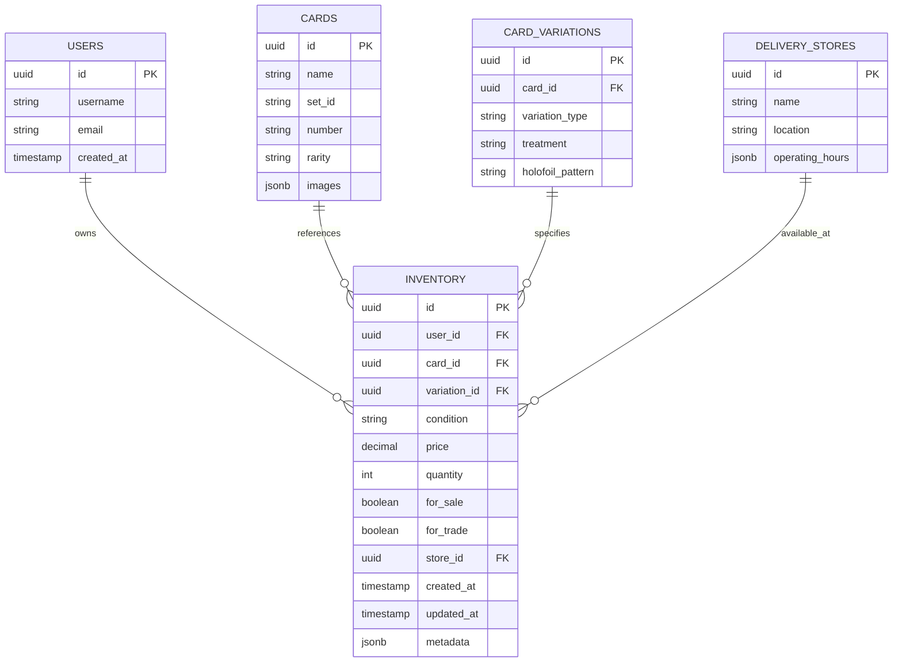

# Inventory Management Data Model

## Overview

<purpose>
This document details the database schema and data model for the inventory management system of the Pokemon TCG Trade Platform. It covers the core tables, relationships, indexes, and common query patterns.
</purpose>

## Database Schema



## Core Tables

<tables>
### Inventory Table

The `inventory` table is the central table for tracking cards available for trading or selling.

```sql
CREATE TABLE inventory (
    id UUID PRIMARY KEY DEFAULT uuid_generate_v4(),
    user_id UUID NOT NULL REFERENCES users(id) ON DELETE CASCADE,
    card_id UUID NOT NULL REFERENCES cards(id),
    variation_id UUID REFERENCES card_variations(id),
    condition VARCHAR(10) NOT NULL,
    price DECIMAL(10, 2),
    quantity INTEGER NOT NULL DEFAULT 1,
    for_sale BOOLEAN NOT NULL DEFAULT true,
    for_trade BOOLEAN NOT NULL DEFAULT false,
    store_id UUID REFERENCES delivery_stores(id),
    notes TEXT,
    created_at TIMESTAMP WITH TIME ZONE NOT NULL DEFAULT NOW(),
    updated_at TIMESTAMP WITH TIME ZONE NOT NULL DEFAULT NOW(),
    metadata JSONB
);

-- Indexes for performance
CREATE INDEX inventory_user_id_idx ON inventory(user_id);
CREATE INDEX inventory_card_id_idx ON inventory(card_id);
CREATE INDEX inventory_variation_id_idx ON inventory(variation_id);
CREATE INDEX inventory_condition_idx ON inventory(condition);
CREATE INDEX inventory_for_sale_idx ON inventory(for_sale) WHERE for_sale = true;
CREATE INDEX inventory_for_trade_idx ON inventory(for_trade) WHERE for_trade = true;
CREATE INDEX inventory_store_id_idx ON inventory(store_id);
CREATE INDEX inventory_created_at_idx ON inventory(created_at);
```

#### Column Descriptions

| Column | Type | Description |
|--------|------|-------------|
| id | UUID | Primary key |
| user_id | UUID | Foreign key to users table |
| card_id | UUID | Foreign key to cards table |
| variation_id | UUID | Foreign key to card_variations table |
| condition | VARCHAR(10) | Card condition (NM, LP, MP, HP, DMG) |
| price | DECIMAL(10, 2) | Asking price (if for_sale is true) |
| quantity | INTEGER | Number of identical cards available |
| for_sale | BOOLEAN | Whether the card is available for purchase |
| for_trade | BOOLEAN | Whether the card is available for trading |
| store_id | UUID | Store where the card is available for pickup |
| notes | TEXT | Seller notes about the card |
| created_at | TIMESTAMP | When the listing was created |
| updated_at | TIMESTAMP | When the listing was last updated |
| metadata | JSONB | Additional flexible data (e.g., trade preferences) |

### Related Tables

The inventory system relies on several other tables:

1. **users**: Contains user account information
2. **cards**: Contains card data from the Pokemon TCG API
3. **card_variations**: Contains variation information (holofoil, reverse holofoil, etc.)
4. **delivery_stores**: Contains information about physical pickup locations
</tables>

## Views and Materialized Views

<views>
### Enhanced Inventory View

This view joins inventory with related tables to provide a complete picture of available cards:

```sql
CREATE VIEW enhanced_inventory AS
SELECT 
    i.id,
    i.user_id,
    u.username,
    i.card_id,
    c.name AS card_name,
    c.set_id,
    s.name AS set_name,
    c.number,
    c.rarity,
    c.images,
    cv.variation_type,
    cv.treatment,
    cv.holofoil_pattern,
    i.condition,
    i.price,
    i.quantity,
    i.for_sale,
    i.for_trade,
    i.store_id,
    ds.name AS store_name,
    ds.location AS store_location,
    i.notes,
    i.created_at,
    i.updated_at
FROM 
    inventory i
JOIN 
    users u ON i.user_id = u.id
JOIN 
    cards c ON i.card_id = c.id
LEFT JOIN 
    card_variations cv ON i.variation_id = cv.id
JOIN 
    sets s ON c.set_id = s.id
LEFT JOIN 
    delivery_stores ds ON i.store_id = ds.id;
```

### User Inventory Stats

This materialized view provides aggregated statistics about user inventory:

```sql
CREATE MATERIALIZED VIEW user_inventory_stats AS
SELECT
    user_id,
    COUNT(*) AS total_listings,
    SUM(quantity) AS total_cards,
    COUNT(*) FILTER (WHERE for_sale = true) AS for_sale_listings,
    COUNT(*) FILTER (WHERE for_trade = true) AS for_trade_listings,
    SUM(price * quantity) FILTER (WHERE for_sale = true) AS total_value,
    AVG(price) FILTER (WHERE for_sale = true) AS avg_price,
    COUNT(DISTINCT card_id) AS unique_cards,
    MAX(created_at) AS latest_listing,
    MIN(created_at) AS oldest_listing
FROM
    inventory
GROUP BY
    user_id;

-- Index for performance
CREATE UNIQUE INDEX user_inventory_stats_user_id_idx ON user_inventory_stats(user_id);

-- Refresh schedule
COMMENT ON MATERIALIZED VIEW user_inventory_stats IS 'Refreshed daily at 3:00 AM';
```
</views>

## Common Query Patterns

<query_patterns>
### Finding Available Cards

```sql
-- Search for available Charizard cards
SELECT *
FROM enhanced_inventory
WHERE 
    card_name ILIKE '%charizard%'
    AND for_sale = true
    AND quantity > 0
ORDER BY
    price ASC;

-- Find cards available for trade in Near Mint condition
SELECT *
FROM enhanced_inventory
WHERE 
    for_trade = true
    AND condition = 'NM'
    AND quantity > 0
ORDER BY
    created_at DESC;

-- Find cards available at a specific store
SELECT *
FROM enhanced_inventory
WHERE 
    store_id = '550e8400-e29b-41d4-a716-446655440000'
    AND (for_sale = true OR for_trade = true)
    AND quantity > 0
ORDER BY
    card_name ASC;
```

### Inventory Management

```sql
-- Add a new card to inventory
INSERT INTO inventory (
    user_id, card_id, variation_id, condition, 
    price, quantity, for_sale, for_trade, store_id, notes
) VALUES (
    '123e4567-e89b-12d3-a456-426614174000', -- user_id
    '550e8400-e29b-41d4-a716-446655440000', -- card_id
    '7c9e6679-7425-40de-944b-e07fc1f90ae7', -- variation_id
    'NM',                                    -- condition
    15.99,                                   -- price
    1,                                       -- quantity
    true,                                    -- for_sale
    false,                                   -- for_trade
    '6ba7b810-9dad-11d1-80b4-00c04fd430c8', -- store_id
    'Mint condition, pack fresh'             -- notes
);

-- Update card price and availability
UPDATE inventory
SET 
    price = 19.99,
    for_trade = true,
    updated_at = NOW()
WHERE 
    id = '123e4567-e89b-12d3-a456-426614174000';

-- Remove sold cards from inventory
DELETE FROM inventory
WHERE 
    id = '123e4567-e89b-12d3-a456-426614174000';

-- Decrease quantity after partial sale
UPDATE inventory
SET 
    quantity = quantity - 1,
    updated_at = NOW()
WHERE 
    id = '123e4567-e89b-12d3-a456-426614174000'
    AND quantity > 1;
```

### Analytics Queries

```sql
-- Most popular cards in inventory
SELECT 
    card_id,
    card_name,
    COUNT(*) AS listing_count,
    SUM(quantity) AS total_quantity,
    AVG(price) AS avg_price
FROM 
    enhanced_inventory
WHERE 
    for_sale = true
GROUP BY 
    card_id, card_name
ORDER BY 
    listing_count DESC
LIMIT 10;

-- Price distribution by condition
SELECT 
    condition,
    COUNT(*) AS listing_count,
    MIN(price) AS min_price,
    MAX(price) AS max_price,
    AVG(price) AS avg_price,
    PERCENTILE_CONT(0.5) WITHIN GROUP (ORDER BY price) AS median_price
FROM 
    inventory
WHERE 
    for_sale = true
    AND card_id = '550e8400-e29b-41d4-a716-446655440000'
GROUP BY 
    condition
ORDER BY 
    CASE 
        WHEN condition = 'NM' THEN 1
        WHEN condition = 'LP' THEN 2
        WHEN condition = 'MP' THEN 3
        WHEN condition = 'HP' THEN 4
        WHEN condition = 'DMG' THEN 5
    END;
```
</query_patterns>

## Database Functions and Triggers

<functions_triggers>
### Auto-Update Timestamp Trigger

```sql
CREATE OR REPLACE FUNCTION update_modified_column()
RETURNS TRIGGER AS $$
BEGIN
    NEW.updated_at = NOW();
    RETURN NEW;
END;
$$ LANGUAGE plpgsql;

CREATE TRIGGER update_inventory_modtime
BEFORE UPDATE ON inventory
FOR EACH ROW
EXECUTE FUNCTION update_modified_column();
```

### Inventory Activity Logging

```sql
CREATE TABLE inventory_activity_log (
    id UUID PRIMARY KEY DEFAULT uuid_generate_v4(),
    inventory_id UUID REFERENCES inventory(id),
    user_id UUID REFERENCES users(id),
    action VARCHAR(50) NOT NULL,
    previous_state JSONB,
    new_state JSONB,
    created_at TIMESTAMP WITH TIME ZONE NOT NULL DEFAULT NOW()
);

CREATE OR REPLACE FUNCTION log_inventory_changes()
RETURNS TRIGGER AS $$
BEGIN
    IF (TG_OP = 'INSERT') THEN
        INSERT INTO inventory_activity_log (
            inventory_id, user_id, action, previous_state, new_state
        ) VALUES (
            NEW.id,
            NEW.user_id,
            'INSERT',
            NULL,
            row_to_json(NEW)
        );
    ELSIF (TG_OP = 'UPDATE') THEN
        INSERT INTO inventory_activity_log (
            inventory_id, user_id, action, previous_state, new_state
        ) VALUES (
            NEW.id,
            NEW.user_id,
            'UPDATE',
            row_to_json(OLD),
            row_to_json(NEW)
        );
    ELSIF (TG_OP = 'DELETE') THEN
        INSERT INTO inventory_activity_log (
            inventory_id, user_id, action, previous_state, new_state
        ) VALUES (
            OLD.id,
            OLD.user_id,
            'DELETE',
            row_to_json(OLD),
            NULL
        );
    END IF;
    RETURN NULL;
END;
$$ LANGUAGE plpgsql;

CREATE TRIGGER inventory_audit_trigger
AFTER INSERT OR UPDATE OR DELETE ON inventory
FOR EACH ROW EXECUTE FUNCTION log_inventory_changes();
```
</functions_triggers>

## Performance Considerations

<performance>
### Indexing Strategy

The inventory table has several indexes to optimize common query patterns:

1. **Primary key index** on `id` (automatically created)
2. **Foreign key indexes** on `user_id`, `card_id`, `variation_id`, and `store_id`
3. **Filtered indexes** on `for_sale` and `for_trade` to optimize searches for available cards
4. **Condition index** to speed up filtering by card condition
5. **Timestamp index** on `created_at` for chronological sorting

### Query Optimization

For large inventory tables, consider:

1. **Pagination** for all inventory listing endpoints
2. **Materialized views** for frequently accessed aggregated data
3. **Partial indexes** for commonly filtered subsets of data
4. **VACUUM ANALYZE** scheduled regularly to maintain index efficiency

### Scaling Considerations

As the inventory grows:

1. **Partitioning** the inventory table by user_id or created_at for very large datasets
2. **Read replicas** for analytics and reporting queries
3. **Connection pooling** to handle concurrent inventory operations
4. **Caching** frequently accessed inventory items
</performance>

## Related Documentation

<related_docs>
- [Enhanced Database Documentation](enhanced-database-documentation.md): Complete database schema
- [Inventory Management Overview](overview.md): System architecture
- [Inventory API Reference](api-reference.md): API endpoints
- [Inventory Analytics](analytics.md): Reporting and metrics
</related_docs>
