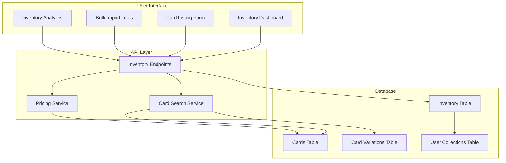

# Pokemon TCG Trade Platform Inventory Management

## Overview

<purpose>
This document provides an overview of the inventory management system for the Pokemon TCG Trade Platform. The inventory system allows users to track cards available for trading or selling, manage their condition and pricing, and make them visible to potential buyers.
</purpose>

## System Architecture

## Key Components

<key_components>
### 1. Inventory Database

The core of the inventory system is the `inventory` table in our Supabase PostgreSQL database. This table tracks all cards that users have made available for trading or selling.

Key relationships:
- Each inventory item belongs to a user
- Each inventory item references a specific card and variation
- Inventory items can be linked to specific stores for delivery

### 2. Inventory Management UI

The user interface for inventory management includes:
- Dashboard for viewing and managing listed cards
- Add/Edit forms for individual card listings
- Bulk import tools for adding multiple cards
- Analytics for tracking inventory performance

### 3. API Services

Backend services that power the inventory system:
- CRUD operations for inventory items
- Search functionality for finding cards
- Pricing recommendations based on market data
- Inventory analytics and reporting

### 4. Integration Points

The inventory system integrates with:
- User Trading Flow for connecting buyers and sellers
- Collection Management for moving cards between collection and inventory
- Delivery System for handling physical card transfers
- WhatsApp for communication about inventory items
</key_components>

## Related Documentation

<related_docs>
- [Inventory Data Model](inventory-management/data-model.md): Detailed database schema
- [Inventory User Interface](inventory-management/user-interface.md): UI components and interactions
- [Inventory API Reference](inventory-management/api-reference.md): API endpoints for inventory management
- [Inventory Analytics](inventory-management/analytics.md): Reporting and metrics
</related_docs>
