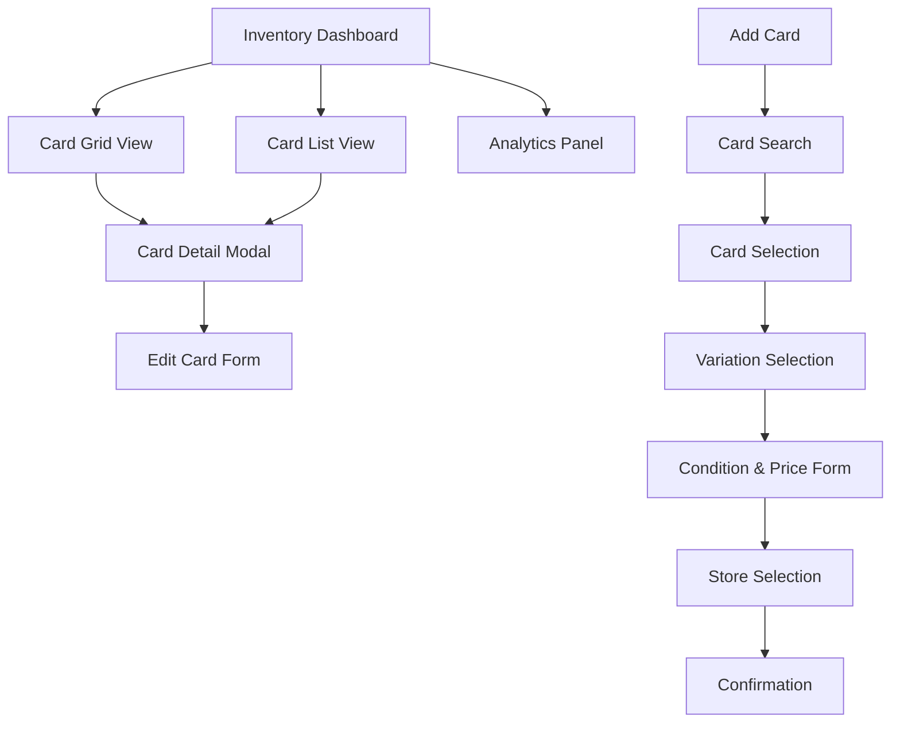
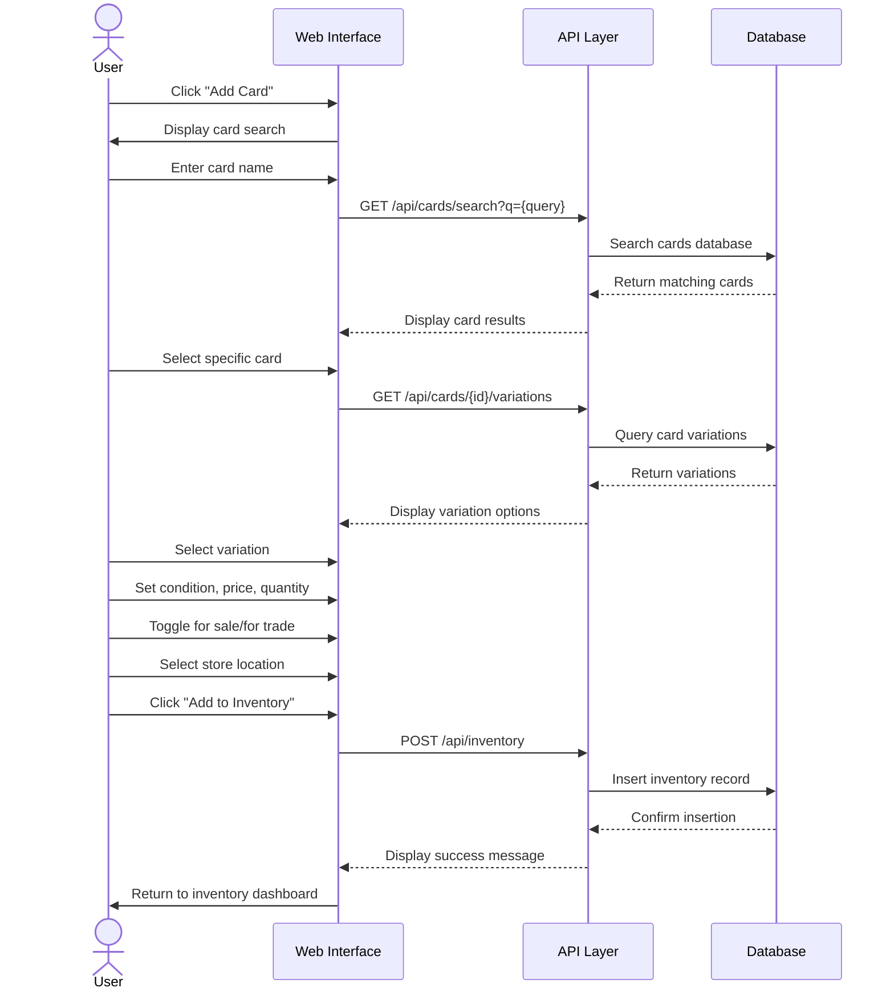
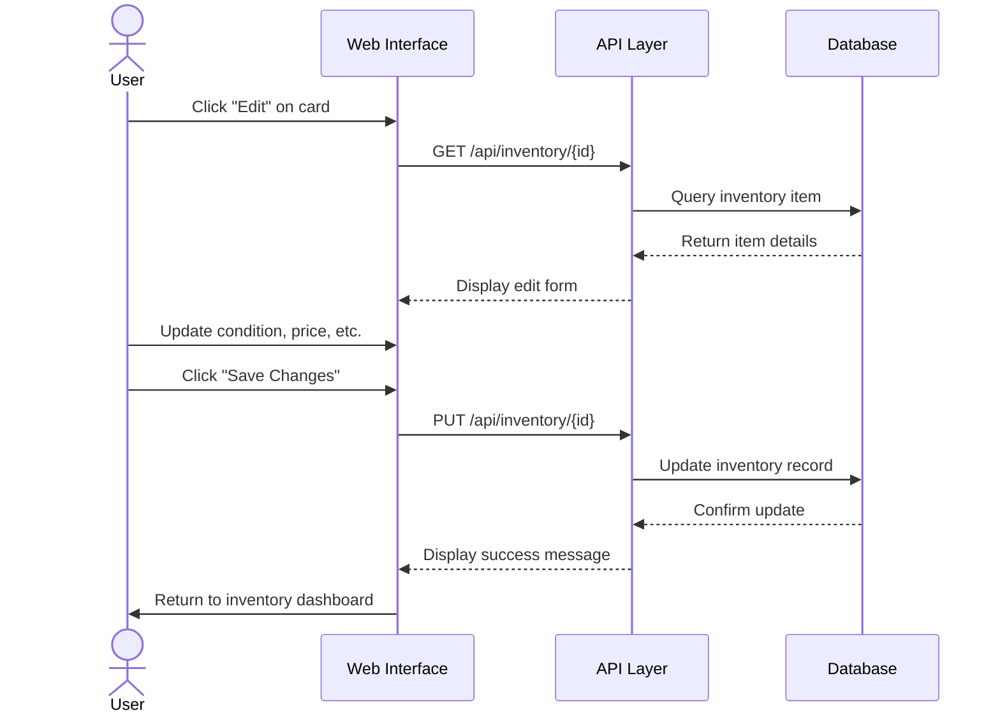
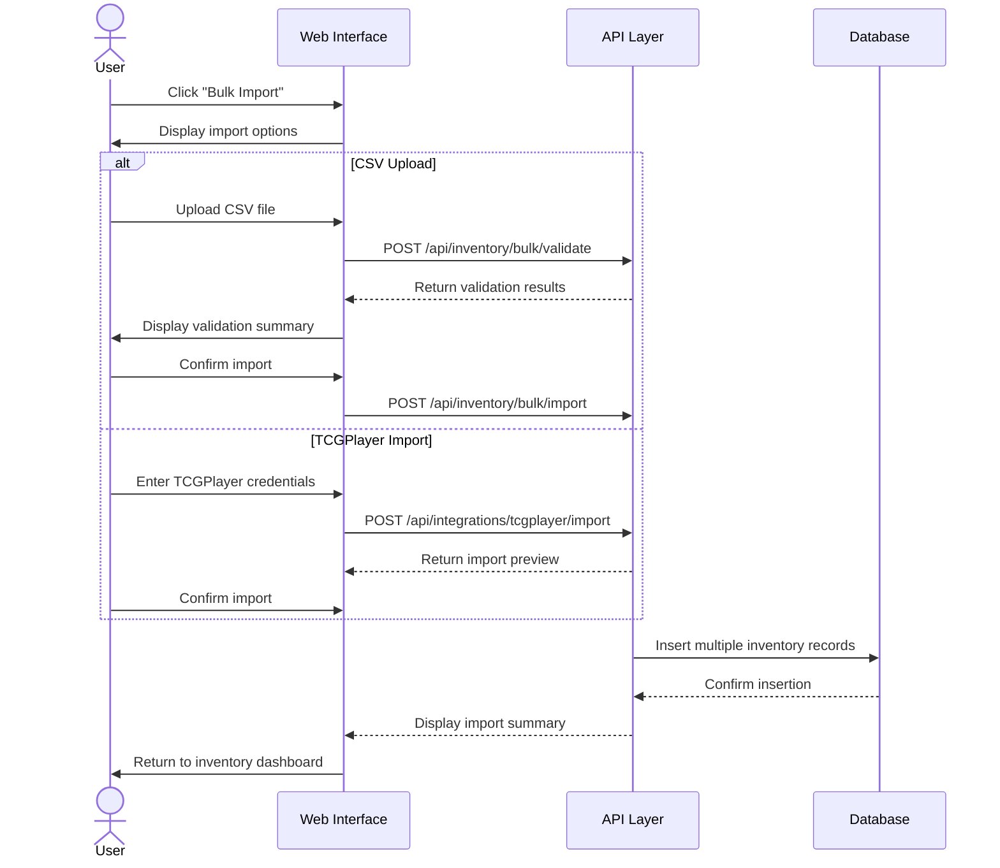

# Inventory Management User Interface

## Overview

<purpose>
This document details the user interface components and interactions for the inventory management system of the Pokemon TCG Trade Platform. It covers the main screens, components, and user flows for managing card inventory.
</purpose>

## Interface Architecture



## Key Screens

<screens>
### Inventory Dashboard

The main interface for managing inventory with the following features:

- Toggle between grid and list views
- Filter controls (condition, price range, set, etc.)
- Sort options (newest, price, alphabetical)
- Quick actions (edit, remove, mark as sold)
- Analytics summary (total cards, value, recent activity)

### Add Card Flow

Multi-step process for adding cards to inventory:

1. **Card Search**: Search by name, set, or scan card
2. **Card Selection**: Select specific card from results
3. **Variation Selection**: Choose card variation (holo, reverse holo, etc.)
4. **Condition & Price**: Set condition, price, quantity, and availability
5. **Store Selection**: Choose pickup location
6. **Confirmation**: Review and confirm listing

### Card Detail View

Modal view showing detailed information about a card in inventory:

- Card image and details
- Condition and price information
- Listing status (for sale, for trade)
- Pickup location
- Edit and remove options
- Contact history
</screens>

## Core Components

<components>
### InventoryGrid Component

```tsx
// src/components/inventory/InventoryGrid.tsx
import React from 'react';
import { Card } from '../ui/Card';
import { Badge } from '../ui/Badge';
import { Button } from '../ui/Button';
import { formatCurrency } from '@/lib/utils/format';
import type { InventoryItem } from '@/types';

interface InventoryGridProps {
  items: InventoryItem[];
  onEdit: (id: string) => void;
  onRemove: (id: string) => void;
  onView: (id: string) => void;
}

export default function InventoryGrid({
  items,
  onEdit,
  onRemove,
  onView
}: InventoryGridProps) {
  return (
    <div className="grid grid-cols-1 sm:grid-cols-2 md:grid-cols-3 lg:grid-cols-4 gap-4">
      {items.map((item) => (
        <Card key={item.id} className="overflow-hidden">
          <div className="relative">
             onView(item.id)}
            />
            <div className="absolute top-2 right-2 flex gap-1">
              {item.forSale && (
                <Badge variant="success">
                  {formatCurrency(item.price)}
                </Badge>
              )}
              {item.forTrade && (
                <Badge variant="info">Trade</Badge>
              )}
            </div>
          </div>
          
          <div className="p-3">
            <h3 className="font-semibold text-sm truncate">
              {item.card.name}
            </h3>
            <p className="text-xs text-gray-500">
              {item.card.set.name} · {item.condition}
            </p>
            
            <div className="mt-2 flex justify-between">
              <Button
                size="sm"
                variant="ghost"
                onClick={() => onEdit(item.id)}
              >
                Edit
              </Button>
              <Button
                size="sm"
                variant="ghost"
                className="text-red-500"
                onClick={() => onRemove(item.id)}
              >
                Remove
              </Button>
            </div>
          </div>
        </Card>
      ))}
    </div>
  );
}
```

### CardConditionSelector Component

```tsx
// src/components/inventory/CardConditionSelector.tsx
import React from 'react';
import { RadioGroup } from '../ui/RadioGroup';
import { Label } from '../ui/Label';
import { Tooltip } from '../ui/Tooltip';
import { InfoCircledIcon } from '@radix-ui/react-icons';

interface CardConditionSelectorProps {
  value: string;
  onChange: (value: string) => void;
}

export default function CardConditionSelector({
  value,
  onChange
}: CardConditionSelectorProps) {
  const conditions = [
    {
      value: 'NM',
      label: 'Near Mint',
      description: 'Card is in perfect or near perfect condition'
    },
    {
      value: 'LP',
      label: 'Lightly Played',
      description: 'Card shows minimal wear, may have minor edge wear or scratching'
    },
    {
      value: 'MP',
      label: 'Moderately Played',
      description: 'Card shows moderate wear, may have edge wear, scratches, or minor creases'
    },
    {
      value: 'HP',
      label: 'Heavily Played',
      description: 'Card shows significant wear, may have creases, edge wear, and scratches'
    },
    {
      value: 'DMG',
      label: 'Damaged',
      description: 'Card is significantly damaged, may have tears, major creases, or water damage'
    }
  ];
  
  return (
    <div className="space-y-3">
      <div className="flex items-center">
        <Label className="text-base font-medium">Card Condition</Label>
        <Tooltip content="Select the condition that best describes your card's state">
          <InfoCircledIcon className="ml-1 h-4 w-4 text-gray-500" />
        </Tooltip>
      </div>
      
      <RadioGroup
        value={value}
        onValueChange={onChange}
        className="grid grid-cols-1 md:grid-cols-5 gap-2"
      >
        {conditions.map((condition) => (
          <div
            key={condition.value}
            className={`
              border rounded-md p-3 cursor-pointer transition-colors
              ${value === condition.value ? 'border-primary bg-primary/5' : 'border-gray-200'}
            `}
            onClick={() => onChange(condition.value)}
          >
            <div className="font-medium">{condition.label}</div>
            <div className="text-xs text-gray-500">{condition.value}</div>
            <div className="mt-1 text-xs text-gray-600">{condition.description}</div>
          </div>
        ))}
      </RadioGroup>
    </div>
  );
}
```

### InventoryFilters Component

```tsx
// src/components/inventory/InventoryFilters.tsx
import React from 'react';
import { Input } from '../ui/Input';
import { Select } from '../ui/Select';
import { Checkbox } from '../ui/Checkbox';
import { Button } from '../ui/Button';
import { Slider } from '../ui/Slider';
import { Label } from '../ui/Label';

interface InventoryFiltersProps {
  filters: {
    search: string;
    condition: string[];
    priceRange: [number, number];
    forSale: boolean;
    forTrade: boolean;
    set: string;
    sortBy: string;
  };
  onFilterChange: (filters: any) => void;
  onReset: () => void;
  sets: { id: string; name: string }[];
}

export default function InventoryFilters({
  filters,
  onFilterChange,
  onReset,
  sets
}: InventoryFiltersProps) {
  // Filter implementation
  // ...
}
```
</components>

## User Flows

<user_flows>
### Adding a Card to Inventory



### Editing an Inventory Item



### Bulk Import Flow


</user_flows>

## Accessibility Considerations

<accessibility>
### Keyboard Navigation

- All interactive elements are keyboard accessible
- Logical tab order follows visual layout
- Focus states are clearly visible
- Keyboard shortcuts for common actions:
  - `Alt+N`: Add new card
  - `Alt+E`: Edit selected card
  - `Alt+D`: Delete selected card
  - `Alt+F`: Focus search filter

### Screen Reader Support

- All images have appropriate alt text
- ARIA labels for interactive elements
- Announcements for dynamic content changes
- Proper heading hierarchy for navigation

### Color and Contrast

- All text meets WCAG AA contrast requirements
- Color is not the only means of conveying information
- High contrast mode support
- Customizable text size
</accessibility>

## Responsive Design

<responsive>
### Breakpoint Behavior

- **Mobile (< 640px)**: 
  - Single column card grid
  - Simplified filters in dropdown
  - Full-width forms
  - Bottom navigation bar

- **Tablet (640px - 1024px)**:
  - Two column card grid
  - Sidebar filters
  - Multi-step forms with progress indicator
  - Side navigation

- **Desktop (> 1024px)**:
  - Four column card grid
  - Persistent sidebar filters
  - Side-by-side forms
  - Full navigation with shortcuts
</responsive>

## Related Documentation

<related_docs>
- [Inventory Management Overview](docs/inventory-management/overview.md): System architecture
- [Inventory Data Model](docs/inventory-management/data-model.md): Database schema
- [Component Catalog](docs/component-catalog.md): Reusable UI components
- [Accessibility Guidelines](docs/accessibility-guidelines.md): Platform-wide accessibility standards
</related_docs>
