---
title: "Mermaid Diagram Guide"
type: "guide"
description: "Standards and examples for creating effective mermaid diagrams in project documentation"
author: "Documentation Team"
version: "1.0.0"
last_updated: "2023-12-12"
status: "published"
category: "documentation"
has_mermaid: true
---

# Mermaid Diagram Guide

## Overview

This guide provides standards, templates, and best practices for creating effective mermaid diagrams in the Pokémon TCG Trading Platform documentation. Mermaid diagrams enhance comprehension of complex systems, workflows, and relationships, making documentation more accessible to both human readers and AI systems.

## Why Use Mermaid Diagrams?

- **Visual Clarity**: Convert complex text explanations into intuitive visual representations
- **Consistency**: Maintain a unified visual language across documentation
- **Maintainability**: Update diagrams easily within markdown files without external tools
- **AI Comprehension**: Provide structured representations that AI can parse and understand
- **Documentation Validation**: Meet our documentation standards (currently only 41% of docs have diagrams)

## Basic Diagram Types

### Flowcharts

Perfect for representing processes, workflows, and decision trees.

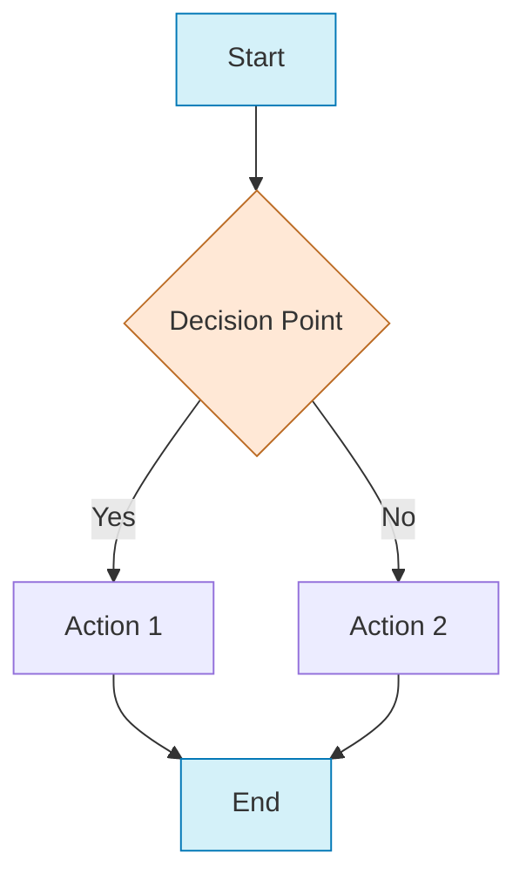

**Template:**
```
flowchart TD
    A[Start] --> B{Decision Point}
    B -->|Yes| C[Action 1]
    B -->|No| D[Action 2]
    C --> E[End]
    D --> E
    
    style A fill:#d4f1f9,stroke:#0077b6
    style E fill:#d4f1f9,stroke:#0077b6
    style B fill:#ffe8d6,stroke:#bc6c25
```

### Sequence Diagrams

Ideal for illustrating interactions between components or systems over time.

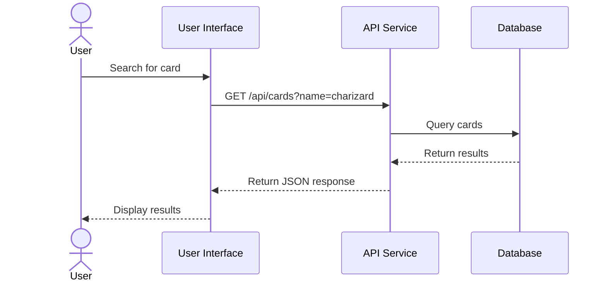

**Template:**
```
sequenceDiagram
    actor User
    participant A as Component A
    participant B as Component B
    participant C as Component C
    
    User->>A: Action
    A->>B: Request
    B->>C: Process
    C-->>B: Response
    B-->>A: Result
    A-->>User: Display
```

### Class Diagrams

Useful for representing data models and class relationships.

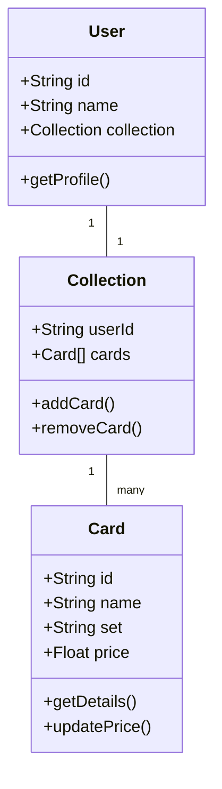

**Template:**
```
classDiagram
    class Entity1 {
        +String property1
        +Type property2
        +method1()
        +method2()
    }
    
    class Entity2 {
        +String property1
        +Type property2
        +method1()
    }
    
    Entity1 "1" -- "many" Entity2
```

### Entity Relationship Diagrams

Perfect for database schema visualization.

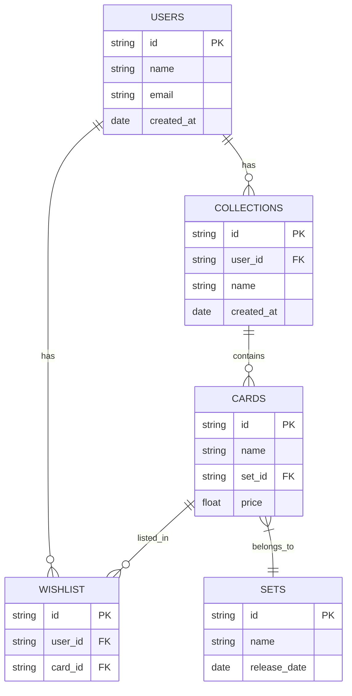

**Template:**
```
erDiagram
    ENTITY1 ||--o{ ENTITY2 : relationship
    ENTITY2 ||--o{ ENTITY3 : relationship
    
    ENTITY1 {
        type field1 PK
        type field2
    }
    
    ENTITY2 {
        type field1 PK
        type field2 FK
    }
    
    ENTITY3 {
        type field1 PK
        type field2
    }
```

### State Diagrams

Ideal for illustrating state machines and transitions.

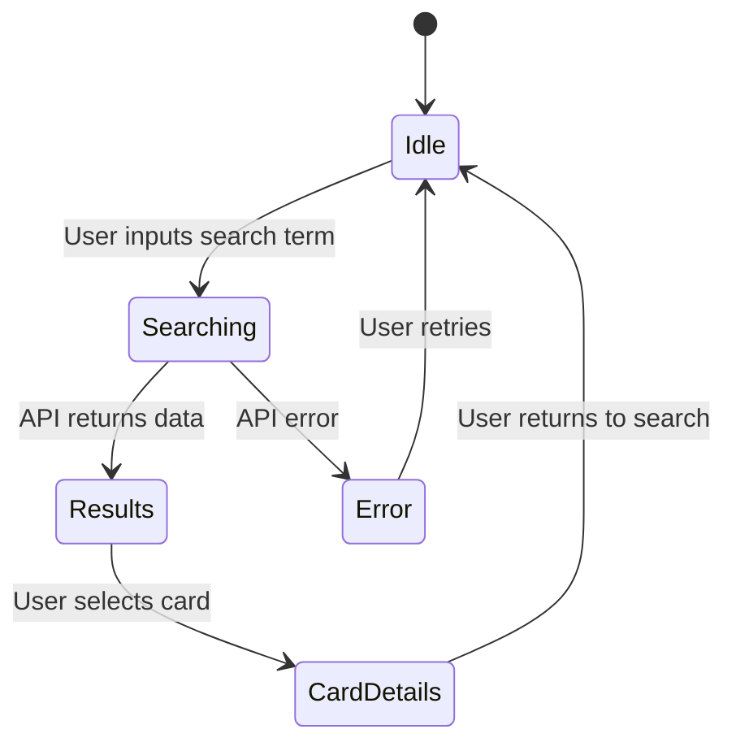

**Template:**
```
stateDiagram-v2
    [*] --> InitialState
    InitialState --> State2: Event1
    State2 --> State3: Event2
    State3 --> InitialState: Event3
    State3 --> [*]: Complete
```

### Gantt Charts

Useful for project planning and timeline visualization.

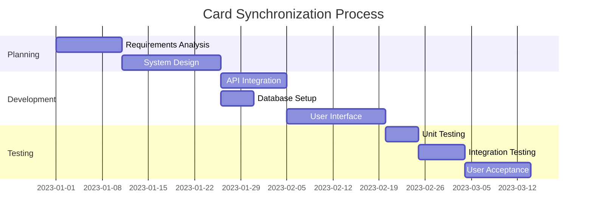

**Template:**
```
gantt
    title Project Timeline
    dateFormat  YYYY-MM-DD
    
    section Phase 1
    Task 1   :a1, 2023-01-01, 10d
    Task 2   :a2, after a1, 15d
    
    section Phase 2
    Task 3   :b1, after a2, 10d
    Task 4   :b2, after b1, 7d
```

### Pie Charts

Good for showing distribution and proportions.

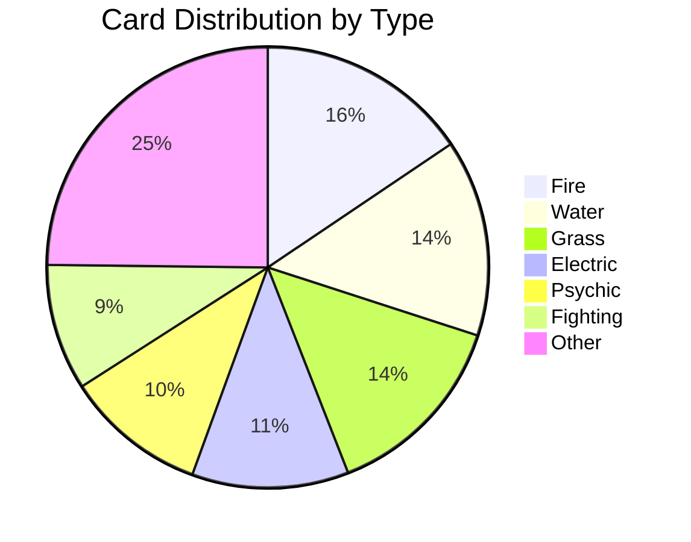

**Template:**
```
pie
    title Distribution Title
    "Segment 1" : 40
    "Segment 2" : 30
    "Segment 3" : 20
    "Segment 4" : 10
```

## AI-Friendly Diagram Practices

### Semantic Labeling

- Use descriptive labels for nodes and edges
- Include clear titles for all diagrams
- Add captions explaining key aspects of the diagram

### Visual Hierarchy

- Use consistent styling for similar elements
- Apply color coding to indicate categories or importance
- Group related elements visually

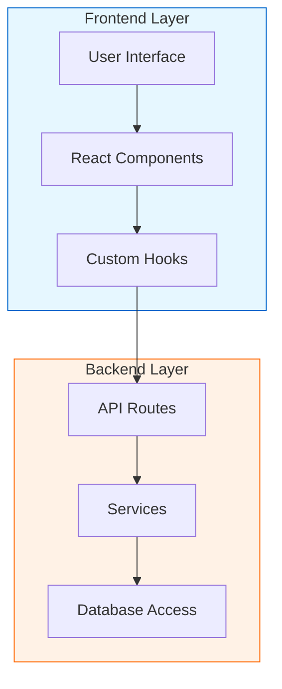

### Text Descriptions

Always include a text description of what the diagram represents:

```
This flowchart illustrates the architecture of the Pokémon TCG Trading Platform, 
showing the relationship between frontend components (User Interface, React Components, 
Custom Hooks) and backend services (API Routes, Services, Database Access).
```

## Diagram Integration Examples

### API Documentation

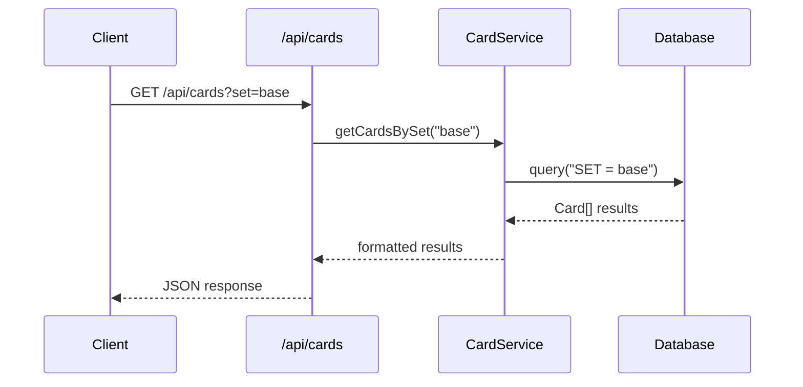

### Component Documentation

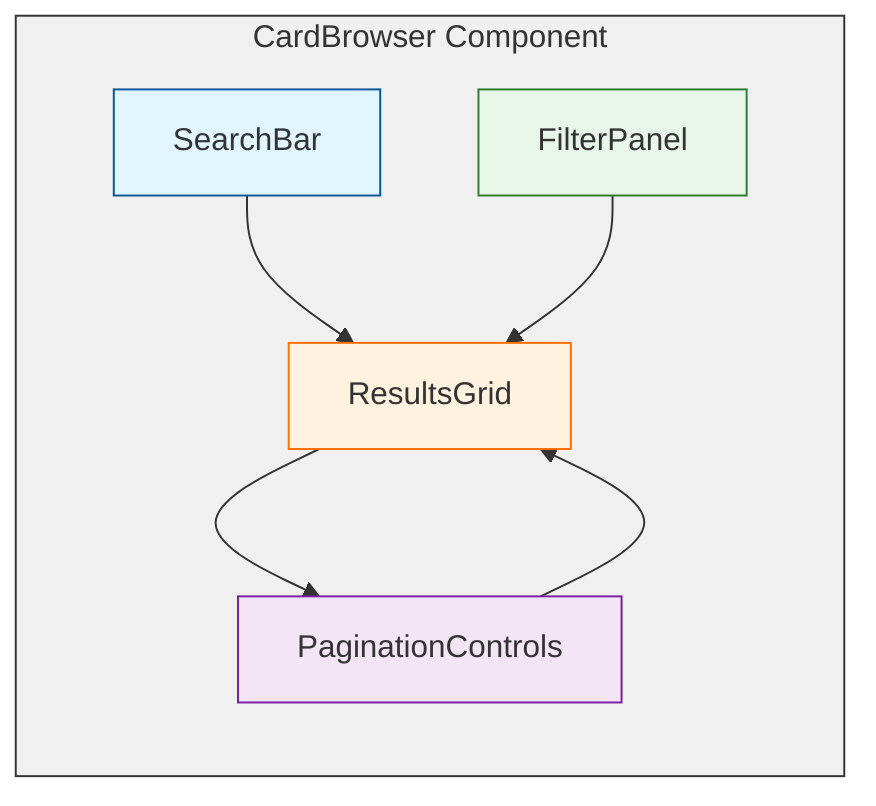

### Process Documentation

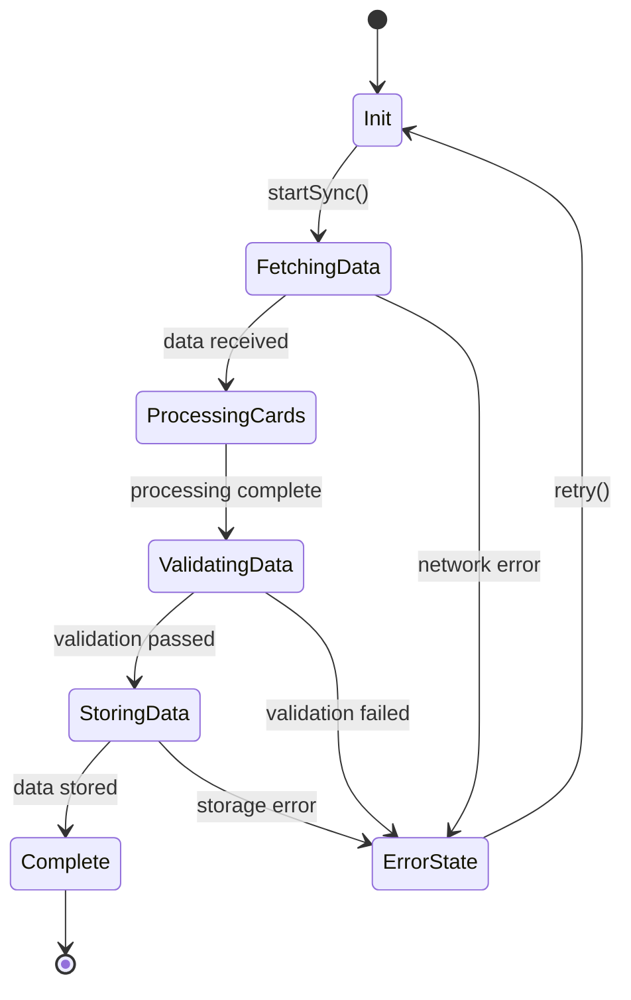

## Tools for Creating Mermaid Diagrams

- **Mermaid Live Editor**: [https://mermaid.live/](https://mermaid.live/)
- **VS Code Mermaid Preview Extension**: View diagrams directly in your editor
- **Mermaid CLI**: Generate SVG files from mermaid diagrams
- **Our Custom Mermaid Template Generator**: See tools/mermaid-generator.js

## Adding Diagrams to Documentation

1. **Identify visualization opportunities**: Look for complex processes, architectures, or relationships
2. **Select the appropriate diagram type** based on what you're explaining
3. **Create the diagram** using the templates provided above
4. **Add the diagram to your markdown file** using the mermaid code block syntax:

```
```mermaid
diagram code here
```
```

5. **Include a text description** of what the diagram represents
6. **Set `has_mermaid: true`** in your document's frontmatter
7. **Validate your documentation** with `npm run validate-docs`

## Diagram Checklist

Before adding a diagram to documentation, ensure it meets these criteria:

- [ ] Uses the appropriate diagram type for the content
- [ ] Includes descriptive labels for all elements
- [ ] Has a clear title and purpose
- [ ] Uses consistent styling with other diagrams
- [ ] Includes accompanying text description
- [ ] Does not contain excessive detail that could confuse users
- [ ] Follows our color scheme and styling conventions
- [ ] Fits well within the documentation flow

## Conclusion

Incorporating effective mermaid diagrams into our documentation significantly improves both human and AI comprehension of our system. By following these guidelines and using the provided templates, we can ensure consistent, high-quality visualizations throughout our documentation.

For technical assistance with creating diagrams, refer to the official [Mermaid Documentation](https://mermaid.js.org/intro/) or contact the Documentation Team. 