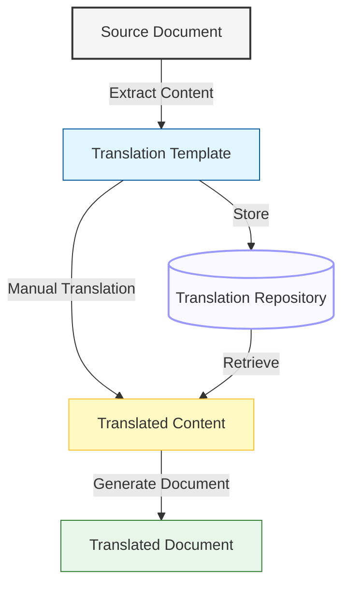

---
title: "Multilingual Documentation Framework"
type: "guide"
description: "Overview of the multilingual documentation support system for the Pokémon TCG Trading Platform"
author: "Documentation Team"
version: "1.0.0"
last_updated: "2023-12-10"
status: "published"
category: "documentation"
has_mermaid: true
---

# Multilingual Documentation Framework

## Overview

This document describes the multilingual documentation framework implemented for the Pokémon TCG Trading Platform. The framework enables translation of documentation into multiple languages while maintaining consistency and traceability to the original English documents.

## Architecture

The multilingual documentation system is built on a simple, file-based translation workflow:



## Directory Structure

The system uses the following directory structure:

- `/docs` - Original English documentation files
- `/translations` - Translation templates and content
  - `/{lang}` - Language-specific translation files (e.g., `/translations/es/`)
- `/i18n` - Generated translated documentation
  - `/{lang}` - Language-specific documentation (e.g., `/i18n/es/`)

## Translation Workflow

### 1. Extract Content for Translation

Use the `[removed-invalid-reference]` tool to extract content from source markdown files:

```bash
npm run i18n-extract docs/path/to/document.md es
```

This creates a JSON translation template in the `/translations/es/` directory with:
- A reference to the original document
- Original frontmatter data
- Content to be translated

### 2. Translate Content

Edit the JSON translation template to translate:
- The document title
- The document description
- The markdown content

The translation file preserves the original structure and formatting.

### 3. Generate Translated Document

Use the `[removed-invalid-reference]` tool to create the translated markdown document:

```bash
npm run i18n-generate translations/es/document.json es
```

This generates a markdown file in the `/i18n/es/` directory with:
- Translated title and description
- Original metadata (version, status, etc.)
- Additional translation metadata (original file reference, translation date)
- Translated content

## Frontmatter Extensions

Translated documents include additional frontmatter fields:

| Field | Description |
|-------|-------------|
| `language` | The language code (e.g., "es") |
| `original_file` | Path to the original English file |
| `translated` | Always `true` for translated files |
| `translation_date` | The date the translation was generated |

## Supported Languages

The framework currently supports:

- English (en) - Source language
- Spanish (es)
- French (fr)
- German (de)
- Japanese (ja)

Additional languages can be added as needed.

## Translation Tools

### Extraction Tool

The `[removed-invalid-reference]` script extracts content from source documents:

```bash
node tools/i18n-extract.js <source-file> [language-code]
```

### Generation Tool

The `[removed-invalid-reference]` script creates translated markdown files:

```bash
node tools/i18n-generate.js <translation-file> [language-code]
```

## NPM Scripts

| Script | Description |
|--------|-------------|
| `npm run i18n-extract` | Extract content from a document for translation |
| `npm run i18n-generate` | Generate a translated document from translations |

## Future Enhancements

1. **Bulk Translation Processing**: Add support for processing multiple files at once
2. **Translation Status Tracking**: Implement a system to track which documents need translation updates
3. **Automatic Change Detection**: Flag documents that have changed since translation
4. **Machine Translation Integration**: Add support for initial machine translation to speed up the process
5. **Web-based Translation Interface**: Create a UI for managing translations
6. **Language Selection in Documentation UI**: Add a language selector to the documentation site 