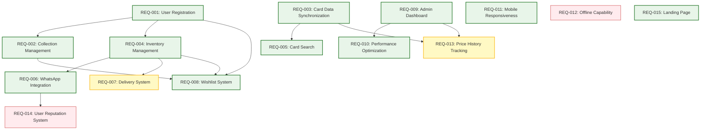

# Pokemon TCG Trade Platform - Product Requirements Document

## Executive Summary

The Pokemon TCG Trade Platform is a web application designed specifically for Pokemon Trading Card Game collectors in Costa Rica to showcase their card inventories, manage their collections, and facilitate direct trades between collectors. The platform acts as a centralized system for connecting buyers and sellers rather than a traditional marketplace with payment processing. Unique features include WhatsApp integration for direct communication and a physical delivery network leveraging partner stores.

## Business Goals

<business_goals>
1. Create a centralized platform for Pokemon TCG collectors in Costa Rica
2. Facilitate transparent card trading with real-time pricing data
3. Build a comprehensive database of Pokemon cards with accurate metadata
4. Establish a network of physical delivery points for convenient card exchanges
5. Drive engagement within the Pokemon TCG community in Costa Rica
</business_goals>

## Target Users

<target_users>
### Primary User Personas

1. **Casual Collectors**
   - Age: 16-40
   - Behavior: Collects cards as a hobby, trades occasionally
   - Needs: Easy browsing, collection management, fair trading

2. **Dedicated Collectors**
   - Age: 20-45
   - Behavior: Actively builds specific collections, trades frequently
   - Needs: Detailed card information, price tracking, set completion tools

3. **Card Stores/Shops**
   - Age: N/A (Business)
   - Behavior: Buys and sells cards, offers trade-in deals
   - Needs: Inventory management, price trend analysis, community engagement

4. **Community Organizers**
   - Age: 25-50
   - Behavior: Organizes events, maintains community connections
   - Needs: Community features, event coordination, user verification
</target_users>

## Requirements

<requirement>
### User Authentication and Profile Management

<requirement id="REQ-001" type="Functional" priority="Must-Have" status="Implemented">

#### User Registration and Authentication

Users must be able to create accounts and authenticate securely.

##### Implementation Details
- Email/password registration and login
- Social authentication options (Google)
- Secure password storage with bcrypt
- JWT-based authentication

##### Related Files
- `src/app/auth/register/page.tsx` (planned)
- `src/app/auth/login/page.tsx` (planned)
- `src/lib/services/auth-service.ts` (planned)

</requirement>

<requirement id="REQ-002" type="Functional" priority="Must-Have" status="Implemented">

### Card Database and Synchronization

The platform must maintain a comprehensive database of Pokemon cards synchronized with the Pokemon TCG API.

#### Acceptance Criteria:
- Complete card information including name, number, set, rarity, etc.
- Card images (small and large) from official sources
- Regular synchronization with the Pokemon TCG API
- Support for all card variations (holofoil, reverse holo, etc.)
- Price tracking from reliable sources

#### Implementation Files:
- `src/lib/services/pokemon-tcg-sync.ts` (planned)
- `src/app/api/pokemon-tcg/route.ts` (planned)
- `src/lib/services/price-update.ts` (planned)

</requirement>

<requirement id="REQ-003" type="Functional" priority="Must-Have" status="Implemented">

### Collection Management

Users must be able to track their personal card collections.

#### Acceptance Criteria:
- Add/remove cards from personal collection
- Track card quantities and conditions
- Filter and sort collection by various criteria
- Track collection statistics (unique cards, sets, etc.)
- Export collection data

#### Implementation Files:
- `src/app/collections/page.tsx` (planned)
- `src/components/collections/CollectionManager.tsx` (planned)
- `src/lib/services/collection-service.ts` (planned)

</requirement>

<requirement id="REQ-004" type="Functional" priority="Must-Have" status="Implemented">

### Trading Inventory Management

Users must be able to list cards they want to sell or trade.

#### Acceptance Criteria:
- List cards with pricing, condition, and quantities
- Mark cards as available for trade vs. sale
- Specify delivery options
- Set visibility options for listings
- Bulk inventory management

#### Dependencies:
- REQ-001 (User Registration)
- REQ-002 (Card Database)

#### Implementation Files:
- `src/app/trade/page.tsx` (planned)
- `src/components/inventory/InventoryManager.tsx` (planned)
- `src/lib/services/inventory-service.ts` (planned)

</requirement>

<requirement id="REQ-005" type="Functional" priority="Must-Have" status="Implemented">

### Card Search and Browsing

Users must be able to search and browse cards in the database.

#### Acceptance Criteria:
- Search by card name, set, number, etc.
- Advanced filtering options (rarity, type, etc.)
- Grid and list view options
- Sort by various criteria (price, name, set, etc.)
- Pagination for large result sets

#### Implementation Files:
- `src/app/search/page.tsx` (planned)
- `src/components/cards/CardBrowser.tsx` (planned)
- `src/lib/services/card-search-service.ts` (planned)

</requirement>

<requirement id="REQ-006" type="Functional" priority="Must-Have" status="Implemented">

### WhatsApp Integration

Users must be able to initiate direct contact via WhatsApp for trading negotiations.

#### Acceptance Criteria:
- WhatsApp message templates for card inquiries
- Click-to-WhatsApp functionality from card listings
- WhatsApp number verification during registration
- Contact tracking and logging
- Spam prevention measures

#### Dependencies:
- REQ-001 (User Registration)
- REQ-004 (Trading Inventory)

#### Implementation Files:
- `src/components/trade/ContactButton.tsx` (planned)
- `src/lib/services/whatsapp-service.ts` (planned)
- `src/app/api/contact-logs/route.ts` (planned)

</requirement>

<requirement id="REQ-007" type="Functional" priority="Must-Have" status="In Progress">

### Delivery System

The platform must facilitate physical card exchanges via partner stores.

#### Acceptance Criteria:
- Partner store network management
- Store-to-store delivery options
- Delivery tracking and status updates
- User preferences for pickup/dropoff locations
- Integration with WhatsApp for delivery notifications

#### Dependencies:
- REQ-004 (Trading Inventory)
- REQ-006 (WhatsApp Integration)

#### Implementation Files:
- `src/app/api/delivery/route.ts` (planned)
- `src/components/delivery/StoreSelector.tsx` (planned)
- `src/lib/services/delivery-service.ts` (planned)

</requirement>

<requirement id="REQ-008" type="Functional" priority="Must-Have" status="Implemented">

### Wishlist Management

Users must be able to maintain wishlists of cards they want to acquire.

#### Acceptance Criteria:
- Add/remove cards from wishlist
- Specify condition preferences
- Set maximum price willing to pay
- Receive notifications when wishlist items become available
- Integration with search functionality

#### Dependencies:
- REQ-001 (User Registration)
- REQ-002 (Card Database)

#### Implementation Files:
- `src/app/wishlist/page.tsx` (planned)
- `src/components/wishlist/WishlistManager.tsx` (planned)
- `src/lib/services/wishlist-service.ts` (planned)

</requirement>

<requirement id="REQ-009" type="Functional" priority="Must-Have" status="Implemented">

### Admin Dashboard

Administrators must have tools to manage the platform and monitor system health.

#### Acceptance Criteria:
- User management and verification
- Card database management
- Price update triggering and monitoring
- System health monitoring
- Data validation and cleanup tools
- Store network management

#### Implementation Files:
- `src/app/admin/dashboard/page.tsx` (planned)
- `src/components/admin/SystemMonitor.tsx` (planned)
- `src/lib/services/admin-service.ts` (planned)

</requirement>

<requirement id="REQ-010" type="Non-Functional" priority="Must-Have" status="Implemented">

### Performance and Scalability

The platform must handle large numbers of cards and users efficiently.

#### Acceptance Criteria:
- Page load times under 3 seconds
- Search results returned in under 1 second
- Support for 100+ concurrent users
- Database optimization for 100,000+ cards
- Efficient caching strategies

#### Implementation Files:
- `src/lib/utils/cache-utils.ts` (planned)
- `src/lib/services/supabase-optimization.ts` (planned)

</requirement>

<requirement id="REQ-011" type="Non-Functional" priority="Must-Have" status="Implemented">

### Mobile Responsiveness

The platform must work well on mobile devices.

#### Acceptance Criteria:
- Responsive design for all screen sizes
- Touch-friendly UI elements
- Optimized images for mobile
- Easy navigation on small screens
- WhatsApp deep linking for mobile devices

#### Implementation Files:
- `src/components/layouts/ResponsiveLayout.tsx` (planned)
- `src/app/globals.css` (planned)

</requirement>

<requirement id="REQ-012" type="Non-Functional" priority="Should-Have" status="Planned">

### Multilingual Support

The platform should support multiple languages, with focus on Spanish and English.

#### Acceptance Criteria:
- Language selection option
- Complete translations for Spanish and English
- Date, time, and currency localization
- RTL support for future language additions
- Language-specific routing

#### Implementation Files:
- `src/lib/i18n/`
- `src/app/[lang]/`

</requirement>

<requirement id="REQ-013" type="Functional" priority="Should-Have" status="In Progress">

### Price History Tracking

Users should be able to view historical price data for cards.

#### Acceptance Criteria:
- Price history charts for each card
- Historical data storage
- Multiple timeframe options (7d, 30d, 90d, 1y)
- Price trend indicators
- Market price vs. platform price comparisons

#### Dependencies:
- REQ-002 (Card Database)

#### Implementation Files:
- `src/components/cards/PriceHistoryChart.tsx` (planned)
- `src/lib/services/price-history-service.ts` (planned)

</requirement>

<requirement id="REQ-014" type="Functional" priority="Should-Have" status="Planned">

### User Reputation System

Users should have reputation scores based on successful trades.

#### Acceptance Criteria:
- Trade completion tracking
- User ratings and reviews
- Reputation score calculation
- Verification badges for trusted users
- Dispute resolution process

#### Dependencies:
- REQ-001 (User Registration)
- REQ-006 (WhatsApp Integration)

#### Implementation Files:
- `src/components/user/ReputationBadge.tsx` (planned)
- `src/lib/services/reputation-service.ts` (planned)

</requirement>

<requirement id="REQ-015" type="Functional" priority="Must-Have" status="Implemented">

### Landing Page and User Onboarding

The platform must provide an intuitive and engaging landing page that clearly communicates the platform's purpose and guides new users through onboarding.

#### Implementation Details
- Hero section with platform overview
- Featured cards carousel
- Step-by-step onboarding guide for new users
- Quick access to key features

#### Related Files
- `src/app/page.tsx` (planned)
- `src/components/landing/Hero.tsx` (planned)
- `src/components/onboarding/OnboardingSteps.tsx` (planned)

</requirement>

## Technical Requirements

<technical_requirements>
1. **Frontend**
   - Next.js 14 with App Router
   - TypeScript for type safety
   - Tailwind CSS for styling
   - shadcn/ui component library
   - Mobile-first responsive design

2. **Backend**
   - Supabase for database and authentication
   - PostgreSQL for relational data
   - Serverless functions for API endpoints
   - Twilio for SMS verification

3. **APIs and Integrations**
   - Pokemon TCG API for card data
   - WhatsApp Business API for messaging
   - Supabase Auth for authentication
   - Vercel for deployment and hosting

4. **Performance**
   - Client-side caching strategies
   - Server-side rendering for SEO and performance
   - Image optimization and lazy loading
   - Database indexing and query optimization
</technical_requirements>

## Constraints and Limitations

<constraints>
1. **Budget Constraints**
   - Limited budget for third-party services
   - Focus on open-source solutions where possible
   - Cost-effective hosting and API usage

2. **Timeline Constraints**
   - Initial MVP launch: Q1 2023
   - Feature complete version: Q4 2023
   - Iterative releases based on user feedback

3. **Technical Constraints**
   - Pokemon TCG API rate limits
   - WhatsApp API limitations for business accounts
   - Mobile device compatibility requirements
   - Internet connectivity variations in target market
</constraints>

## Success Metrics

<success_metrics>
1. **User Engagement**
   - 1,000+ registered users within 6 months
   - 50+ active daily users
   - Average session duration > 10 minutes

2. **Trading Activity**
   - 500+ cards listed for trade/sale
   - 100+ completed trades per month
   - 20+ partner stores in the delivery network

3. **Platform Performance**
   - Average page load time < 3 seconds
   - 99.9% uptime
   - < 1% error rate on API calls
   - Search response time < 1 second
</success_metrics>

## Future Considerations

<future_considerations>
1. **Expansion to Other Regions**
   - Adaptations for other Central American countries
   - Region-specific delivery networks

2. **Additional Trading Card Games**
   - Framework for supporting other TCGs (Magic: The Gathering, Yu-Gi-Oh!, etc.)
   - Game-specific metadata and search capabilities

3. **Advanced Features**
   - AI-powered price recommendations
   - Visual card recognition for quick adding
   - In-platform chat/messaging system
   - Mobile application development
</future_considerations>

## Revision History

<revision_history>
| Version | Date       | Author        | Description                                |
|---------|------------|---------------|--------------------------------------------|
| 1.0.0   | 2023-03-15 | Product Team  | Initial PRD                               |
| 1.1.0   | 2023-07-22 | Product Team  | Updated with WhatsApp integration details |
| 1.2.0   | 2023-11-18 | Product Team  | Updated with delivery system requirements |
</revision_history>

## Requirements Relationship Diagram

## Implementation Timeline

<timeline>
// ... existing code ...
</timeline>

## Related Documentation

<related_docs>
- [System Design Document](./system-design-document.md): Technical architecture and implementation details
- [API Reference](./api-reference.md): API endpoints and integration specifications
- [User Trading Flow](./user-trading-flow.md): User interaction flows and processes
</related_docs> 