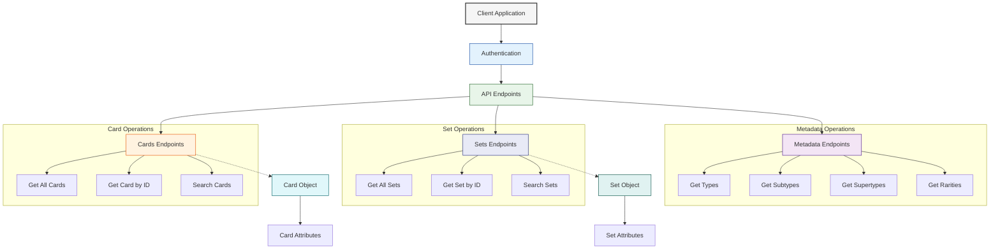

---
title: Main Overview
version: 1.0.0
last_updated: '2025-03-24'
status: Active
tags:
  - documentation
has_mermaid: true
---

# Pokémon TCG API Documentation

## Main Page - Welcome

Welcome to the Pokémon TCG API docs!

## API Architecture

### Overview

The Pokémon TCG API is organized around REST. Our API has predictable resource-oriented URLs, accepts JSON encoded request bodies, returns JSON-encoded responses, and uses standard HTTP response codes, authentication, and verbs.

You can use the Pokémon TCG API without registering for an API key, although your limits are far less than if you had an API key. The API key you use to authenticate the request determines your rate limits. Register for an api key at the Developer Portal.

You can use this documentation to get familiar with the REST API or any of the supported developer SDKs, such as Python, Ruby and more.

### Version 1 Deprecation

Version 1 of the API will no longer receive any data updates. It is officially deprecated as of August 1, 2021. The last set available in Version 1 of the API is Chilling Reigns. Please update your application accordingly.

## Documentation Structure

This documentation has been split into several smaller files for easier navigation:

1. **Main Overview** (this file)
2. **Authentication and Rate Limits** - Information about API keys and usage limits
3. **V1 to V2 Migration Guide** - Changes between API versions
4. **Error Handling** - HTTP status codes and error responses
5. **Card Object Reference** - Detailed description of the Card object and its attributes
6. **Set Object Reference** - Detailed description of the Set object and its attributes
7. **Card Endpoints** - API endpoints for retrieving and searching cards
8. **Set Endpoints** - API endpoints for retrieving and searching sets
9. **Types, Subtypes, Supertypes, and Rarities Endpoints** - Additional API endpoints