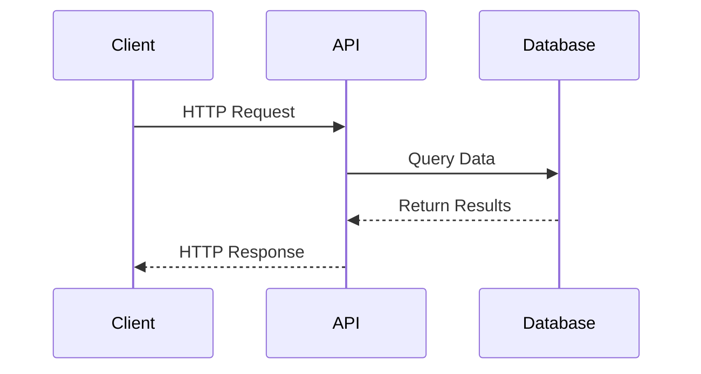

# Authentication and Rate Limits

## Diagram

## Authentication

The Pokémon TCG API uses API keys to authenticate requests. Sign up for an account at the Pokémon TCG Developer Portal to get your API key for free.

Your API keys carry many privileges, so be sure to keep them secure! Do not share your secret API keys in publicly accessible areas such as GitHub, client-side code, and so forth. If you feel as though your API key has been compromised, you can generate a new key at any time.

Authentication to the API is performed via the X-Api-Key header. Provide your API key in the headers of all requests to authenticate to the Pokémon TCG API.

All API requests must be made over HTTPS. Calls made over plain HTTP will fail will redirect to HTTPS automatically. API requests without authentication won't fail, but your rate limits are drastically reduced.

## Rate Limits

### Overview

Rate limits are enforced for all third-party applications and services. This document is an overview of the rate limits themselves, as well as how they are enforced and best practices for handling the errors returned when a rate limit is reached.

### V2 Rate Limits

Third-party application rate limits depend on your API key. By default, requests are limited to 20,000/day. If you need a higher rate limit, feel free to contact me via Discord or email and we can discuss.

If you aren't using an API key, you are rate limited to 1000 requests a day, and a maxium of 30 per minute.

### V1 (Deprecated) Rate Limits

Third-party applications are currently throttled to 30 requests per minute. As this API continues to age, the rate limits may be updated to provide better performance to users

### Rationale

As previously mentioned, the primary goal is to provide a responsive interface for developers and users to use when accessing the Pokémon TCG data. Since each request made to the API incurs a computational cost, it's in the best interest of both the Pokémon TCG API and its developer partners that these costs be minimized to the greatest degree possible.

Rate limiting also helps third-party developers by encouraging them to build their integrations to make economical use of API requests.

By donating to this API via Patreon or Kofi, you can help ensure that the server performance will meet your application needs.