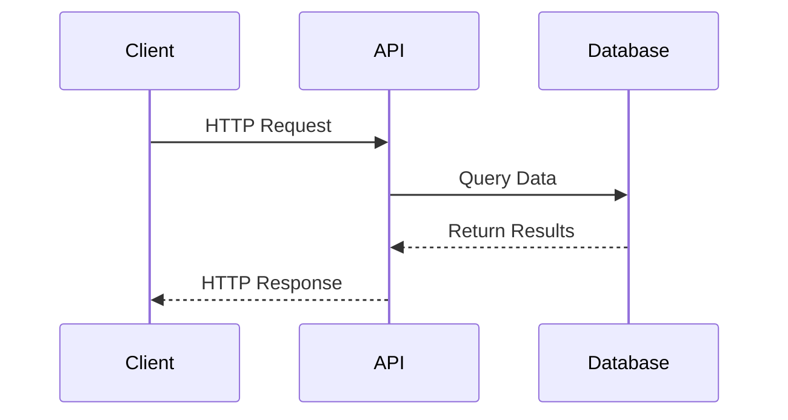

# Error Handling

## Diagram



The Pokémon TCG API uses conventional HTTP response codes to indicate the success or failure of an API request. In general: Codes in the 200 range indicate success. Codes in the 4xx range indicate an error that failed given the information provided (e.g., a required parameter was omitted). Codes in the 5xx range indicate an error with the Pokémon TCG API servers.

## HTTP Status Code Summary

| Status Code | Description |
| ----------- | ----------- |
| 200 - OK | Everything worked as expected. |
| 400 - Bad Request | The request was unacceptable, often due to an incorrect query string parameter |
| 402 - Request Failed | The parameters were valid but the request failed. |
| 403 - Forbidden | The user doesn't have permissions to perform the request. |
| 404 - Not Found | The requested resource doesn't exist. |
| 429 - Too Many Requests | The rate limit has been exceeded. |
| 500, 502, 503, 504 - Server Errors | Something went wrong on our end. |

## Sample Error Response

```json
{
  "error": {
    "message": "Bad Request. Your request is either malformed, or is missing one or more required fields.",
    "code": 400
  }
}
```