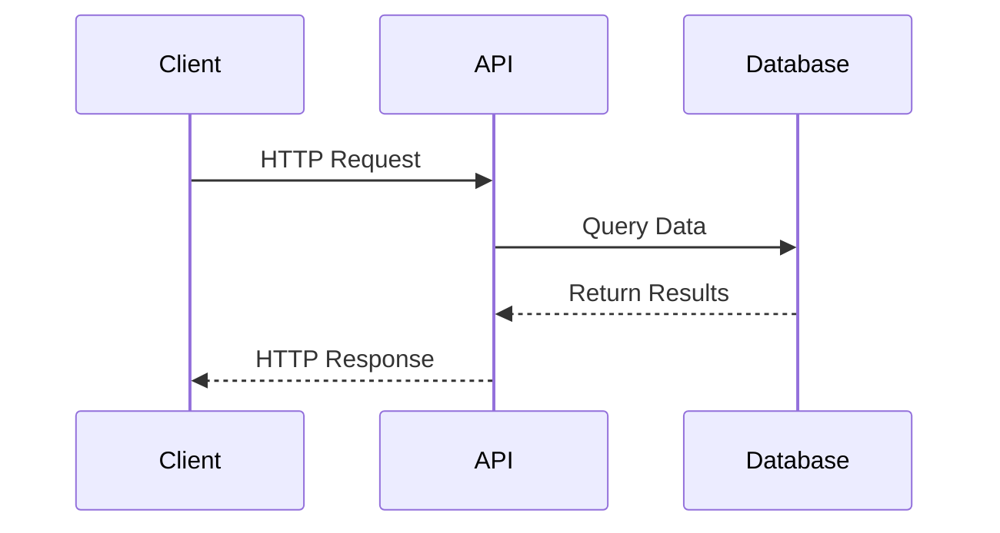

# Card Endpoints

## Diagram



## Get a card

Fetch the details of a single card.

### HTTP Request
```
GET https://api.pokemontcg.io/v2/cards/<id>
```

### URL Parameters
| Parameter | Description |
| --------- | ----------- |
| id | The Id of the card |

### Body Parameters
None

### Query Parameters
All query parameters are optional.

| Parameter | Description | Default Value |
| --------- | ----------- | ------------- |
| select | A comma delimited list of fields to return in the response (ex. ?select=id,name). By default, all fields are returned if this query parameter is not used. |  |

### Code Samples
```python
card = Card.find('xy1-1')
```

### Sample Response
```json
{
  "data": {
    "id": "xy1-1",
    "name": "Venusaur-EX",
    "supertype": "Pokémon",
    "subtypes": [
      "Basic",
      "EX"
    ],
    "hp": "180",
    "types": [
      "Grass"
    ],
    "evolvesTo": [
      "M Venusaur-EX"
    ],
    "rules": [
      "Pokémon-EX rule: When a Pokémon-EX has been Knocked Out, your opponent takes 2 Prize cards."
    ],
    "attacks": [
      {
        "name": "Poison Powder",
        "cost": [
          "Grass",
          "Colorless",
          "Colorless"
        ],
        "convertedEnergyCost": 3,
        "damage": "60",
        "text": "Your opponent's Active Pokémon is now Poisoned."
      },
      {
        "name": "Jungle Hammer",
        "cost": [
          "Grass",
          "Grass",
          "Colorless",
          "Colorless"
        ],
        "convertedEnergyCost": 4,
        "damage": "90",
        "text": "Heal 30 damage from this Pokémon."
      }
    ],
    "weaknesses": [
      {
        "type": "Fire",
        "value": "×2"
      }
    ],
    "retreatCost": [
      "Colorless",
      "Colorless",
      "Colorless",
      "Colorless"
    ],
    "convertedRetreatCost": 4,
    "set": {
      "id": "xy1",
      "name": "XY",
      "series": "XY",
      "printedTotal": 146,
      "total": 146,
      "legalities": {
        "unlimited": "Legal",
        "expanded": "Legal"
      },
      "ptcgoCode": "XY",
      "releaseDate": "2014/02/05",
      "updatedAt": "2018/03/04 10:35:00",
      "images": {
        "symbol": "https://images.pokemontcg.io/xy1/symbol.png",
        "logo": "https://images.pokemontcg.io/xy1/logo.png"
      }
    },
    "number": "1",
    "artist": "Eske Yoshinob",
    "rarity": "Rare Holo EX",
    "nationalPokedexNumbers": [
      3
    ],
    "legalities": {
      "unlimited": "Legal",
      "expanded": "Legal"
    },
    "images": {
      "small": "https://images.pokemontcg.io/xy1/1.png",
      "large": "https://images.pokemontcg.io/xy1/1_hires.png"
    },
    "tcgplayer": {
      "url": "https://prices.pokemontcg.io/tcgplayer/xy1-1",
      "updatedAt": "2021/07/09",
      "prices": {
        "holofoil": {
          "low": 1.0,
          "mid": 3.46,
          "high": 12.95,
          "market": 3.32,
          "directLow": 2.95
        }
      }
    }
  }
}
```

## Search cards

Search for one or many cards given a search query.

### HTTP Request
```
GET https://api.pokemontcg.io/v2/cards
```

### URL Parameters
None

### Body Parameters
None

### Query Parameters
All query parameters are optional.

| Parameter | Description | Default Value |
| --------- | ----------- | ------------- |
| q | The search query. Examples can be found below. |  |
| page | The page of data to access. | 1 |
| pageSize | The maximum amount of cards to return. | 250 (max of 250) |
| orderBy | The field(s) to order the results by. Examples can be found below. |  |
| select | A comma delimited list of fields to return in the response (ex. ?select=id,name). By default, all fields are returned if this query parameter is not used. |  |

To perform search queries, you use the q parameter. The search syntax is a very familiar Lucene like syntax.

#### Keyword matching:

Search for all cards that have "charizard" in the name field.
```
name:charizard
```

Search for the phrase "venusaur v" in the name field.
```
name:"venusaur v"
```

Search for "charizard" in the name field AND the type "mega" in the subtypes field.
```
name:charizard subtypes:mega
```

Search for "charizard" in the name field AND either the subtypes of "mega" or "vmax."
```
name:charizard (subtypes:mega OR subtypes:vmax)
```

Search for all "mega" subtypes, but NOT water types.
```
subtypes:mega -types:water
```

#### Wildcard Matching

Search for any card that starts with "char" in the name field.
```
name:char*
```

Search for any card that starts with "char" in the name and ends with "der."
```
name:char*der
```

#### Exact Matching

Search for any card named "charizard." That is, no other word except for "charizard" appears in the name field.
```
!name:charizard
```

#### Range Searches

Some fields support searching on a range. This includes fields with numerical data like hp and nationalPokedexNumbers.

Search for only cards that feature the original 151 pokemon.
```
nationalPokedexNumbers:[1 TO 151]
```

Using square brackets [ and ] means to do an inclusive range search, while using curly braces { and } means exclusive.

Search for cards with a max HP up to 100.
```
hp:[* TO 100]
```

Search for cards with any HP greater than or equal to 150.
```
hp:[150 TO *]
```

#### Search on nested fields

To search nested fields, use a period . as a separator. For example, to filter by the set id:
```
set.id:sm1
```

Or to filter on cards where they have an attack named "Spelunk":
```
attacks.name:Spelunk
```

Find cards that are banned in Standard.
```
legalities.standard:banned
```

Every field in the response is searchable.

#### Ordering Data

You can also order data using the orderBy query parameter.

Order all cards from Sun & Moon by their number.
```
?orderBy=number
```

Order all cards from Sun & Moon by their name (ascending) and then their number (descending)
```
?orderBy=name,-number
```

### Code Samples
```python
# Get all cards (will take awhile, automatically pages through data)
cards = Card.all()


# Get a single page of cards
cards = Card.where(page=1, pageSize=250)


# Filter cards via query parameters
cards = Card.where(q='set.name:generations subtypes:mega')


# Order by release date (descending)
cards = Card.where(q='subtypes:mega', orderBy='-set.releaseDate')
```

### Sample Response
```json
{
  "data": [
    {
      "id": "g1-1",
      "name": "Venusaur-EX",
      "supertype": "Pokémon",
      "subtypes": [
        "Basic",
        "EX"
      ],
      "hp": "180",
      "types": [
        "Grass"
      ],
      "evolvesTo": [
        "M Venusaur-EX"
      ],
      "rules": [
        "Pokémon-EX rule: When a Pokémon-EX has been Knocked Out, your opponent takes 2 Prize cards."
      ],
      "attacks": [
        {
          "name": "Frog Hop",
          "cost": [
            "Grass",
            "Colorless",
            "Colorless"
          ],
          "convertedEnergyCost": 3,
          "damage": "40+",
          "text": "Flip a coin. If heads, this attack does 40 more damage."
        },
        {
          "name": "Poison Impact",
          "cost": [
            "Grass",
            "Grass",
            "Colorless",
            "Colorless"
          ],
          "convertedEnergyCost": 4,
          "damage": "80",
          "text": "Your opponent's Active Pokémon is now Asleep and Poisoned."
        }
      ],
      "weaknesses": [
        {
          "type": "Fire",
          "value": "×2"
        }
      ],
      "retreatCost": [
        "Colorless",
        "Colorless",
        "Colorless",
        "Colorless"
      ],
      "convertedRetreatCost": 4,
      "set": {
        "id": "g1",
        "name": "Generations",
        "series": "XY",
        "printedTotal": 115,
        "total": 115,
        "legalities": {
          "unlimited": "Legal",
          "expanded": "Legal"
        },
        "ptcgoCode": "GEN",
        "releaseDate": "2016/02/22",
        "updatedAt": "2020/08/14 09:35:00",
        "images": {
          "symbol": "https://images.pokemontcg.io/g1/symbol.png",
          "logo": "https://images.pokemontcg.io/g1/logo.png"
        }
      },
      "number": "1",
      "artist": "Eske Yoshinob",
      "rarity": "Rare Holo EX",
      "nationalPokedexNumbers": [
        3
      ],
      "legalities": {
        "unlimited": "Legal",
        "expanded": "Legal"
      },
      "images": {
        "small": "https://images.pokemontcg.io/g1/1.png",
        "large": "https://images.pokemontcg.io/g1/1_hires.png"
      },
      "tcgplayer": {
        "url": "https://prices.pokemontcg.io/tcgplayer/g1-1",
        "updatedAt": "2021/07/15",
        "prices": {
          "holofoil": {
            "low": 2.44,
            "mid": 5.4,
            "high": 16.99,
            "market": 5.38,
            "directLow": 6.1
          }
        }
      }
    },
    {...},
    {...}
  ],
  "page": 1,
  "pageSize": 250,
  "count": 117,
  "totalCount": 117
}
```