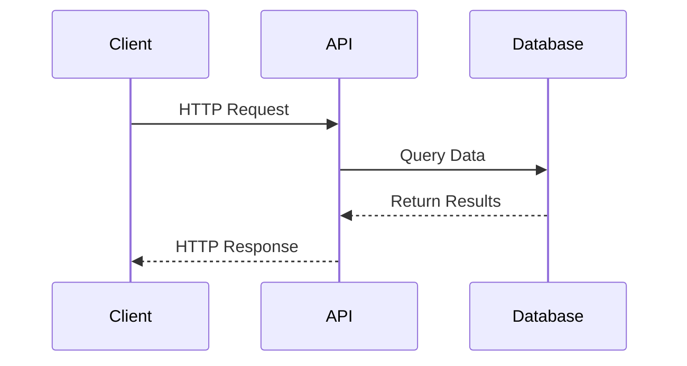

# Set Endpoints

## Diagram



## Get a set

Fetch the details of a single set.

### HTTP Request
```
GET https://api.pokemontcg.io/v2/sets/<id>
```

### URL Parameters
| Parameter | Description |
| --------- | ----------- |
| id | The Id of the set |

### Body Parameters
None

### Query Parameters
All query parameters are optional.

| Parameter | Description | Default Value |
| --------- | ----------- | ------------- |
| select | A comma delimited list of fields to return in the response (ex. ?select=id,name). By default, all fields are returned if this query parameter is not used. |  |

### Code Samples
```python
set = Set.find('swsh1')
```

### Sample Response
```json
{
  "data": {
    "id": "swsh1",
    "name": "Sword & Shield",
    "series": "Sword & Shield",
    "printedTotal": 202,
    "total": 216,
    "legalities": {
      "unlimited": "Legal",
      "standard": "Legal",
      "expanded": "Legal"
    },
    "ptcgoCode": "SSH",
    "releaseDate": "2020/02/07",
    "updatedAt": "2020/08/14 09:35:00",
    "images": {
      "symbol": "https://images.pokemontcg.io/swsh1/symbol.png",
      "logo": "https://images.pokemontcg.io/swsh1/logo.png"
    }
  }
}
```

## Search sets

Search for one or many sets given a search query.

### HTTP Request
```
GET https://api.pokemontcg.io/v2/sets
```

### URL Parameters
None

### Body Parameters
None

### Query Parameters
All query parameters are optional.

| Parameter | Description | Default Value |
| --------- | ----------- | ------------- |
| q | The search query. Examples can be found below. |  |
| page | The page of data to access. | 1 |
| pageSize | The maximum amount of sets to return. | 250 (max of 250) |
| orderBy | The field(s) to order the results by. |  |
| select | A comma delimited list of fields to return in the response (ex. ?select=id,name). By default, all fields are returned if this query parameter is not used. |  |

### Code Samples
```python
# Get all sets
sets = Set.all()

# Get sets filtered by legality
sets = Set.where(q='legalities.standard:legal')
```

### Sample Response
```json
{
  "data": [
    {
      "id": "base1",
      "name": "Base",
      "series": "Base",
      "printedTotal": 102,
      "total": 102,
      "legalities": {
        "unlimited": "Legal"
      },
      "ptcgoCode": "BS",
      "releaseDate": "1999/01/09",
      "updatedAt": "2020/08/14 09:35:00",
      "images": {
        "symbol": "https://images.pokemontcg.io/base1/symbol.png",
        "logo": "https://images.pokemontcg.io/base1/logo.png"
      }
    },
    {...},
    {...}
  ],
  "page": 1,
  "pageSize": 250,
  "count": 117,
  "totalCount": 117
}
```