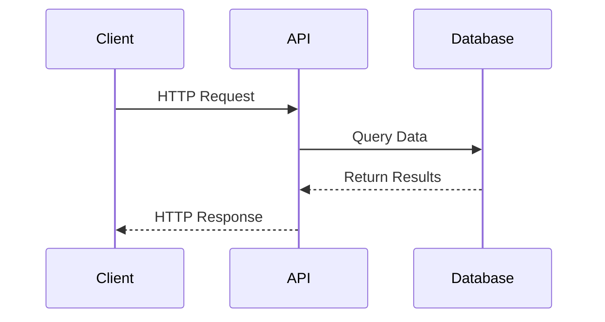

# Additional Endpoints

## Diagram



## Types

Get all Pokemon types.

### HTTP Request
```
GET https://api.pokemontcg.io/v2/types
```

### URL Parameters
None

### Body Parameters
None

### Query Parameters
None

### Code Samples
```python
types = Type.all()
```

### Sample Response
```json
{
  "data": [
    "Colorless",
    "Darkness",
    "Dragon",
    "Fairy",
    "Fighting",
    "Fire",
    "Grass",
    "Lightning",
    "Metal",
    "Psychic",
    "Water"
  ]
}
```

## Subtypes

Get all Pokemon card subtypes.

### HTTP Request
```
GET https://api.pokemontcg.io/v2/subtypes
```

### URL Parameters
None

### Body Parameters
None

### Query Parameters
None

### Code Samples
```python
subtypes = Subtype.all()
```

### Sample Response
```json
{
  "data": [
    "BREAK",
    "Baby",
    "Basic",
    "EX",
    "Eternamax",
    "Fusion",
    "Gigantamax",
    "GX",
    "Goldenrod Game Corner",
    "Item",
    "LEGEND",
    "Level-Up",
    "MEGA",
    "Pokémon Tool",
    "Pokémon Tool F",
    "Prime",
    "Prism Star",
    "Radical Raid",
    "Rapid Strike",
    "Restored",
    "Rocket's Secret Machine",
    "Single Strike",
    "Special",
    "Stadium",
    "Stage 1",
    "Stage 2",
    "Supporter",
    "TAG TEAM",
    "Team Plasma",
    "Technical Machine",
    "Trainer",
    "Tera ex",
    "Tera",
    "V",
    "VMAX",
    "VSTAR",
    "ex"
  ]
}
```

## Supertypes

Get all Pokemon card supertypes.

### HTTP Request
```
GET https://api.pokemontcg.io/v2/supertypes
```

### URL Parameters
None

### Body Parameters
None

### Query Parameters
None

### Code Samples
```python
supertypes = Supertype.all()
```

### Sample Response
```json
{
  "data": [
    "Energy",
    "Pokémon",
    "Trainer"
  ]
}
```

## Rarities

Get all Pokemon card rarities.

### HTTP Request
```
GET https://api.pokemontcg.io/v2/rarities
```

### URL Parameters
None

### Body Parameters
None

### Query Parameters
None

### Code Samples
```python
rarities = Rarity.all()
```

### Sample Response
```json
{
  "data": [
    "Amazing Rare",
    "Common",
    "LEGEND",
    "Promo",
    "Rare",
    "Rare ACE",
    "Rare BREAK",
    "Rare Holo",
    "Rare Holo EX",
    "Rare Holo GX",
    "Rare Holo LV.X",
    "Rare Holo Star",
    "Rare Holo V",
    "Rare Holo VMAX",
    "Rare Holo ex",
    "Rare Prime",
    "Rare Prism Star",
    "Rare Rainbow",
    "Rare Secret",
    "Rare Shining",
    "Rare Shiny",
    "Rare Shiny GX",
    "Rare Ultra",
    "Uncommon"
  ]
}
```