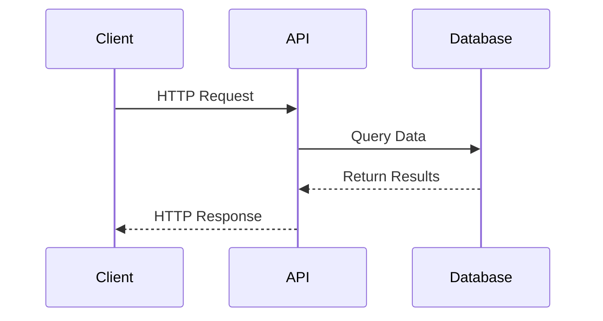

# Pokémon TCG API Documentation

## Diagram

This directory contains the official documentation for the Pokémon TCG API, split into smaller, more digestible files for easier navigation and reference.

## Documentation Structure

The documentation is organized into the following files:

1. **[01_main_overview.md](01_main_overview.md)** - Introduction to the API and documentation structure
2. **[02_authentication_rate_limits.md](02_authentication_rate_limits.md)** - Information about API keys and usage limits
3. **[03_v1_to_v2_migration.md](03_v1_to_v2_migration.md)** - Changes between API versions
4. **[04_error_handling.md](04_error_handling.md)** - HTTP status codes and error responses
5. **[05_card_object_reference.md](05_card_object_reference.md)** - Detailed description of the Card object and its attributes
6. **[06_set_object_reference.md](06_set_object_reference.md)** - Detailed description of the Set object and its attributes
7. **[07_card_endpoints.md](07_card_endpoints.md)** - API endpoints for retrieving and searching cards
8. **[08_set_endpoints.md](08_set_endpoints.md)** - API endpoints for retrieving and searching sets
9. **[09_additional_endpoints.md](09_additional_endpoints.md)** - Endpoints for types, subtypes, supertypes, and rarities

## API Overview

The Pokémon TCG API is a RESTful API that provides access to Pokémon Trading Card Game information. It includes data about cards, sets, types, and more. The API is free to use, with higher rate limits available for registered users with API keys.

## Getting Started

To get started with the Pokémon TCG API:

1. Read the [Main Overview](01_main_overview.md) to understand the API structure
2. Check the [Authentication and Rate Limits](02_authentication_rate_limits.md) to learn about API keys
3. Explore the object references to understand the data structure
4. Review the endpoint documentation to learn how to make API requests

## Official Resources

- Official API: [https://api.pokemontcg.io/v2/](https://api.pokemontcg.io/v2/)
- Developer Portal: [https://dev.pokemontcg.io/](https://dev.pokemontcg.io/)
- GitHub Repository: [https://github.com/PokemonTCG/pokemon-tcg-api-docs](https://github.com/PokemonTCG/pokemon-tcg-api-docs)