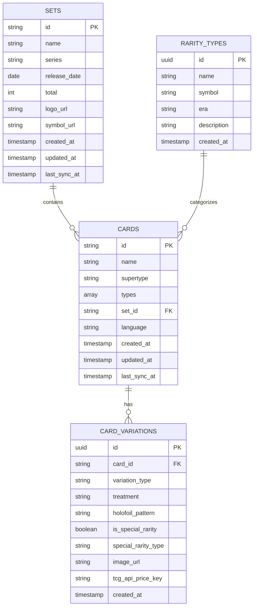
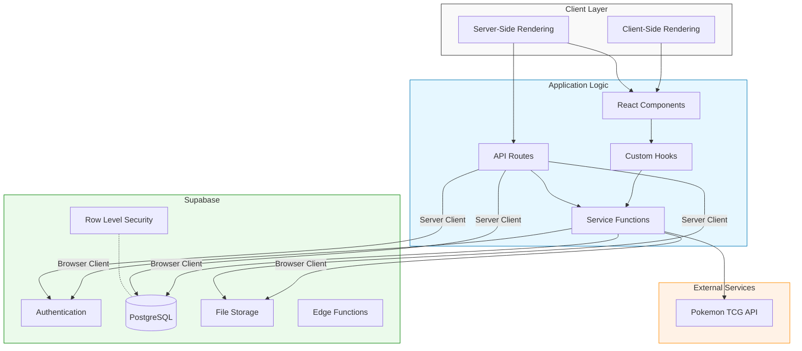
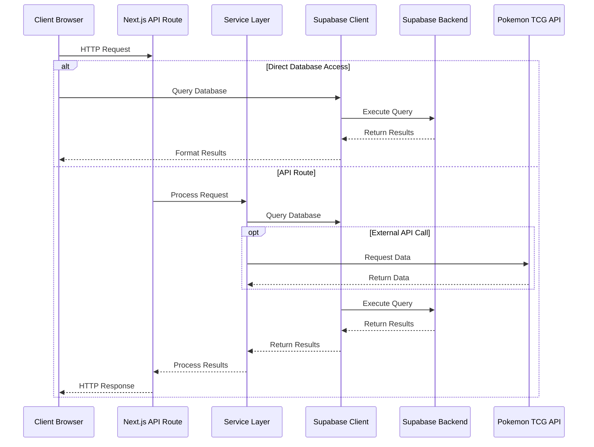
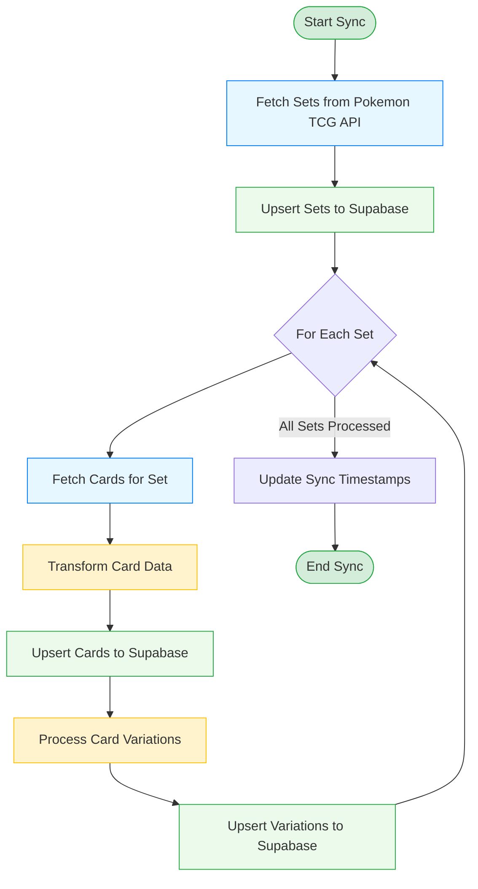

---
title: Supabase Api Architecture
version: 1.0.0
last_updated: '2025-03-24'
status: Active
tags:
  - documentation
has_mermaid: true
---

# Supabase and API Architecture

This document provides a detailed overview of the Supabase integration and API architecture in the Pokémon TCG Trade Platform. It serves as a reference for developers working on the project.

## Table of Contents
- [Database Schema](#database-schema)
- [Supabase Integration](#supabase-integration)
- [API System](#api-system)
- [Data Synchronization](#data-synchronization)
- [Search Functionality](#search-functionality)

## Database Schema

### Core Tables

#### Cards Table
The `cards` table is the primary table for storing Pokémon card information:

- `id`: text (Primary Key), NOT NULL
- `name`: text, NOT NULL
- `supertype`: text, nullable
- `types`: ARRAY, nullable
- `set_id`: text, NOT NULL, foreign key referencing "sets" table
- `language`: text, NOT NULL, default 'English'
- `created_at`: timestamp with time zone, default now()
- `updated_at`: timestamp with time zone, default now()
- `last_sync_at`: timestamp with time zone, default now()

#### Card Variations Table
The `card_variations` table stores information about different variations of a card:

- `id`: uuid (Primary Key), NOT NULL, default uuid_generate_v4()
- `card_id`: text, NOT NULL, foreign key referencing "cards" table
- `variation_type`: text, NOT NULL
- `treatment`: text, nullable
- `holofoil_pattern`: text, nullable
- `is_special_rarity`: boolean, default false
- `special_rarity_type`: text, nullable
- `image_url`: text, nullable
- `tcg_api_price_key`: text, nullable
- `created_at`: timestamp with time zone, default now()

### Other Tables
- `sets`: Stores information about card sets
- `rarity_types`: Stores information about different rarity types

### Database Relationships



## Supabase Integration

### Client-Side Integration

The project uses two approaches for Supabase client initialization:

1. **Browser Client** (`src/lib/supabase-browser.ts` (planned)):
   ```typescript
   'use client';
   import { createClient } from '@supabase/supabase-js';
   import { Database } from './database.types';

   export const createBrowserSupabaseClient = () => {
     return createClient<Database>(
       process.env.NEXT_PUBLIC_SUPABASE_URL || '',
       process.env.NEXT_PUBLIC_SUPABASE_ANON_KEY || ''
     );
   };

   export default createBrowserSupabaseClient;
   ```

2. **SSR Client** (using `@supabase/ssr`):
   Used for server-side components and API routes in Next.js 15.

### Application Architecture with Supabase



### TypeScript Integration

The project uses TypeScript types generated from the Supabase schema, stored in `src/lib/database.types.ts` (planned), which provides type safety when interacting with the database.

## API System

### Test Endpoints

1. **Pokemon TCG Test Endpoint** (`src/app/api/test-pokemon-tcg/route.ts` (planned)):
   - Syncs set and card data from Pokemon TCG API to Supabase
   - Performs data transformations
   - Returns success status and statistics

2. **Supabase Test Endpoint** (`src/app/api/test-supabase/route.ts` (planned)):
   - Tests the Supabase connection
   - Queries the `rarity_types` table
   - Returns connection status

### API Request Flow



### Data Access Pattern

The application primarily uses **client-side data fetching** directly from Supabase, rather than dedicated API endpoints for each data operation. This approach:

1. Leverages Supabase's Row Level Security (RLS) for access control
2. Reduces backend code by using Supabase's query capabilities directly
3. Enables real-time updates when the database changes

## Data Synchronization

### Pokemon TCG Service

The `PokemonTcgService` (`src/lib/services/pokemon-tcg-service.ts` (planned)) handles synchronization of data from the Pokemon TCG API to the Supabase database:

1. **Set Synchronization**: Fetches all sets from the Pokemon TCG API and upserts them into the Supabase database
2. **Card Synchronization**: Fetches cards for specific sets, transforms the data, and upserts them into the database
3. **Variation Handling**: Creates and updates card variations based on alternative art, holofoil patterns, etc.

### Synchronization Process Flow



## Search Functionality

The advanced search functionality is implemented in the client-side component (`src/app/test-cards/advanced/page.tsx` (planned)) without a dedicated API endpoint:

1. **Filter Initialization**:
   - Fetches available sets, rarity types, and other filter options from Supabase
   - Extracts unique values for types, generations, and eras

2. **Dynamic Query Building**:
   - Constructs a Supabase query based on URL search parameters
   - Applies filters for set, rarity, type, generation, era, and name search
   - Orders and limits results

3. **UI Display**:
   - Renders filter form with dropdown options
   - Displays card grid with images and details
   - Links to card details and related functionality

### Search Parameters

The advanced search supports the following filters:
- Set (dropdown from sets table)
- Rarity (dropdown from rarity_types table)
- Type (dropdown from unique card types)
- Generation (dropdown from unique pokemon_generation values)
- Era (dropdown from unique card_era values)
- Name search (text input with ilike query)

## Future Enhancements

1. **Dedicated API Routes**: Consider creating dedicated API routes for complex operations to:
   - Centralize business logic
   - Add caching layers
   - Implement custom validation

2. **Real-time Subscriptions**: Leverage Supabase's real-time capabilities for live updates

3. **Improved Error Handling**: Standardize error handling across API routes and client-side code

## Environment Variables

The system requires the following environment variables:
- `NEXT_PUBLIC_SUPABASE_URL`: Supabase project URL
- `NEXT_PUBLIC_SUPABASE_ANON_KEY`: Supabase anonymous key for client-side access
- `POKEMONTCG_API_KEY`: API key for accessing the Pokemon TCG API