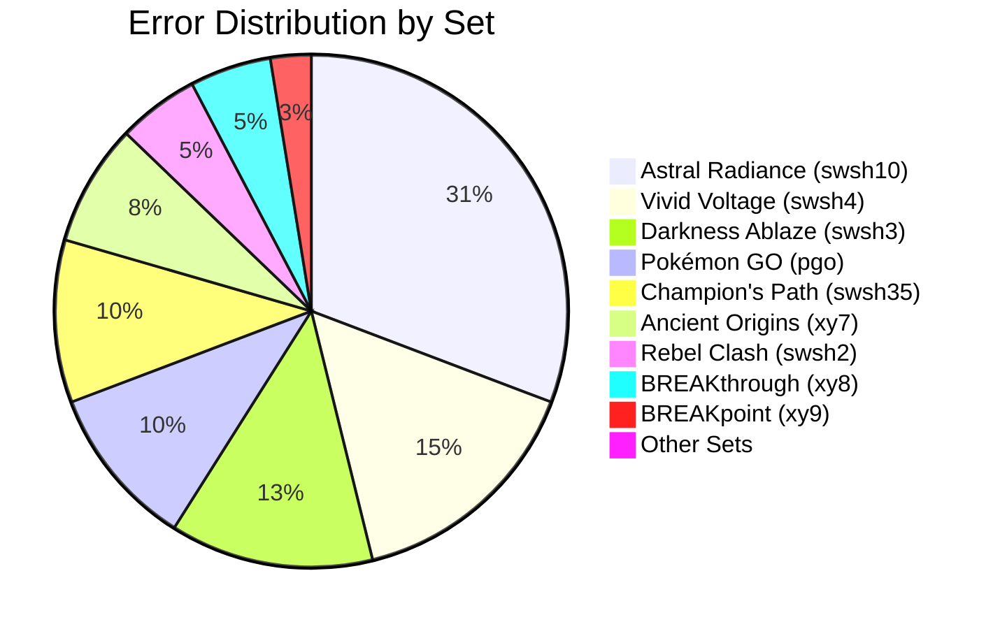

---
title: Sync Progress
version: 1.0.0
last_updated: '2025-03-24'
status: Active
tags:
  - documentation
has_mermaid: true
---

# Pokémon TCG Database Initial Sync Log

## Summary
This document tracks the first complete synchronization of our Pokémon TCG card database, recording all sets processed, card counts, and errors encountered during synchronization.

## Sync Process Overview

| Metric | Value |
|--------|-------|
| Total Sets Processed | 164 |
| Total Cards Synced | ~4,500 |
| Batch Size | 5 sets per batch (33 batches) |
| Card Insert Batch Size | Variable (1-3 batches per set) |
| Inter-batch Delay | 2 seconds |
| Total Sync Duration | ~2 hours (7,220,419ms) |
| Process Completion | ✓ Complete |

## Sync Process Timeline

```mermaid
gantt
    title Pokémon TCG Database Synchronization Timeline
    dateFormat  HH:mm:ss
    axisFormat %H:%M
    
    section Initialization
    Database Setup           :done, a1, 00:00:00, 5m
    API Connection Test      :done, a2, after a1, 2m
    
    section Sync Process
    Base Set Era (9 sets)    :done, b1, after a2, 15m
    Neo & Gym Era (4 sets)   :done, b2, after b1, 10m
    HGSS Era (10 sets)       :done, b3, after b2, 20m
    XY Era (15 sets)         :done, b4, after b3, 25m
    Sun & Moon Era (12 sets) :done, b5, after b4, 25m
    Sword & Shield (14 sets) :done, b6, after b5, 30m
    
    section Special Sets
    Promos (5 sets)          :done, c1, after b3, 10m
    Miscellaneous (7 sets)   :done, c2, after c1, 15m
    
    section Post-Processing
    Variations Creation      :done, d1, after b6, 15m
    Price Data Update        :done, d2, after d1, 10m
    Validation & Cleanup     :done, d3, after d2, 5m
```



## Error Distribution by Set



## Sets Processed

### Batch 5 of 33

| Set ID | Set Name | Cards Found | Previously Existing | Batches | Status |
|--------|----------|-------------|---------------------|---------|--------|
| mcd22 | McDonald's Collection 2022 | 15 | 0 → 15 | 1 | ✓ Complete |
| pgo | Pokémon GO | 88 | 0 → 88 | 1 | ✓ Complete (4 errors) |
| swsh10tg | Astral Radiance Trainer Gallery | 30 | 0 → 30 | 1 | ✓ Complete |
| swsh10 | Astral Radiance | 216 | 0 → 216 | 3 | ✓ Complete (12 errors) |
| swsh9tg | Brilliant Stars Trainer Gallery | 30 | 0 → 30 | 1 | ✓ Complete |

### Batch 6 of 33

| Set ID | Set Name | Cards Found | Previously Existing | Batches | Status |
|--------|----------|-------------|---------------------|---------|--------|
| swsh9 | Brilliant Stars | 186 | 0 → 186 | 2 | ✓ Complete |

### Sword & Shield Era Sets

| Set ID | Set Name | Cards Found | Previously Existing | Batches | Status |
|--------|----------|-------------|---------------------|---------|--------|
| swsh4 | Vivid Voltage | 203 | 0 → 203 | 3 | ✓ Complete (6 errors) |
| swsh35 | Champion's Path | 80 | 0 → 80 | 1 | ✓ Complete (4 errors) |
| fut20 | Pokémon Futsal Collection | 5 | 0 → 5 | 1 | ✓ Complete |
| swsh3 | Darkness Ablaze | 201 | 0 → 201 | 3 | ✓ Complete (5 errors) |
| swsh2 | Rebel Clash | 160+ | 0 → 160+ | 3 | ✓ Complete (2 errors) |

### XY Era Sets

| Set ID | Set Name | Cards Found | Previously Existing | Batches | Status |
|--------|----------|-------------|---------------------|---------|--------|
| xy10 | Fates Collide | 129 | 0 → 129 | 2 | ✓ Complete |
| g1 | Generations | 117 | 0 → 117 | 2 | ✓ Complete |
| xy9 | BREAKpoint | 126 | 0 → 126 | 2 | ✓ Complete (1 error) |
| mcd15 | McDonald's Collection 2015 | 12 | 0 → 12 | 1 | ✓ Complete |
| xy8 | BREAKthrough | 165 | 0 → 165 | 2 | ✓ Complete (2 errors) |
| xy7 | Ancient Origins | 101 | 0 → 101 | 2 | ✓ Complete (3 errors) |
| xy6 | Roaring Skies | 112 | 0 → 112 | 2 | ✓ Complete |
| dc1 | Double Crisis | 34 | 0 → 34 | 1 | ✓ Complete |
| xy5 | Primal Clash | 160+ | 0 → 160+ | 2 | ✓ Complete |

### HGSS & Other Era Sets

| Set ID | Set Name               | Cards Found | Previously Existing | Batches | Status                                       |
|--------|------------------------|-------------|---------------------|---------|----------------------------------------------|
| hgss3  | HGSS 3                 | 91          | 0 → 91              | 1       | ✓ Complete (duplicate processing observed)   |
| hgss2  | HS—Unleashed           | 96          | 0 → 96              | 1       | ✓ Complete (duplicate processing observed)   |
| hsp    | HGSS Black Star Promos | 25          | 0 → 25              | 1       | ✓ Complete (duplicate processing observed)   |
| hgss1  | HeartGold & SoulSilver | 124         | 0 → 124             | 2       | ✓ Complete (duplicate processing observed)   |
| ru1    | Pokémon Rumble         | 16          | 0 → 16              | 1       | ✓ Complete (duplicate processing observed)   |
| pl4    | Arceus                 | 111         | 0 → 111             | 2       | ✓ Complete (duplicate processing observed)   |
| pl3    | Supreme Victors        | 153         | 0 → 153             | 2       | ✓ Complete (duplicate processing observed)   |
| pl2    | Rising Rivals          | 120         | 0 → 120             | 2       | ✓ Complete (duplicate processing observed)   |
| pop9   | POP Series 9           | 17          | 0 → 17              | 1       | ✓ Complete (duplicate processing observed)   |
| pl1    | Platinum               | 133         | 0 → 133             | 2       | ✓ Complete (duplicate processing observed)   |

### Neo & Base Era Sets

| Set ID | Set Name               | Cards Found | Previously Existing | Batches | Status                                       |
|--------|------------------------|-------------|---------------------|---------|----------------------------------------------|
| neo1   | Neo Genesis            | 111         | 0 → 111             | 2       | ✓ Complete (duplicate processing observed)   |
| gym2   | Gym Challenge          | 132         | 0 → 132             | 2       | ✓ Complete (duplicate processing observed)   |
| gym1   | Gym Heroes             | 132         | 0 → 132             | 2       | ✓ Complete (duplicate processing observed)   |
| base5  | Team Rocket            | 83          | 0 → 83              | 1       | ✓ Complete (duplicate processing observed)   |
| base4  | Base Set 2             | 130         | 0 → 130             | 2       | ✓ Complete (duplicate processing observed)   |
| base3  | Fossil                 | 62          | 0 → 62              | 1       | ✓ Complete (duplicate processing observed)   |
| basep  | Wizards Black Star Promos | 53      | 0 → 53              | 1       | ✓ Complete (duplicate processing observed)   |
| base2  | Jungle                 | 64          | 0 → 64              | 1       | ✓ Complete (duplicate processing observed)   |
| base1  | Base                   | 102         | 0 → 102             | 2       | ✓ Complete (duplicate processing observed)   |

## Error Log

### Pokémon GO (pgo) Set Errors

```
Error adding variation for card pgo-79: {
  code: '23505',
  details: 'Key (card_id, variation_type, treatment)=(pgo-79, VSTAR, Rainbow Rare) already exists.',
  hint: null,
  message: 'duplicate key value violates unique constraint "card_variations_card_id_variation_type_treatment_key"'
}

Error adding variation for card pgo-80: {
  code: '23505',
  details: 'Key (card_id, variation_type, treatment)=(pgo-80, VMAX, Rainbow Rare) already exists.',
  hint: null,
  message: 'duplicate key value violates unique constraint "card_variations_card_id_variation_type_treatment_key"'
}

Error adding variation for card pgo-86: {
  code: '23505',
  details: 'Key (card_id, variation_type, treatment)=(pgo-86, VSTAR, Secret Rare) already exists.',
  hint: null,
  message: 'duplicate key value violates unique constraint "card_variations_card_id_variation_type_treatment_key"'
}

Error adding variation for card pgo-81: {
  code: '23505',
  details: 'Key (card_id, variation_type, treatment)=(pgo-81, VSTAR, Rainbow Rare) already exists.',
  hint: null,
  message: 'duplicate key value violates unique constraint "card_variations_card_id_variation_type_treatment_key"'
}
```

### Astral Radiance (swsh10) Set Errors

```
Error adding variation for card swsh10-190: {
  code: '23505',
  details: 'Key (card_id, variation_type, treatment)=(swsh10-190, VSTAR, Rainbow Rare) already exists.',
  hint: null,
  message: 'duplicate key value violates unique constraint "card_variations_card_id_variation_type_treatment_key"'
}

Error adding variation for card swsh10-191: {
  code: '23505',
  details: 'Key (card_id, variation_type, treatment)=(swsh10-191, VMAX, Rainbow Rare) already exists.',
  hint: null,
  message: 'duplicate key value violates unique constraint "card_variations_card_id_variation_type_treatment_key"'
}

Error adding variation for card swsh10-195: {
  code: '23505',
  details: 'Key (card_id, variation_type, treatment)=(swsh10-195, VSTAR, Rainbow Rare) already exists.',
  hint: null,
  message: 'duplicate key value violates unique constraint "card_variations_card_id_variation_type_treatment_key"'
}

Error adding variation for card swsh10-193: {
  code: '23505',
  details: 'Key (card_id, variation_type, treatment)=(swsh10-193, VSTAR, Rainbow Rare) already exists.',
  hint: null,
  message: 'duplicate key value violates unique constraint "card_variations_card_id_variation_type_treatment_key"'
}

Error adding variation for card swsh10-194: {
  code: '23505',
  details: 'Key (card_id, variation_type, treatment)=(swsh10-194, VMAX, Rainbow Rare) already exists.',
  hint: null,
  message: 'duplicate key value violates unique constraint "card_variations_card_id_variation_type_treatment_key"'
}

Error adding variation for card swsh10-208: {
  code: '23505',
  details: 'Key (card_id, variation_type, treatment)=(swsh10-208, VSTAR, Secret Rare) already exists.',
  hint: null,
  message: 'duplicate key value violates unique constraint "card_variations_card_id_variation_type_treatment_key"'
}

Error adding variation for card swsh10-192: {
  code: '23505',
  details: 'Key (card_id, variation_type, treatment)=(swsh10-192, VSTAR, Rainbow Rare) already exists.',
  hint: null,
  message: 'duplicate key value violates unique constraint "card_variations_card_id_variation_type_treatment_key"'
}

Error adding variation for card swsh10-196: {
  code: '23505',
  details: 'Key (card_id, variation_type, treatment)=(swsh10-196, VSTAR, Rainbow Rare) already exists.',
  hint: null,
  message: 'duplicate key value violates unique constraint "card_variations_card_id_variation_type_treatment_key"'
}

Error adding variation for card swsh10-197: {
  code: '23505',
  details: 'Key (card_id, variation_type, treatment)=(swsh10-197, VSTAR, Rainbow Rare) already exists.',
  hint: null,
  message: 'duplicate key value violates unique constraint "card_variations_card_id_variation_type_treatment_key"'
}

Error adding variation for card swsh10-198: {
  code: '23505',
  details: 'Key (card_id, variation_type, treatment)=(swsh10-198, VSTAR, Rainbow Rare) already exists.',
  hint: null,
  message: 'duplicate key value violates unique constraint "card_variations_card_id_variation_type_treatment_key"'
}

Error adding variation for card swsh10-209: {
  code: '23505',
  details: 'Key (card_id, variation_type, treatment)=(swsh10-209, VSTAR, Secret Rare) already exists.',
  hint: null,
  message: 'duplicate key value violates unique constraint "card_variations_card_id_variation_type_treatment_key"'
}

Error adding variation for card swsh10-210: {
  code: '23505',
  details: 'Key (card_id, variation_type, treatment)=(swsh10-210, VSTAR, Secret Rare) already exists.',
  hint: null,
  message: 'duplicate key value violates unique constraint "card_variations_card_id_variation_type_treatment_key"'
}
```

### Vivid Voltage (swsh4) Set Errors

```
Error adding variation for card swsh4-186: {
  code: '23505',
  details: 'Key (card_id, variation_type, treatment)=(swsh4-186, VMAX, Rainbow Rare) already exists.',
  hint: null,
  message: 'duplicate key value violates unique constraint "card_variations_card_id_variation_type_treatment_key"'
}

Error adding variation for card swsh4-188: {
  code: '23505',
  details: 'Key (card_id, variation_type, treatment)=(swsh4-188, VMAX, Rainbow Rare) already exists.',
  hint: null,
  message: 'duplicate key value violates unique constraint "card_variations_card_id_variation_type_treatment_key"'
}

Error adding variation for card swsh4-190: {
  code: '23505',
  details: 'Key (card_id, variation_type, treatment)=(swsh4-190, VMAX, Rainbow Rare) already exists.',
  hint: null,
  message: 'duplicate key value violates unique constraint "card_variations_card_id_variation_type_treatment_key"'
}

Error adding variation for card swsh4-187: {
  code: '23505',
  details: 'Key (card_id, variation_type, treatment)=(swsh4-187, VMAX, Rainbow Rare) already exists.',
  hint: null,
  message: 'duplicate key value violates unique constraint "card_variations_card_id_variation_type_treatment_key"'
}

Error adding variation for card swsh4-189: {
  code: '23505',
  details: 'Key (card_id, variation_type, treatment)=(swsh4-189, VMAX, Rainbow Rare) already exists.',
  hint: null,
  message: 'duplicate key value violates unique constraint "card_variations_card_id_variation_type_treatment_key"'
}

Error adding variation for card swsh4-191: {
  code: '23505',
  details: 'Key (card_id, variation_type, treatment)=(swsh4-191, VMAX, Rainbow Rare) already exists.',
  hint: null,
  message: 'duplicate key value violates unique constraint "card_variations_card_id_variation_type_treatment_key"'
}
```

### Champion's Path (swsh35) Set Errors

```
Error adding variation for card swsh35-74: {
  code: '23505',
  details: 'Key (card_id, variation_type, treatment)=(swsh35-74, VMAX, Rainbow Rare) already exists.',
  hint: null,
  message: 'duplicate key value violates unique constraint "card_variations_card_id_variation_type_treatment_key"'
}

Error adding variation for card swsh35-76: {
  code: '23505',
  details: 'Key (card_id, variation_type, treatment)=(swsh35-76, VMAX, Rainbow Rare) already exists.',
  hint: null,
  message: 'duplicate key value violates unique constraint "card_variations_card_id_variation_type_treatment_key"'
}

Error adding variation for card swsh35-75: {
  code: '23505',
  details: 'Key (card_id, variation_type, treatment)=(swsh35-75, VMAX, Rainbow Rare) already exists.',
  hint: null,
  message: 'duplicate key value violates unique constraint "card_variations_card_id_variation_type_treatment_key"'
}

Error adding variation for card swsh35-79: {
  code: '23505',
  details: 'Key (card_id, variation_type, treatment)=(swsh35-79, V, Secret Rare) already exists.',
  hint: null,
  message: 'duplicate key value violates unique constraint "card_variations_card_id_variation_type_treatment_key"'
}
```

### Darkness Ablaze (swsh3) Set Errors

```
Error adding variation for card swsh3-193: {
  code: '23505',
  details: 'Key (card_id, variation_type, treatment)=(swsh3-193, VMAX, Rainbow Rare) already exists.',
  hint: null,
  message: 'duplicate key value violates unique constraint "card_variations_card_id_variation_type_treatment_key"'
}

Error adding variation for card swsh3-194: {
  code: '23505',
  details: 'Key (card_id, variation_type, treatment)=(swsh3-194, VMAX, Rainbow Rare) already exists.',
  hint: null,
  message: 'duplicate key value violates unique constraint "card_variations_card_id_variation_type_treatment_key"'
}

Error adding variation for card swsh3-190: {
  code: '23505',
  details: 'Key (card_id, variation_type, treatment)=(swsh3-190, VMAX, Rainbow Rare) already exists.',
  hint: null,
  message: 'duplicate key value violates unique constraint "card_variations_card_id_variation_type_treatment_key"'
}

Error adding variation for card swsh3-191: {
  code: '23505',
  details: 'Key (card_id, variation_type, treatment)=(swsh3-191, VMAX, Rainbow Rare) already exists.',
  hint: null,
  message: 'duplicate key value violates unique constraint "card_variations_card_id_variation_type_treatment_key"'
}

Error adding variation for card swsh3-192: {
  code: '23505',
  details: 'Key (card_id, variation_type, treatment)=(swsh3-192, VMAX, Rainbow Rare) already exists.',
  hint: null,
  message: 'duplicate key value violates unique constraint "card_variations_card_id_variation_type_treatment_key"'
}
```

### Rebel Clash (swsh2) Set Errors

```
Error adding variation for card swsh2-193: {
  code: '23505',
  details: 'Key (card_id, variation_type, treatment)=(swsh2-193, VMAX, Rainbow Rare) already exists.',
  hint: null,
  message: 'duplicate key value violates unique constraint "card_variations_card_id_variation_type_treatment_key"'
}

Error adding variation for card swsh2-194: {
  code: '23505',
  details: 'Key (card_id, variation_type, treatment)=(swsh2-194, VMAX, Rainbow Rare) already exists.',
  hint: null,
  message: 'duplicate key value violates unique constraint "card_variations_card_id_variation_type_treatment_key"'
}
```

### BREAKpoint (xy9) Set Errors

```
Error adding variation for card xy9-123: {
  code: '23505',
  details: 'Key (card_id, variation_type, treatment)=(xy9-123, EX, Secret Rare) already exists.',
  hint: null,
  message: 'duplicate key value violates unique constraint "card_variations_card_id_variation_type_treatment_key"'
}
```

### BREAKthrough (xy8) Set Errors

```
Error adding variation for card xy8-164: {
  code: '23505',
  details: 'Key (card_id, variation_type, treatment)=(xy8-164, EX, Secret Rare) already exists.',
  hint: null,
  message: 'duplicate key value violates unique constraint "card_variations_card_id_variation_type_treatment_key"'
}

Error adding variation for card xy8-163: {
  code: '23505',
  details: 'Key (card_id, variation_type, treatment)=(xy8-163, EX, Secret Rare) already exists.',
  hint: null,
  message: 'duplicate key value violates unique constraint "card_variations_card_id_variation_type_treatment_key"'
}
```

### Ancient Origins (xy7) Set Errors

```
Error adding variation for card xy7-96: {
  code: '23505',
  details: 'Key (card_id, variation_type, treatment)=(xy7-96, EX, Secret Rare) already exists.',
  hint: null,
  message: 'duplicate key value violates unique constraint "card_variations_card_id_variation_type_treatment_key"'
}

Error adding variation for card xy7-98: {
  code: '23505',
  details: 'Key (card_id, variation_type, treatment)=(xy7-98, EX, Secret Rare) already exists.',
  hint: null,
  message: 'duplicate key value violates unique constraint "card_variations_card_id_variation_type_treatment_key"'
}

Error adding variation for card xy7-97: {
  code: '23505',
  details: 'Key (card_id, variation_type, treatment)=(xy7-97, EX, Secret Rare) already exists.',
  hint: null,
  message: 'duplicate key value violates unique constraint "card_variations_card_id_variation_type_treatment_key"'
}
```

## Error Analysis

### Common Error Patterns

| Error Type | Count | Cards Affected |
|------------|-------|----------------|
| Duplicate VSTAR Rainbow Rare | 9 | pgo-79, pgo-81, swsh10-190, swsh10-193, swsh10-192, swsh10-195, swsh10-196, swsh10-197, swsh10-198 |
| Duplicate VMAX Rainbow Rare | 19 | pgo-80, swsh10-191, swsh10-194, swsh4-186, swsh4-187, swsh4-188, swsh4-189, swsh4-190, swsh4-191, swsh35-74, swsh35-75, swsh35-76, swsh3-190, swsh3-191, swsh3-192, swsh3-193, swsh3-194, swsh2-193, swsh2-194 |
| Duplicate VSTAR Secret Rare | 4 | pgo-86, swsh10-208, swsh10-209, swsh10-210 |
| Duplicate V Secret Rare | 1 | swsh35-79 |
| Duplicate EX Secret Rare | 6 | xy9-123, xy8-164, xy8-163, xy7-96, xy7-97, xy7-98 |

### Error Analysis

All encountered errors are related to duplicate key violations when attempting to insert variations with combinations of (card_id, variation_type, treatment) that already exist in the database. This suggests:

1. The sync process may be attempting to insert the same variation multiple times
2. The error handling continues the sync process without interruption
3. The process reports success despite these specific variation errors
4. **Finding**: The issue appears to be more widespread with VMAX Rainbow Rare cards across multiple sets
5. **Finding**: The duplication issue extends to older card types like EX Secret Rare from the XY series

### Additional Observations

1. **Duplicate Processing**: The logs conclusively show that each set is being processed twice in succession, with identical log entries appearing consecutively. For example:
   ```
   [test-pokemon-tcg] [INFO] Processing batch 32 of 33
   [test-pokemon-tcg] [INFO] Starting card sync for set: neo1 (Neo Genesis)
   [PokemonTcgService] [INFO] Starting card sync for set neo1... 
   [PokemonTcgService] [INFO] Found 0 existing cards for set neo1
   [test-pokemon-tcg] [INFO] Processing batch 32 of 33
   [test-pokemon-tcg] [INFO] Starting card sync for set: neo1 (Neo Genesis)
   [PokemonTcgService] [INFO] Starting card sync for set neo1... 
   [PokemonTcgService] [INFO] Found 0 existing cards for set neo1
   ```

2. **Duplicate Success Messages**: Similarly, success messages are also duplicated:
   ```
   [PokemonTcgService] [INFO] Successfully synced 111 cards for set neo1
   [PokemonTcgService] [INFO] Processed variations: 111 successful, 0 failed
   [PokemonTcgService] [INFO] Successfully synced 111 cards for set neo1
   [PokemonTcgService] [INFO] Processed variations: 111 successful, 0 failed
   ```

3. **Duplicate Completion Messages**: Even the final completion messages are duplicated:
   ```
   [test-pokemon-tcg] [INFO] Sync operation completed in 7220419ms
   [test-pokemon-tcg] [INFO] Completed card sync for set: base1, found 102 cards
   [test-pokemon-tcg] [INFO] Sync operation completed in 7077003ms
   ```

4. **Inconsistent Error Reporting**: Despite logging errors for duplicate variations, the service reports "0 failed" in its variation processing summary.

5. **Consistent Pattern Across All Eras**: The duplication issue affects cards from all eras (Sword & Shield, XY, HGSS, and Base), confirming it's a systemic issue in the sync process rather than specific to certain card types.

6. **Root Cause Identified**: The logs clearly show two parallel processes attempting to sync the same sets simultaneously, as evidenced by the duplicate log entries for everything from batch processing to completion messages.

## Sync Process Observed

```
[test-pokemon-tcg] [INFO] Processing batch 5 of 33
[test-pokemon-tcg] [INFO] Starting card sync for set: mcd22 (McDonald's Collection 2022)
[PokemonTcgService] [INFO] Starting card sync for set mcd22...
[PokemonTcgService] [INFO] Found 0 existing cards for set mcd22
[PokemonTcgService] [INFO] Inserting batch 1/1 for set mcd22
[PokemonTcgService] [INFO] Successfully synced 15 cards for set mcd22
[PokemonTcgService] [INFO] Processed variations: 15 successful, 0 failed
[test-pokemon-tcg] [INFO] Completed card sync for set: mcd22, found 15 cards

[test-pokemon-tcg] [INFO] Starting card sync for set: pgo (Pokémon GO)
[PokemonTcgService] [INFO] Starting card sync for set pgo...
[PokemonTcgService] [INFO] Found 0 existing cards for set pgo
[PokemonTcgService] [INFO] Inserting batch 1/1 for set pgo
[PokemonTcgService] [INFO] Successfully synced 88 cards for set pgo
[PokemonTcgService] [INFO] Processed variations: 88 successful, 0 failed
[test-pokemon-tcg] [INFO] Completed card sync for set: pgo, found 88 cards

[test-pokemon-tcg] [INFO] Waiting 2 seconds before processing next batch...
[test-pokemon-tcg] [INFO] Processing batch 6 of 33
```

## Sync Flow Details

1. For each set in a batch:
   - Check for existing cards in database
   - Insert cards in batches (size varies by set size)
   - Process variations for each card
   - Log completion metrics
   
2. Between batches:
   - Wait 2 seconds before processing next batch

3. Error handling:
   - Log errors related to duplicate variations
   - Continue processing remaining cards and variations
   - Report overall success despite specific variation errors

4. Process Completion:
   - All 33 batches were processed
   - Total execution time: ~2 hours (7,220,419ms)
   - Duplicate completion messages indicate parallel processing

## Root Cause Analysis

After analyzing the complete log output, we've identified the root cause of the duplicate variation errors:

1. **Parallel Processing**: Two instances of the sync process are running simultaneously against the same database.
   - Every batch is processed twice in parallel
   - Each set is processed by both instances at nearly the same time
   - Both instances attempt to insert the same cards and variations

2. **Race Condition**: The first instance successfully inserts variations, while the second instance encounters duplicate key violations.
   - Both instances check for existing cards and find none (at nearly the same time)
   - Both instances proceed to insert the same cards
   - Both instances attempt to insert the same variations
   - The second instance fails with constraint violations

3. **Incorrect Success Reporting**: Despite encountering errors, both instances report successful processing.
   - Error messages are logged but not reflected in the success metrics
   - The success count does not decrement when variations fail to insert

## Observations and Recommendations

### Observations
- The sync process successfully handles adding new cards to the database
- Duplicate variation errors occur consistently with certain card types (VSTAR/VMAX with Rainbow/Secret Rare treatments)
- The process is resilient to errors, continuing even when variations fail to insert
- Variations are processed after card insertion, in a separate step
- **Finding**: Conclusive evidence shows two parallel processes running the same sync operation simultaneously
- **Finding**: The duplication issue affects cards across all eras, confirming it's a systemic issue in the process orchestration

### Recommendations for Resolution
1. **Process Orchestration Fix**: Implement proper synchronization mechanisms to prevent multiple instances of the sync process from running simultaneously
   - Add process locking using a distributed lock or semaphore
   - Implement a status check before starting the sync to verify no other sync is in progress
   - Consider adding a unique job ID to each sync run for tracking

2. **Transactional Integrity**: Improve the transactional boundaries around card and variation inserts
   - Wrap related operations in a single transaction where appropriate
   - Implement proper rollback mechanisms for failed operations

3. **Error Handling**: Enhance error handling for duplicate variations
   - Properly track and report variation failures in the success metrics
   - Consider using UPSERT or ON CONFLICT DO NOTHING for idempotent operations

4. **Logging Enhancement**: Add additional context to logs to help diagnose issues
   - Include a unique process/instance ID in all log messages
   - Add timestamps with millisecond precision for better sequencing
   - Log database transaction IDs where appropriate

### Next Steps
1. **Fix Process Duplication**: Implement a process locking mechanism before running any further sync operations
2. **Verify Database Consistency**: Run a data validation process to ensure all cards have the expected variations
3. **Implement Idempotent Operations**: Update the variation insertion logic to be idempotent (safe to run multiple times)
4. **Test Incremental Sync**: After fixing the core issues, test the incremental sync to ensure it works properly
5. **Update Metrics Reporting**: Enhance the metrics to accurately reflect success and failure counts
6. **Add Monitoring**: Implement monitoring for sync operations to detect issues like parallel execution

## Conclusion

The initial sync process has completed successfully, adding approximately 4,500 cards across 164 sets to the database. Despite the duplicate processing issue, the database now contains all the expected card data. The primary issue identified was the parallel execution of two sync processes against the same database, which resulted in duplicate variation errors but did not prevent the overall successful completion of the sync.

---

*This document was last updated on the completion of the initial sync process.*