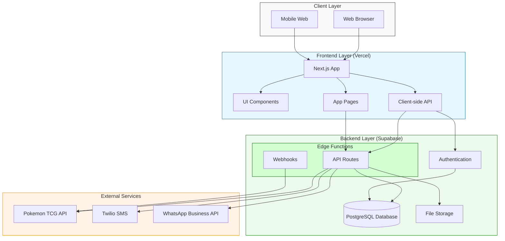
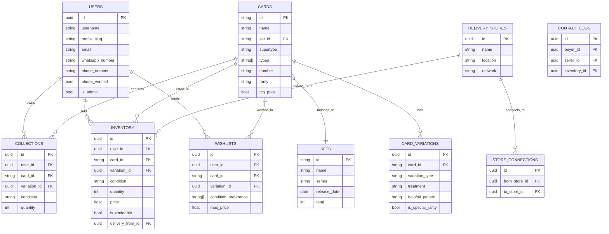
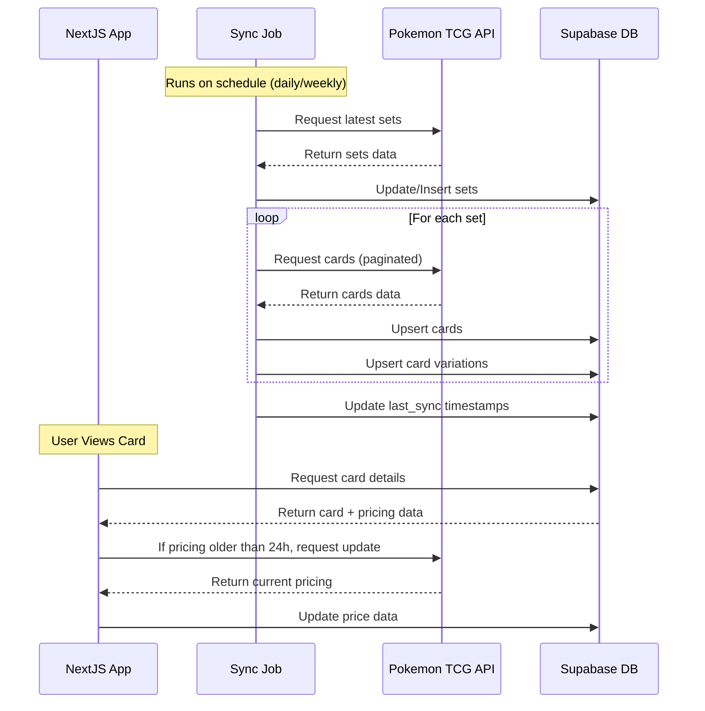
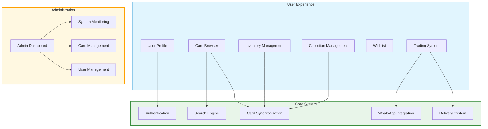

Thank you for the clarifications. I'll update the system design document to incorporate these details:

# Pokémon TCG Trade Platform - System Design Document (Updated)

## 1. Overview

This document outlines the database schema and data management strategy for the Pokémon TCG Trade Platform. The platform will allow users to create shareable profile catalogs of their trading cards with WhatsApp integration for direct communication. The focus is on creating robust user profiles with streamlined inventory management, not a global marketplace (which is reserved for future development).

## 2. Tech Stack

- **Frontend**: Next.js, Tailwind CSS, Shadcn
- **Backend/Database**: Supabase
- **API Integration**: Pokémon TCG API (via Typescript SDK)
- **Authentication**: Supabase Auth with Phone/SMS verification using Twilio
- **Hosting**: Vercel (free tier initially)
- **Analytics**: Vercel Analytics (free tier)

### 2.1 System Architecture



## 3. Database Schema

### 3.1 Core Tables

#### `users`
```sql
CREATE TABLE users (
  id UUID PRIMARY KEY DEFAULT uuid_generate_v4(),
  email TEXT UNIQUE,
  username TEXT UNIQUE NOT NULL,
  profile_slug TEXT UNIQUE NOT NULL,
  profile_image_url TEXT,
  bio TEXT,
  location TEXT,
  whatsapp_number TEXT NOT NULL,
  phone_number TEXT UNIQUE,
  phone_verified BOOLEAN DEFAULT FALSE,
  created_at TIMESTAMP WITH TIME ZONE DEFAULT now(),
  updated_at TIMESTAMP WITH TIME ZONE DEFAULT now(),
  is_verified BOOLEAN DEFAULT FALSE,
  last_login TIMESTAMP WITH TIME ZONE,
  is_admin BOOLEAN DEFAULT FALSE
);
```

#### `sets`
```sql
CREATE TABLE sets (
  id TEXT PRIMARY KEY,
  name TEXT NOT NULL,
  series TEXT, -- The major grouping (eg: "Scarlet & Violet", "Sword & Shield")
  release_date DATE,
  total INTEGER,
  logo_url TEXT,
  symbol_url TEXT,
  created_at TIMESTAMP WITH TIME ZONE DEFAULT now(),
  updated_at TIMESTAMP WITH TIME ZONE DEFAULT now(),
  last_sync_at TIMESTAMP WITH TIME ZONE DEFAULT now()
);
```

#### `cards`
```sql
CREATE TABLE cards (
  id TEXT PRIMARY KEY,
  name TEXT NOT NULL,
  supertype TEXT,
  types TEXT[],
  set_id TEXT NOT NULL REFERENCES sets(id),
  number TEXT NOT NULL,
  rarity TEXT,
  rarity_code TEXT, -- Common, Uncommon, Rare, etc.
  card_era TEXT, -- Base, E-Series, EX Series, Diamond & Pearl, etc.
  language TEXT NOT NULL DEFAULT 'English', -- Primary options: English, Spanish, Japanese
  image_small TEXT,
  image_large TEXT,
  pokemon_generation INTEGER, -- Which game generation the Pokémon first appeared in (1-9)
  tcg_price DECIMAL(10,2),
  price_updated_at TIMESTAMP WITH TIME ZONE,
  created_at TIMESTAMP WITH TIME ZONE DEFAULT now(),
  updated_at TIMESTAMP WITH TIME ZONE DEFAULT now(),
  last_sync_at TIMESTAMP WITH TIME ZONE DEFAULT now()
);
```

#### `card_variations`
```sql
CREATE TABLE card_variations (
  id UUID PRIMARY KEY DEFAULT uuid_generate_v4(),
  card_id TEXT NOT NULL REFERENCES cards(id) ON DELETE CASCADE,
  variation_type TEXT NOT NULL, -- Basic variation types: 'Normal', 'Reverse Holo', 'Holo', etc.
  treatment TEXT, -- Additional treatment descriptors: 'Full Art', 'Alt Art', 'Rainbow Rare', etc.
  holofoil_pattern TEXT, -- 'Cosmos', 'Tinsel', 'Sheen', 'Water-Web', etc.
  is_special_rarity BOOLEAN DEFAULT FALSE,
  special_rarity_type TEXT, -- 'Secret Rare', 'Ultra Rare', 'Illustration Rare', etc.
  image_url TEXT,
  tcg_api_price_key TEXT, -- Maps to the API's price data key (normal, holofoil, reverseHolofoil, etc.)
  created_at TIMESTAMP WITH TIME ZONE DEFAULT now(),
  UNIQUE(card_id, variation_type, treatment)
);
```

### 3.2 Database Entity Relationship Diagram



#### `rarity_types`
```sql
CREATE TABLE rarity_types (
  id UUID PRIMARY KEY DEFAULT uuid_generate_v4(),
  name TEXT NOT NULL,
  symbol TEXT, -- Text representation of the symbol (●, ◆, ★, etc.)
  era TEXT, -- When this rarity was introduced/used
  description TEXT,
  created_at TIMESTAMP WITH TIME ZONE DEFAULT now()
);
```

#### `delivery_stores`
```sql
CREATE TABLE delivery_stores (
  id UUID PRIMARY KEY DEFAULT uuid_generate_v4(),
  name TEXT NOT NULL,
  location TEXT NOT NULL,
  network TEXT NOT NULL, -- Identifies which network the store belongs to (e.g., "Omega")
  address TEXT,
  contact_info TEXT,
  created_at TIMESTAMP WITH TIME ZONE DEFAULT now()
);
```

#### `store_connections`
```sql
CREATE TABLE store_connections (
  id UUID PRIMARY KEY DEFAULT uuid_generate_v4(),
  from_store_id UUID NOT NULL REFERENCES delivery_stores(id) ON DELETE CASCADE,
  to_store_id UUID NOT NULL REFERENCES delivery_stores(id) ON DELETE CASCADE,
  created_at TIMESTAMP WITH TIME ZONE DEFAULT now(),
  UNIQUE(from_store_id, to_store_id)
);
```

#### `inventory` (User's Cards for Sale/Trade)
```sql
CREATE TABLE inventory (
  id UUID PRIMARY KEY DEFAULT uuid_generate_v4(),
  user_id UUID NOT NULL REFERENCES users(id) ON DELETE CASCADE,
  card_id TEXT NOT NULL REFERENCES cards(id) ON DELETE CASCADE,
  variation_id UUID REFERENCES card_variations(id),
  condition TEXT NOT NULL CHECK (condition IN ('NM', 'LP', 'MP', 'HP', 'DMG')),
  quantity INTEGER NOT NULL CHECK (quantity > 0),
  price DECIMAL(10,2) NOT NULL,
  is_tradeable BOOLEAN DEFAULT FALSE,
  desired_trades TEXT, -- Text description of cards they would accept in trade
  delivery_from_id UUID REFERENCES delivery_stores(id),
  is_visible BOOLEAN DEFAULT TRUE,
  notes TEXT,
  created_at TIMESTAMP WITH TIME ZONE DEFAULT now(),
  updated_at TIMESTAMP WITH TIME ZONE DEFAULT now(),
  UNIQUE(user_id, card_id, variation_id, condition)
);
```

#### `collections` (User's Personal Collection)
```sql
CREATE TABLE collections (
  id UUID PRIMARY KEY DEFAULT uuid_generate_v4(),
  user_id UUID NOT NULL REFERENCES users(id) ON DELETE CASCADE,
  card_id TEXT NOT NULL REFERENCES cards(id) ON DELETE CASCADE,
  variation_id UUID REFERENCES card_variations(id),
  condition TEXT NOT NULL CHECK (condition IN ('NM', 'LP', 'MP', 'HP', 'DMG')),
  quantity INTEGER NOT NULL CHECK (quantity > 0),
  notes TEXT,
  created_at TIMESTAMP WITH TIME ZONE DEFAULT now(),
  updated_at TIMESTAMP WITH TIME ZONE DEFAULT now(),
  UNIQUE(user_id, card_id, variation_id, condition)
);
```

#### `wishlists`
```sql
CREATE TABLE wishlists (
  id UUID PRIMARY KEY DEFAULT uuid_generate_v4(),
  user_id UUID NOT NULL REFERENCES users(id) ON DELETE CASCADE,
  card_id TEXT NOT NULL REFERENCES cards(id) ON DELETE CASCADE,
  variation_id UUID REFERENCES card_variations(id),
  condition_preference TEXT[] DEFAULT ARRAY['NM'],
  max_price DECIMAL(10,2),
  created_at TIMESTAMP WITH TIME ZONE DEFAULT now(),
  updated_at TIMESTAMP WITH TIME ZONE DEFAULT now(),
  UNIQUE(user_id, card_id, variation_id)
);
```

#### `contact_logs` (Optional - for tracking inquiries)
```sql
CREATE TABLE contact_logs (
  id UUID PRIMARY KEY DEFAULT uuid_generate_v4(),
  buyer_id UUID NOT NULL REFERENCES users(id),
  seller_id UUID NOT NULL REFERENCES users(id),
  inventory_id UUID NOT NULL REFERENCES inventory(id),
  created_at TIMESTAMP WITH TIME ZONE DEFAULT now()
);
```

### 3.3 Views

```sql
-- Enhanced cards view combining card info with set info
CREATE VIEW enhanced_cards AS
SELECT 
  c.*,
  s.name as set_name,
  s.series as set_series,
  s.release_date,
  s.logo_url as set_logo_url,
  s.symbol_url as set_symbol_url
FROM cards c
JOIN sets s ON c.set_id = s.id;

-- User catalog view for profile pages
CREATE VIEW user_catalogs AS
SELECT 
  u.id as user_id,
  u.username,
  u.profile_slug,
  COUNT(DISTINCT i.card_id) as unique_cards,
  SUM(i.quantity) as total_cards,
  COUNT(DISTINCT c.set_id) as unique_sets
FROM users u
LEFT JOIN inventory i ON u.id = i.user_id
LEFT JOIN cards c ON i.card_id = c.id
WHERE i.is_visible = TRUE
GROUP BY u.id, u.username, u.profile_slug;

-- Store delivery options view
CREATE VIEW store_delivery_options AS
SELECT 
  s1.id as from_store_id,
  s1.name as from_store_name,
  s1.location as from_location,
  s2.id as to_store_id,
  s2.name as to_store_name,
  s2.location as to_location
FROM delivery_stores s1
JOIN store_connections sc ON s1.id = sc.from_store_id
JOIN delivery_stores s2 ON sc.to_store_id = s2.id;
```

## 4. Data Flow Processes

### 4.1 Card Synchronization Process



## 5. Key Components Diagram



## Related Documentation

<related_docs>
- [Inventory Data Model](./inventory-management/data-model.md): Database schema and relationships
- [API Reference](./api-reference.md): API endpoints and integration details
- [User Trading Flow](./user-trading-flow.md): User interaction flows
</related_docs>