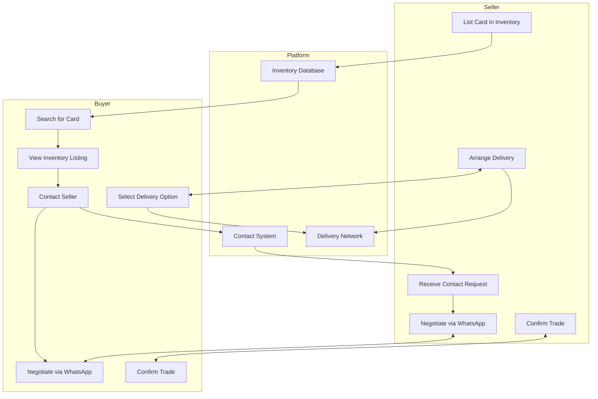
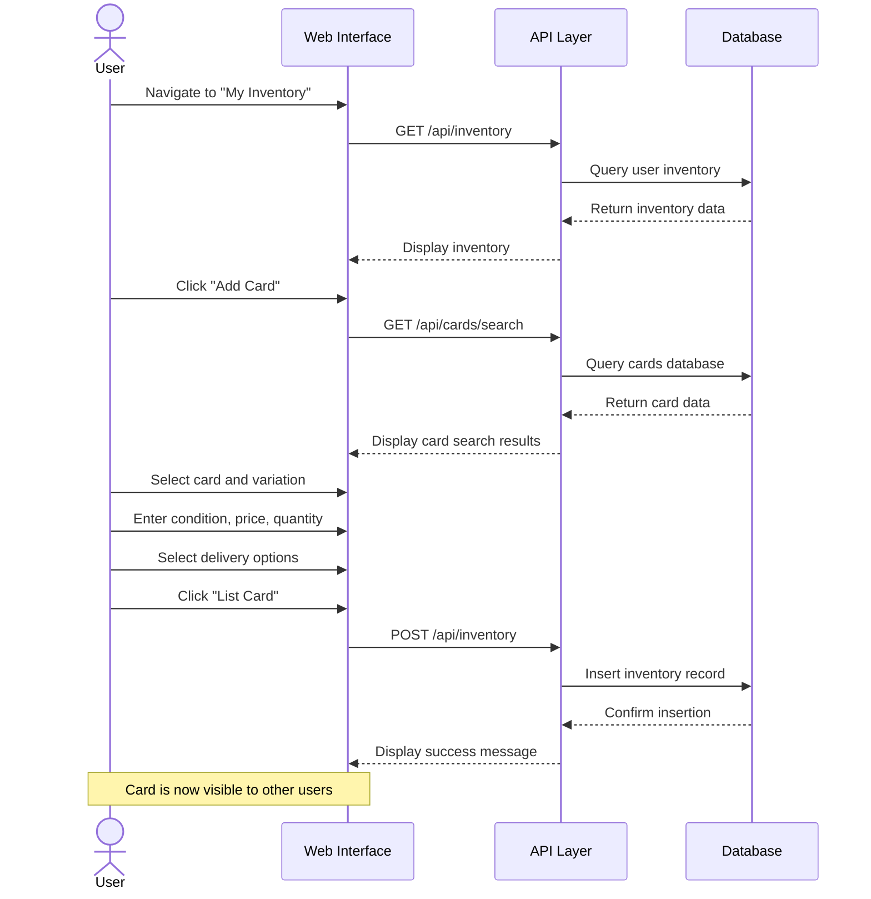
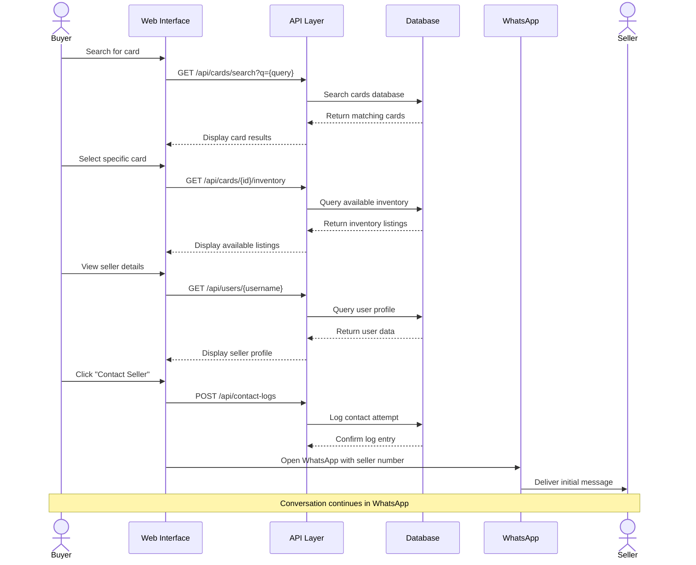
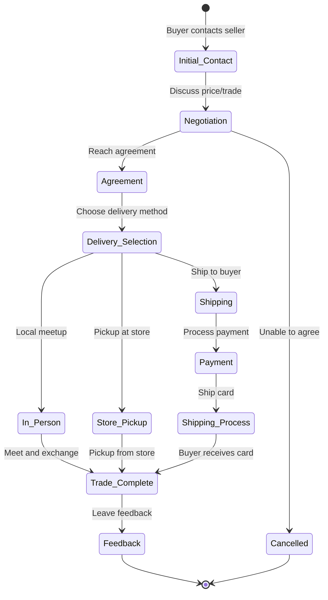
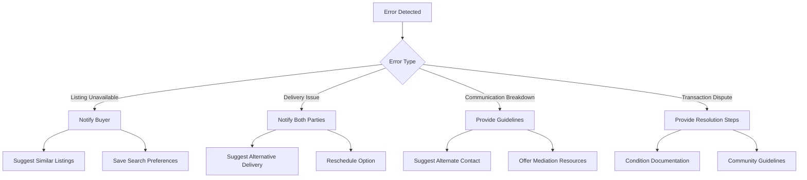

# Pokemon TCG Trade Platform User Trading Flow

## Overview

<purpose>
This document details the user trading flow for the Pokemon TCG Trade Platform, including the process of listing cards, finding trading partners, negotiating trades, and completing transactions. The platform's unique approach focuses on connecting traders via WhatsApp rather than implementing a traditional marketplace.
</purpose>

## Trading Flow Architecture



## User Personas

<personas>
### Collector Persona

**Name**: Alex
**Age**: 28
**Experience**: Moderate (3 years collecting)
**Goals**:
- Complete specific sets
- Find rare cards in good condition
- Connect with other collectors
- Trade duplicates for missing cards

**Pain Points**:
- Difficulty finding specific cards
- Trust issues with online marketplaces
- Shipping damage concerns
- Overpaying due to market fluctuations

### Trader Persona

**Name**: Sam
**Age**: 35
**Experience**: Expert (10+ years trading)
**Goals**:
- Buy low, sell/trade high
- Build network of reliable trading partners
- Stay informed about market trends
- Efficiently manage large inventory

**Pain Points**:
- Time spent on negotiations
- Keeping track of inventory
- Finding serious buyers/traders
- Managing delivery logistics

### Casual Player Persona

**Name**: Jordan
**Age**: 19
**Experience**: Beginner (1 year playing)
**Goals**:
- Build competitive decks
- Trade cards for gameplay, not collection
- Learn about card values
- Connect with local players

**Pain Points**:
- Uncertainty about card values
- Limited knowledge of card conditions
- Small network of trading partners
- Budget constraints
</personas>

## Key User Flows

### 1. Listing a Card for Trade/Sale

<user_flow id="card-listing">


#### Implementation Details

1. **Card Selection Process**:
   - Typeahead search with card name autocomplete
   - Set filter dropdown for narrowing results
   - Card preview with hover state
   - Variation selection (Holofoil, Reverse Holofoil, etc.)

2. **Listing Form Fields**:
   - Condition dropdown (NM, LP, MP, HP, DMG)
   - Price input with market price reference
   - Quantity selector
   - Trade preference toggle (For Sale, For Trade, Both)
   - Notes/description text area
   - Delivery store selection

3. **Validation Rules**:
   - Condition is required
   - Price is required if "For Sale" is selected
   - Quantity must be at least 1
   - At least one delivery option must be selected

4. **Success Actions**:
   - Confirmation message displayed
   - Option to add another card
   - Option to view listing
</user_flow>

### 2. Finding and Contacting a Seller

<user_flow id="contact-seller">


#### Implementation Details

1. **Card Search Experience**:
   - Advanced filters (set, rarity, price range)
   - Sort options (price, newest, alphabetical)
   - Grid and list view options
   - Card preview on hover

2. **Inventory Listing Display**:
   - Seller username and rating
   - Card condition with description
   - Price and availability
   - Delivery options
   - "Contact Seller" button

3. **Contact Process**:
   - WhatsApp deep linking with pre-populated message
   - Contact logging for platform analytics
   - Recent contacts list for returning users
   - Seller online status indicator (if available)

4. **Privacy Considerations**:
   - WhatsApp number is only revealed after clicking contact
   - Option for sellers to use platform relay number
   - Abuse reporting system
</user_flow>

### 3. Negotiating and Completing a Trade

<user_flow id="trade-completion">


#### Implementation Details

1. **Negotiation Process**:
   - Conducted entirely in WhatsApp
   - Platform provides suggested message templates
   - Reference pricing available in app

2. **Delivery Options**:
   - In-person meetup (geolocation suggested)
   - Store network pickup
   - Traditional shipping
   - Integration with local delivery services

3. **Payment Handling**:
   - Direct between users (platform does not process payments)
   - Suggested payment methods
   - Safety guidelines provided

4. **Trade Completion**:
   - Optional trade confirmation in platform
   - Feedback system for building reputation
   - Trade history for users
</user_flow>

## WhatsApp Integration

<whatsapp_integration>
### Message Templates

The platform provides suggested message templates for common trading scenarios:

1. **Initial Contact Template**:
   ```
   Hi [Seller]! I'm interested in your [Card Name] ([Condition]) listed on Pokemon TCG Trade Platform. Is it still available?
   ```

2. **Offer Template**:
   ```
   I'd like to offer [Amount] for your [Card Name]. OR I have [Trade Card] to offer in exchange.
   ```

3. **Delivery Discussion Template**:
   ```
   If we agree on the trade, what delivery options work for you? I see you're connected to [Store Name] for pickup.
   ```

4. **Trade Confirmation Template**:
   ```
   Great! To confirm: I'll [pay/trade] [Amount/Card] for your [Card Name] via [Delivery Method]. Does that work?
   ```

### Deep Linking Implementation

The platform uses WhatsApp's deep linking API to pre-populate messages:

```javascript
// src/components/trading/ContactButton.tsx
function generateWhatsAppLink(phoneNumber, cardName, condition, price) {
  const formattedNumber = phoneNumber.startsWith('+') 
    ? phoneNumber.substring(1) 
    : phoneNumber;
  
  const message = encodeURIComponent(
    `Hi! I'm interested in your ${cardName} (${condition}) listed for ${price} on Pokemon TCG Trade Platform. Is it still available?`
  );
  
  return `https://wa.me/${formattedNumber}?text=${message}`;
}
```

### Contact Tracking

The platform logs contact attempts for analytics without storing message content:

```typescript
// src/lib/services/contact-service.ts
async function logContactAttempt(buyerId, sellerId, inventoryId) {
  return await supabase
    .from('contact_logs')
    .insert({
      initiator_id: buyerId,
      recipient_id: sellerId,
      inventory_id: inventoryId,
      created_at: new Date().toISOString()
    });
}
```
</whatsapp_integration>

## Delivery System

<delivery_system>
```mermaid
graph TD
    subgraph User Options
        A[In-Person Meetup]
        B[Store Network]
        C[Standard Shipping]
    end
    
    subgraph Store Network
        S1[Store 1]
        S2[Store 2]
        S3[Store 3]
        S4[Store 4]
        
        S1 --- S2
        S2 --- S3
        S1 --- S3
        S3 --- S4
    end
    
    B --> Store Network
    
    subgraph Delivery Process
        D1[Seller Drops Off]
        D2[Store Transfer]
        D3[Buyer Pickup]
    end
    
    Store Network --> D1
    D1 --> D2
    D2 --> D3
```

### Store Network System

The platform partners with local game stores to create a network for card delivery:

1. **Store Registration**:
   - Stores register as delivery points
   - Provide location and operating hours
   - Set handling fees (if any)

2. **Connection Mapping**:
   - Stores establish connections with other stores
   - Define transfer schedules and fees
   - Create delivery routes

3. **User Experience**:
   - Sellers select their preferred dropoff store
   - System shows buyers available pickup locations
   - Transfer time and fees are calculated automatically

### Implementation Details

```typescript
// src/lib/services/delivery-service.ts
async function getDeliveryOptions(sellerStoreId, buyerLocation) {
  // Get direct pickup option
  const { data: sellerStore } = await supabase
    .from('delivery_stores')
    .select('*')
    .eq('id', sellerStoreId)
    .single();
    
  // Get connected stores for transfer options
  const { data: connectedStores } = await supabase
    .from('store_delivery_options')
    .select(`
      origin_store_id,
      destination_store_id,
      destination_store:delivery_stores(*),
      transfer_time_hours,
      transfer_fee
    `)
    .eq('origin_store_id', sellerStoreId);
    
  // If buyer provided location, sort by distance
  let sortedOptions = connectedStores;
  if (buyerLocation) {
    sortedOptions = sortStoresByDistance(connectedStores, buyerLocation);
  }
  
  return {
    directPickup: sellerStore,
    transferOptions: sortedOptions
  };
}
```
</delivery_system>

## Error Handling and Edge Cases

<error_handling>
### Common Error Scenarios

1. **Card No Longer Available**:
   - Seller has traded the card but not updated inventory
   - System prompts seller to update inventory when contacted
   - Buyer receives notification if listing is removed

2. **Delivery Store Closed/Unavailable**:
   - System checks store operating hours
   - Alerts users if selected store is temporarily unavailable
   - Suggests alternative stores

3. **User Unresponsive**:
   - No response tracking in WhatsApp
   - Platform provides guidance on following up
   - Reputation system helps identify responsive users

4. **Condition Disputes**:
   - Guidelines for condition assessment provided
   - Suggested photo sharing process for verification
   - Community guidelines for dispute resolution

### Recovery Paths


</error_handling>

## User Experience Considerations

<ux_considerations>
### Trust Building Elements

1. **User Profiles**:
   - Trade history and volume
   - Community ratings
   - Account age and verification status
   - Collection showcase

2. **Safety Guidelines**:
   - Meeting safety recommendations
   - Payment protection advice
   - Card authentication tips
   - Dispute resolution process

3. **Communication Etiquette**:
   - Suggested response timeframes
   - Negotiation etiquette
   - Sample messages for common scenarios
   - Cultural considerations

### Accessibility Considerations

1. **Alternative Contact Methods**:
   - Email option for users without WhatsApp
   - In-platform messaging fallback
   - Voice call options for accessibility

2. **Language Support**:
   - Multilingual message templates
   - Translation suggestions
   - Cultural trading etiquette guides
</ux_considerations>

## Analytics and Metrics

<analytics>
### Key Trading Metrics

1. **Contact Rate**:
   - Percentage of listings that receive contact requests
   - Average contacts per listing
   - Time to first contact after listing

2. **Conversion Rate**:
   - Estimated completion rate (based on feedback)
   - Factors affecting completion (price, condition, delivery)
   - Time from contact to completion

3. **User Engagement**:
   - Return rate for buyers and sellers
   - Cross-listing (buying and selling)
   - Platform feature usage

### Implementation

```typescript
// src/lib/services/analytics-service.ts
async function generateTradingMetrics(dateRange) {
  const { startDate, endDate } = dateRange;
  
  // Contact rate metrics
  const { data: contactData } = await supabase
    .rpc('calculate_contact_rate', { start_date: startDate, end_date: endDate });
    
  // Conversion estimates
  const { data: conversionData } = await supabase
    .rpc('estimate_conversion_rate', { start_date: startDate, end_date: endDate });
    
  // User engagement
  const { data: engagementData } = await supabase
    .rpc('calculate_user_engagement', { start_date: startDate, end_date: endDate });
    
  return {
    contactRate: contactData,
    conversionRate: conversionData,
    userEngagement: engagementData
  };
}
```
</analytics>

## Related Documentation

<related_docs>
- [Enhanced Database Documentation](enhanced-database-documentation.md): Database schema for trading system
- [API Reference](api-reference.md): API endpoints for trading functionality
- [WhatsApp Integration](whatsapp-integration.md): Detailed WhatsApp integration specifications
- [Delivery System](delivery-system.md): Complete delivery network documentation
</related_docs>
