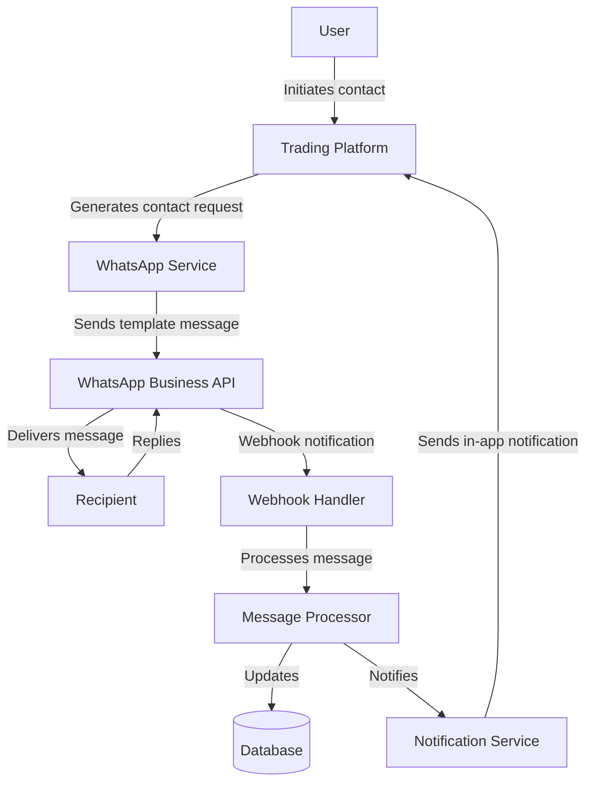
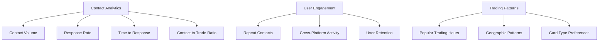
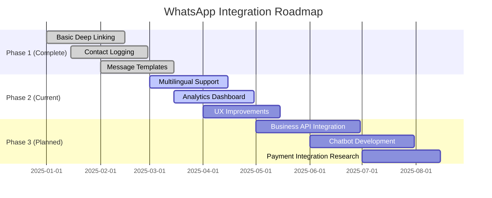

# Pokemon TCG Trade Platform WhatsApp Integration

## Overview

<overview>
The WhatsApp Integration for the Pokemon TCG Trade Platform enables direct communication between buyers and sellers through the WhatsApp messaging platform. This integration allows users to initiate contact, negotiate trades, and coordinate delivery or meetups without leaving the platform's ecosystem. The integration uses the WhatsApp Business API to send templated messages and handle user interactions.
</overview>

## Integration Architecture

<integration_architecture>
The WhatsApp integration is built on a serverless architecture using the WhatsApp Business API. The system follows a webhook-based approach for receiving messages and a template-based system for sending outbound communications.



### Core Components

1. **WhatsApp Service**: Manages communication with the WhatsApp Business API
   - Handles message template rendering
   - Manages API authentication
   - Tracks message delivery status

2. **Webhook Handler**: Processes incoming messages and events
   - Validates webhook signatures
   - Routes messages to appropriate handlers
   - Manages rate limiting and throttling

3. **Message Processor**: Business logic for handling messages
   - Parses message content
   - Updates conversation state
   - Triggers appropriate actions based on message content

4. **Notification Service**: Keeps platform users informed
   - Sends in-app notifications
   - Updates conversation UI in real-time
   - Manages notification preferences
</integration_architecture>

## Security

<security>
The WhatsApp integration implements multiple security layers to protect user data and prevent abuse of the messaging system.

### Authentication and Authorization

- **API Authentication**: Uses OAuth 2.0 for WhatsApp Business API authentication
- **Webhook Verification**: Implements signature verification for all incoming webhooks
- **Rate Limiting**: Prevents abuse through tiered rate limiting based on user trust scores

### Data Protection

- **End-to-End Encryption**: Leverages WhatsApp's built-in encryption for messages
- **Personal Data Handling**: 
  - Phone numbers are stored using encryption at rest
  - Only verified users can initiate contact
  - Users must opt-in to share contact information

### Abuse Prevention

- **Content Filtering**: Automatic filtering of inappropriate content
- **Contact Limitations**: 
  - Daily limits on new contacts per user
  - Graduated limits based on user reputation
  - Cooling-off period after reported violations

### Compliance

- **GDPR Compliance**: 
  - Clear consent flows for data sharing
  - Data export and deletion capabilities
  - Purpose limitation for contact information

- **WhatsApp Policy Compliance**:
  - Adherence to Business API usage policies
  - Proper use of message templates
  - Respect for user opt-out preferences
</security>

## Integration Methods

<integration_methods>
### Direct WhatsApp Linking

The platform uses WhatsApp's URL scheme to create deep links that open WhatsApp with pre-populated messages:

```typescript
// src/lib/utils/whatsapp.ts
export function generateWhatsAppLink(
  phoneNumber: string,
  message: string
): string {
  // Format phone number (remove '+' if present)
  const formattedNumber = phoneNumber.startsWith('+')
    ? phoneNumber.substring(1)
    : phoneNumber;
  
  // Encode message for URL
  const encodedMessage = encodeURIComponent(message);
  
  // Generate WhatsApp deep link
  return `https://wa.me/${formattedNumber}?text=${encodedMessage}`;
}
```

### WhatsApp Business API Integration

For verified business accounts and stores in our delivery network, we offer WhatsApp Business API integration:

```typescript
// src/lib/services/whatsapp-business-service.ts
import { Client } from 'whatsapp-business-api';

export class WhatsAppBusinessService {
  private client: Client;
  
  constructor(apiKey: string) {
    this.client = new Client({
      apiKey,
      businessId: process.env.WHATSAPP_BUSINESS_ID,
    });
  }
  
  async sendTemplateMessage(
    to: string,
    templateName: string,
    parameters: Record<string, string>
  ): Promise<any> {
    return await this.client.sendTemplate({
      to,
      templateName,
      languageCode: 'en_US',
      parameters,
    });
  }
  
  async sendTextMessage(to: string, text: string): Promise<any> {
    return await this.client.sendText({
      to,
      text,
    });
  }
}
```

### Contact Button Implementation

The contact button component that initiates WhatsApp conversations:

```tsx
// src/components/trading/ContactButton.tsx
import React from 'react';
import { Button } from '../ui/Button';
import { FaWhatsapp } from 'react-icons/fa';
import { generateWhatsAppLink } from '@/lib/utils/whatsapp';
import { useSupabaseClient } from '@supabase/auth-helpers-react';

interface ContactButtonProps {
  sellerId: string;
  sellerWhatsApp: string;
  cardName: string;
  cardCondition: string;
  inventoryId: string;
  price?: number;
  variant?: 'primary' | 'secondary' | 'outline';
}

export default function ContactButton({
  sellerId,
  sellerWhatsApp,
  cardName,
  cardCondition,
  inventoryId,
  price,
  variant = 'primary'
}: ContactButtonProps) {
  const supabase = useSupabaseClient();
  
  const handleContact = async () => {
    // Generate initial message
    const initialMessage = price
      ? `Hi! I'm interested in your ${cardName} (${cardCondition}) listed for ${price} on Pokemon TCG Trade Platform. Is it still available?`
      : `Hi! I'm interested in your ${cardName} (${cardCondition}) on Pokemon TCG Trade Platform. Is it still available?`;
    
    // Log contact attempt
    const { data: { session } } = await supabase.auth.getSession();
    if (session) {
      await supabase
        .from('contact_logs')
        .insert({
          initiator_id: session.user.id,
          recipient_id: sellerId,
          inventory_id: inventoryId,
          created_at: new Date().toISOString()
        });
    }
    
    // Open WhatsApp
    const whatsappLink = generateWhatsAppLink(sellerWhatsApp, initialMessage);
    window.open(whatsappLink, '_blank');
  };
  
  return (
    <Button
      variant={variant}
      onClick={handleContact}
      className="flex items-center"
    >
      <FaWhatsapp className="mr-2" />
      Contact via WhatsApp
    </Button>
  );
}
```
</integration_methods>

## Message Templates

<message_templates>
The Pokemon TCG Trade Platform uses WhatsApp message templates for all initial outbound communications. These templates must be pre-approved by WhatsApp and follow their content policy guidelines.

### Supported Template Types

| Template Name | Purpose | Variables | Example |
|---------------|---------|-----------|---------|
| `trade_request` | Initial contact for trading | `{{1}}` = Sender name<br>`{{2}}` = Card name<br>`{{3}}` = Offer details | "Hello! {{1}} is interested in your {{2}} card. Their offer: {{3}}. Reply to discuss this trade." |
| `card_inquiry` | Asking about card condition | `{{1}}` = Sender name<br>`{{2}}` = Card name | "Hello! {{1}} has a question about your {{2}} card condition. Reply to this message to discuss details." |
| `meetup_suggestion` | Suggesting a meetup location | `{{1}}` = Location name<br>`{{2}}` = Date<br>`{{3}}` = Time | "Trading meetup suggestion: {{1}} on {{2}} at {{3}}. Reply to confirm or suggest alternatives." |
| `price_update` | Notify about price change | `{{1}}` = Card name<br>`{{2}}` = Old price<br>`{{3}}` = New price | "Update on {{1}}: Price changed from {{2}} to {{3}}. Are you still interested in this trade?" |
| `delivery_option` | Suggest delivery method | `{{1}}` = Delivery method<br>`{{2}}` = Cost<br>`{{3}}` = Estimated time | "Delivery option: {{1}} ({{2}}) with estimated delivery in {{3}}. Reply to confirm or discuss alternatives." |
| `trade_confirmation` | Confirm trade details | `{{1}}` = Card(s) offered<br>`{{2}}` = Card(s) requested<br>`{{3}}` = Additional terms | "Trade summary: You offer {{1}} in exchange for {{2}}. Additional terms: {{3}}. Reply 'CONFIRM' to proceed." |

### Template Localization

All templates are available in the following languages:
- English (default)
- Spanish
- Portuguese
- French
- German

Templates automatically use the recipient's preferred language if available, defaulting to English when the preferred language is not supported.

### Template Creation Guidelines

When creating new templates for submission to WhatsApp:

1. **Be Specific**: Clearly state the purpose of the message
2. **Be Concise**: Keep messages brief and to the point
3. **Avoid Prohibited Content**:
   - No promotional language
   - No calls to action outside of WhatsApp
   - No mentioning of prohibited items/services
4. **Variable Placement**: Use variables logically, ensure they flow naturally in all supported languages
5. **Testing**: Test template rendering with various input lengths

### Template Submission Process

1. Draft template following guidelines
2. Submit to WhatsApp for approval via Business Manager
3. Approval typically takes 24-48 hours
4. If rejected, review feedback and modify as needed
5. Once approved, add to the template library in the platform

### Template Usage Analytics

All template usage is tracked to measure:
- Delivery rate
- Response rate
- Conversion to successful trades
- Response time

This data helps optimize templates for better engagement and conversion.
</message_templates>

## Contact Logging System

<contact_logging>
### Database Schema

```sql
CREATE TABLE contact_logs (
  id UUID PRIMARY KEY DEFAULT uuid_generate_v4(),
  initiator_id UUID NOT NULL REFERENCES users(id),
  recipient_id UUID NOT NULL REFERENCES users(id),
  inventory_id UUID REFERENCES inventory(id),
  created_at TIMESTAMP WITH TIME ZONE NOT NULL,
  status VARCHAR(20) DEFAULT 'initiated',
  metadata JSONB
);

CREATE INDEX contact_logs_initiator_id_idx ON contact_logs(initiator_id);
CREATE INDEX contact_logs_recipient_id_idx ON contact_logs(recipient_id);
CREATE INDEX contact_logs_inventory_id_idx ON contact_logs(inventory_id);
CREATE INDEX contact_logs_created_at_idx ON contact_logs(created_at);
```

### Logging Implementation

```typescript
// src/lib/services/contact-service.ts
import { SupabaseClient } from '@supabase/supabase-js';

export class ContactService {
  constructor(private supabase: SupabaseClient) {}
  
  async logContactAttempt(
    initiatorId: string,
    recipientId: string,
    inventoryId: string,
    metadata: Record<string, any> = {}
  ): Promise<void> {
    await this.supabase
      .from('contact_logs')
      .insert({
        initiator_id: initiatorId,
        recipient_id: recipientId,
        inventory_id: inventoryId,
        created_at: new Date().toISOString(),
        status: 'initiated',
        metadata
      });
  }
  
  async getRecentContacts(userId: string, limit: number = 10): Promise<any[]> {
    const { data } = await this.supabase
      .from('contact_logs')
      .select(`
        id,
        created_at,
        status,
        inventory:inventory(
          id,
          card:cards(id, name, image_small),
          price,
          condition
        ),
        initiator:users!initiator_id(id, username, profile_image_url),
        recipient:users!recipient_id(id, username, profile_image_url)
      `)
      .or(`initiator_id.eq.${userId},recipient_id.eq.${userId}`)
      .order('created_at', { ascending: false })
      .limit(limit);
    
    return data || [];
  }
  
  async updateContactStatus(
    contactId: string,
    status: 'initiated' | 'responded' | 'completed' | 'cancelled'
  ): Promise<void> {
    await this.supabase
      .from('contact_logs')
      .update({ status })
      .eq('id', contactId);
  }
}
```

### Privacy Considerations

1. **Message Content**:
   - The platform does not store or log actual message content
   - Only contact attempts and basic metadata are recorded
   - Users are informed about what data is collected

2. **Phone Number Protection**:
   - Phone numbers are only revealed after explicit user action
   - Option to use platform-generated temporary contact codes
   - Abuse prevention systems to limit excessive contacts

3. **Data Retention**:
   - Contact logs are retained for 90 days for active users
   - Users can request deletion of their contact history
   - Aggregated analytics data is anonymized
</contact_logging>

## Analytics and Reporting

<analytics>
### Key Metrics



### Implementation

```typescript
// src/lib/services/analytics-service.ts
import { SupabaseClient } from '@supabase/supabase-js';

export class WhatsAppAnalyticsService {
  constructor(private supabase: SupabaseClient) {}
  
  async getContactMetrics(
    startDate: string,
    endDate: string
  ): Promise<any> {
    // Contact volume
    const { data: volumeData } = await this.supabase
      .rpc('get_contact_volume_by_day', {
        start_date: startDate,
        end_date: endDate
      });
    
    // Response rate (estimated from status updates)
    const { data: responseData } = await this.supabase
      .rpc('get_response_rate', {
        start_date: startDate,
        end_date: endDate
      });
    
    // Time to response (estimated)
    const { data: responseTimeData } = await this.supabase
      .rpc('get_average_response_time', {
        start_date: startDate,
        end_date: endDate
      });
    
    // Contact to trade ratio (estimated)
    const { data: conversionData } = await this.supabase
      .rpc('get_contact_conversion_rate', {
        start_date: startDate,
        end_date: endDate
      });
    
    return {
      volume: volumeData,
      responseRate: responseData,
      responseTime: responseTimeData,
      conversionRate: conversionData
    };
  }
  
  async getUserEngagementMetrics(
    startDate: string,
    endDate: string
  ): Promise<any> {
    // Implementation for user engagement metrics
    // ...
  }
  
  async getTradingPatternMetrics(
    startDate: string,
    endDate: string
  ): Promise<any> {
    // Implementation for trading pattern metrics
    // ...
  }
}
```

### Dashboard Visualization

The admin dashboard provides visualizations of WhatsApp engagement metrics:

```tsx
// src/components/admin/WhatsAppMetricsChart.tsx
import React, { useEffect, useState } from 'react';
import {
  LineChart,
  Line,
  XAxis,
  YAxis,
  CartesianGrid,
  Tooltip,
  Legend,
  ResponsiveContainer
} from 'recharts';
import { WhatsAppAnalyticsService } from '@/lib/services/analytics-service';

interface WhatsAppMetricsChartProps {
  startDate: string;
  endDate: string;
  metricType: 'volume' | 'responseRate' | 'responseTime' | 'conversionRate';
}

export default function WhatsAppMetricsChart({
  startDate,
  endDate,
  metricType
}: WhatsAppMetricsChartProps) {
  const [data, setData] = useState<any[]>([]);
  const [loading, setLoading] = useState<boolean>(true);
  
  useEffect(() => {
    async function loadData() {
      setLoading(true);
      
      const analyticsService = new WhatsAppAnalyticsService(supabase);
      const metrics = await analyticsService.getContactMetrics(startDate, endDate);
      
      setData(metrics[metricType] || []);
      setLoading(false);
    }
    
    loadData();
  }, [startDate, endDate, metricType]);
  
  if (loading) {
    return <div>Loading metrics...</div>;
  }
  
  return (
    <ResponsiveContainer width="100%" height={300}>
      <LineChart data={data}>
        <CartesianGrid strokeDasharray="3 3" />
        <XAxis dataKey="date" />
        <YAxis />
        <Tooltip />
        <Legend />
        <Line
          type="monotone"
          dataKey="value"
          stroke="#25D366" // WhatsApp green
          activeDot={{ r: 8 }}
        />
      </LineChart>
    </ResponsiveContainer>
  );
}
```
</analytics>

## User Experience Guidelines

<ux_guidelines>
### Best Practices for Users

1. **Response Time Expectations**:
   - Respond within 24 hours when possible
   - Set status messages if unavailable
   - Use quick replies for common responses

2. **Negotiation Etiquette**:
   - Be clear about price/trade expectations
   - Provide photos of actual cards when requested
   - Confirm details in writing before finalizing

3. **Safety Guidelines**:
   - Only share personal information when necessary
   - Arrange meetups in public places
   - Use secure payment methods
   - Report suspicious behavior

### WhatsApp Feature Utilization

1. **Business Profile**:
   - Sellers encouraged to create WhatsApp Business profiles
   - Add business hours and description
   - Use catalog feature for showcasing cards

2. **Media Sharing**:
   - Guidelines for sharing card photos
   - Recommended lighting and angles
   - Video verification for high-value cards

3. **Location Sharing**:
   - Safe use of location sharing for meetups
   - Temporary vs. real-time location sharing
   - Privacy considerations
</ux_guidelines>

## Multilingual Support

<multilingual>
### Supported Languages

The WhatsApp integration supports the following languages:

1. **Primary Languages**:
   - English
   - Spanish
   - French
   - German
   - Japanese

2. **Secondary Languages** (template-only support):
   - Portuguese
   - Italian
   - Korean
   - Chinese (Simplified)
   - Russian

### Implementation

```typescript
// src/lib/i18n/whatsapp-messages.ts
import i18n from 'i18next';
import { initReactI18next } from 'react-i18next';

// Import language resources
import enMessages from './locales/en/whatsapp.json';
import esMessages from './locales/es/whatsapp.json';
import frMessages from './locales/fr/whatsapp.json';
// Other language imports...

// Initialize i18next
i18n
  .use(initReactI18next)
  .init({
    resources: {
      en: { whatsapp: enMessages },
      es: { whatsapp: esMessages },
      fr: { whatsapp: frMessages },
      // Other languages...
    },
    lng: 'en',
    fallbackLng: 'en',
    ns: ['whatsapp'],
    defaultNS: 'whatsapp',
    interpolation: {
      escapeValue: false
    }
  });

export default i18n;
```

### Language Detection

```typescript
// src/lib/utils/language-detection.ts
import { detect } from 'detect-browser-language';

export function detectUserLanguage(): string {
  // Try to detect from browser
  const browserLang = detect();
  if (browserLang) {
    // Extract primary language code (e.g., 'en-US' -> 'en')
    const primaryLang = browserLang.split('-')[0];
    
    // Check if it's a supported language
    if (['en', 'es', 'fr', 'de', 'ja', 'pt', 'it', 'ko', 'zh', 'ru'].includes(primaryLang)) {
      return primaryLang;
    }
  }
  
  // Default to English
  return 'en';
}
```

### Cultural Considerations

1. **Greeting Styles**:
   - Formal vs. informal based on culture
   - Time-of-day appropriate greetings
   - Cultural trading etiquette

2. **Negotiation Approaches**:
   - Direct pricing vs. indirect negotiation
   - Bargaining expectations by culture
   - Gift culture considerations

3. **Payment Preferences**:
   - Region-specific payment methods
   - Currency formatting
   - Transaction timing expectations
</multilingual>

## Technical Limitations and Solutions

<limitations>
### WhatsApp API Limitations

1. **No Direct Transaction Processing**:
   - WhatsApp doesn't support payment processing
   - Solution: Provide payment method guidance
   - Future: Explore WhatsApp Pay integration where available

2. **Contact Initiation Limits**:
   - WhatsApp Business API has message template requirements
   - Solution: Use click-to-chat links for user-initiated contact
   - Limitation: Cannot send proactive notifications for new listings

3. **Media Quality Compression**:
   - WhatsApp compresses images and videos
   - Solution: In-app high-resolution image sharing
   - Workaround: Guide users on optimal photo settings

### Platform Integration Challenges

1. **Conversation Tracking**:
   - Cannot access message content
   - Solution: Encourage users to update trade status in platform
   - Challenge: Incomplete analytics on conversation outcomes

2. **User Verification**:
   - WhatsApp number may differ from registered number
   - Solution: Verification process for linking numbers
   - Security: Anti-spoofing measures

3. **Cross-Platform Consistency**:
   - WhatsApp experience varies by device
   - Solution: Platform-agnostic instructions
   - Testing: Regular verification across iOS/Android
</limitations>

## Future Enhancements

<future_enhancements>
### Planned Improvements

1. **WhatsApp Business API Full Integration**:
   - Official business account for platform
   - Automated notifications for watchlist matches
   - Verified business badge

2. **Chatbot Assistance**:
   - Optional AI assistant for common questions
   - Price checking commands
   - Condition guide references

3. **Integration with WhatsApp Payments**:
   - Direct payment processing where available
   - Escrow service integration
   - Payment confirmation messaging

4. **Enhanced Analytics**:
   - Sentiment analysis on anonymized feedback
   - Conversion funnel optimization
   - Regional trading pattern insights

### Development Roadmap


</future_enhancements>

## Related Documentation

<related_docs>
- [User Trading Flow](docs/user-trading-flow.md): End-to-end trading process
- [API Reference](docs/api-reference.md): API endpoints for WhatsApp integration
- [Multilingual Support](docs/multilingual-support.md): Language implementation details
- [Analytics System](docs/analytics-system.md): Complete analytics documentation
</related_docs>

## API Endpoints

<api_endpoints>
The WhatsApp integration exposes several REST API endpoints for integration with the platform:

### Initiate Contact

```
POST /api/whatsapp/initiate-contact
```

Initiates WhatsApp contact between two users.

**Request Body:**
```json
{
  "senderId": "string",
  "recipientId": "string",
  "initialMessage": "string",
  "cardId": "string",
  "offerAmount": "number (optional)"
}
```

**Response:**
```json
{
  "contactId": "string",
  "status": "string",
  "messageId": "string"
}
```

### Get Contact History

```
GET /api/whatsapp/contact-history/{contactId}
```

Retrieves the history of a WhatsApp contact.

**Response:**
```json
{
  "contactId": "string",
  "participants": [
    {
      "userId": "string",
      "phoneHash": "string"
    }
  ],
  "messages": [
    {
      "id": "string",
      "direction": "inbound|outbound",
      "content": "string",
      "timestamp": "datetime",
      "status": "string"
    }
  ],
  "status": "active|closed",
  "createdAt": "datetime",
  "updatedAt": "datetime"
}
```

### Send Message

```
POST /api/whatsapp/send-message
```

Sends a WhatsApp message using a template.

**Request Body:**
```json
{
  "contactId": "string",
  "templateName": "string",
  "templateParams": {
    "param1": "value1",
    "param2": "value2"
  }
}
```

**Response:**
```json
{
  "messageId": "string",
  "status": "string"
}
```

### Webhook Receiver

```
POST /api/whatsapp/webhook
```

Receives webhook events from the WhatsApp Business API.

**Request Headers:**
```
X-WhatsApp-Signature: string
```

**Request Body:** WhatsApp API webhook payload

**Response:**
```json
{
  "received": true
}
```

### Update Contact Status

```
PATCH /api/whatsapp/contact/{contactId}/status
```

Updates the status of a WhatsApp contact.

**Request Body:**
```json
{
  "status": "active|paused|closed"
}
```

**Response:**
```json
{
  "contactId": "string",
  "status": "string",
  "updatedAt": "datetime"
}
```
</api_endpoints>
